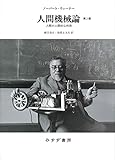

[人間機械論 ――人間の人間的な利用 第2版 【新装版】](http://www.amazon.co.jp/exec/obidos/ASIN/462207883X/tortoisetau09-22/)

- 作者: ノーバート・ウィーナー,鎮目恭夫,池原止戈夫
- 出版社/メーカー: [みすず書房](http://d.hatena.ne.jp/keyword/%A4%DF%A4%B9%A4%BA%BD%F1%CB%BC)
- 発売日: 2014/09/11
- メディア: 単行本
- [この商品を含むブログ (3件) を見る](http://d.hatena.ne.jp/asin/462207883X/tortoisetau09-22)

　ノーバート・ウィーナーが1950年に[サイバネティクス](http://d.hatena.ne.jp/keyword/%A5%B5%A5%A4%A5%D0%A5%CD%A5%C6%A5%A3%A5%AF%A5%B9)の概要について一般向けに書いた本で、技術的な話題よりもその思想的意義を説くものになっている。この邦訳は第二版、1954年に執筆されたものが底本だ。19世紀末から20世紀にかけて物理学に起こった大きな方向転換を端緒として、[エントロピー](http://d.hatena.ne.jp/keyword/%A5%A8%A5%F3%A5%C8%A5%ED%A5%D4%A1%BC)という概念を鍵として[情報工学](http://d.hatena.ne.jp/keyword/%BE%F0%CA%F3%B9%A9%B3%D8)や通信理論の発展を論じ、そこから人間の本性までをも考察するに至る。とはいえウィーナーが取り上げているのは比較的素朴な、20世紀なかばに既に充分実現していた技術にとどまっていて、極端な大風呂敷を広げているわけではない。たとえば、通信理論に基いて信号の伝送経路を最適化するように、社会制度もまた情報をどのように流通させるか、すなわちコミュニケーションの通路を良好に保つためにはどうすればよいかという観点から再設計可能である、といった発想には、むしろ[ゼロ年代](http://d.hatena.ne.jp/keyword/%A5%BC%A5%ED%C7%AF%C2%E5)の[アーキテクチャ](http://d.hatena.ne.jp/keyword/%A5%A2%A1%BC%A5%AD%A5%C6%A5%AF%A5%C1%A5%E3)論にも通じる見通しの良さがある。

　興味深いのは、「コミュニケーション・機密・[社会政策](http://d.hatena.ne.jp/keyword/%BC%D2%B2%F1%C0%AF%BA%F6)」と題された第七章で、機密主義に陥りがちな軍事研究が長期的に見て人類全体に有害であると論じている部分だ。要するに、開発した技術はどんどん公開するべきであって、利用を妨げてはならないのだという。本書が書かれたのが第二次大戦後冷戦体制が強化されつつあった1950年であったことを考えると、この主張はいま想像するよりもずっと大胆なものだったのではないだろうか。

> 繰り返すが、生きているということは、外界からの影響と外界に対する働きかけとの絶えざる流れの中に参加しているということであって、この流れの中でわれわれは過渡的段階にあるにすぎない。いわば世界の有為転変に対して生きているということは、知識とその自由な交換の絶えざる発展の中に参加していることを意味する。多少とも正常な状況の下では、われわれにとっては、そのような適切な知識を確保してゆくことは、ある仮想敵国にそれを持たせないようにすることよりも、はるかに困難であるがはるかに重要なことである。軍事研究所というものの仕組み全体は情報をわれわれ自身が最も有効に使用し発展させることに相反する線に沿っている。（p.128）

　ある研究に軍事研究というレッテルがつけられると、とたんにその成果は部外者から閉ざされてしまう。それだけならまだしも、機密主義が徹底された結果として、別の部門で得られた成果を他の部門で応用するということもできなくなって、いわば「[車輪の再発明](http://d.hatena.ne.jp/keyword/%BC%D6%CE%D8%A4%CE%BA%C6%C8%AF%CC%C0)」をせざるを得なくなることさえある。最近日本でも軍事研究予算が拡大され、大学がその獲得に躍起になるやら抵抗するやらと騒々しいけれど、根本的な問題として、軍事研究という制度がアカデミズムと相反するものである点に留意する必要があるだろう。暗号解読に関する[アラン・チューリング](http://d.hatena.ne.jp/keyword/%A5%A2%A5%E9%A5%F3%A1%A6%A5%C1%A5%E5%A1%BC%A5%EA%A5%F3%A5%B0)の業績が、その内容の機密性ゆえにしばらく一般には知られていなかったことを思い起こすと、看過できない問題ではないだろうか。

　もう一点興味深かったのが、芸術に対する言及だ。第八章は「知識人と科学者との役割」という題が付されていて、その内容はというと、アカデミズムの世界が若い科学者に対して適切な[キャリアパス](http://d.hatena.ne.jp/keyword/%A5%AD%A5%E3%A5%EA%A5%A2%A5%D1%A5%B9)を描けていないことに対する批判になっている。知的好奇心に突き動かされて然るべき若い科学者が、形式的な業績を積むためにルーチンワークのように論文を書いているのは嘆かわしいことだ、と。ただこれは科学にかぎったことではなく、芸術においても同様だとウィーナーは言う。ウィーナーは、なにか新しいことを言うためにではなく、既存の権威を強化したり、あるいは当面の需要をとりあえず満たすためだけに行われるような、おざなりなコミュニケーションには価値を認めない。なぜかといえば、芸術であれ科学であれ、それは[エントロピー](http://d.hatena.ne.jp/keyword/%A5%A8%A5%F3%A5%C8%A5%ED%A5%D4%A1%BC)の増大という自然の傾向に抗って、新しいものを生み出すことを使命としているからだ。

> 何派であろうと美を独占することはできない。美は、秩序と同様に、現実世界の多くの場所に現れるが、[エントロピー](http://d.hatena.ne.jp/keyword/%A5%A8%A5%F3%A5%C8%A5%ED%A5%D4%A1%BC)の増大の巨大な流れに抗する局地的で一時的な戦いとしてしか現れない。（p.142）

　この一節はどこか、[ジル・ドゥルーズ](http://d.hatena.ne.jp/keyword/%A5%B8%A5%EB%A1%A6%A5%C9%A5%A5%A5%EB%A1%BC%A5%BA)＋フェリックス・[ガタリ](http://d.hatena.ne.jp/keyword/%A5%AC%A5%BF%A5%EA)の最後の[著作](http://d.hatena.ne.jp/keyword/%C3%F8%BA%EE)『哲学とは何か』を思い起こさせる。

> 思考の定義、あるいは思考の三つの大きな形態、すなわち芸術、科学、哲学の定義とは、つねに、カオスに立ち向かうこと、カオスのうえに或る平面を描くこと、或る平面を描くことである。（『哲学とは何か』財津理訳、[河出文庫](http://d.hatena.ne.jp/keyword/%B2%CF%BD%D0%CA%B8%B8%CB)、p.332）

　もちろんウィーナーが秩序から無秩序へと至る[エントロピー](http://d.hatena.ne.jp/keyword/%A5%A8%A5%F3%A5%C8%A5%ED%A5%D4%A1%BC)の増大という時間的な枠組みに準拠していて、それに対して[ドゥルーズ](http://d.hatena.ne.jp/keyword/%A5%C9%A5%A5%A5%EB%A1%BC%A5%BA)＋[ガタリ](http://d.hatena.ne.jp/keyword/%A5%AC%A5%BF%A5%EA)が相手どるカオスはそうした漸次的な変化も受け入れない絶対的なカオスなのだとは思うけれど、[ドゥルーズ](http://d.hatena.ne.jp/keyword/%A5%C9%A5%A5%A5%EB%A1%BC%A5%BA)＋[ガタリ](http://d.hatena.ne.jp/keyword/%A5%AC%A5%BF%A5%EA)がウィーナーを知らなかったとは思わないし、なにかア[イデア](http://d.hatena.ne.jp/keyword/%A5%A4%A5%C7%A5%A2)のきっかけにはなったのかもしれない（あるいはルーツが同じか。e.g.熱力学とか）。

[")](http://www.amazon.co.jp/exec/obidos/ASIN/4309463754/tortoisetau09-22/)

[哲学とは何か (河出文庫)](http://www.amazon.co.jp/exec/obidos/ASIN/4309463754/tortoisetau09-22/)

- 作者: G・[ドゥルーズ](http://d.hatena.ne.jp/keyword/%A5%C9%A5%A5%A5%EB%A1%BC%A5%BA),F・[ガタリ](http://d.hatena.ne.jp/keyword/%A5%AC%A5%BF%A5%EA),財津理
- 出版社/メーカー: [河出書房新社](http://d.hatena.ne.jp/keyword/%B2%CF%BD%D0%BD%F1%CB%BC%BF%B7%BC%D2)
- 発売日: 2012/08/04
- メディア: 文庫
- 購入: 2人 クリック: 6回
- [この商品を含むブログ (12件) を見る](http://d.hatena.ne.jp/asin/4309463754/tortoisetau09-22)
