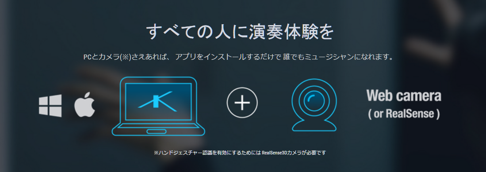

　身体のジェスチャを通じて音楽を演奏できる、[KAGURA](http://www.kagura.cc/jp/)というシステムが発売になるらしい。自分は使ってみたいとは思わないにせよ、おもしろい試みではある。使い方次第ではステージ上のパフォーマンスがよりいっそう派手になるだろうし、こうやってパッケージングされることで、オーディオ・ヴィジュアルなパフォーマンスに対する敷居を下げることにもなるだろう。

　しかし、公式サイトなどに掲げられている、「PCとカメラさえあれば、アプリをインストールするだけで誰でもミュージシャンになれます」というウリ文句には、若干閉口してしまう。

　ミュージシャンになるだけだったらPCだけで十分だ。KAGURAを使うとなったら、PCと[ウェブカム](http://d.hatena.ne.jp/keyword/%A5%A6%A5%A7%A5%D6%A5%AB%A5%E0)を用意して、ソフトをインストールして、設定をこなし、そしてわざわざ身体を動かさなければならない。なんでそんなめんどくさいことをしなくてはならないのだろう？　細かい揚げ足とりかと思われるかもしれないが、これは真剣な話だ。それで提供される「演奏体験」は、「ミュージシャンになりたい」という人にとって満足いくものなのだろうか。いや、こればかりは実際に体験してみないとわからないけれど。

　それでも僕は、パーカッションのひとつでも買ったほうがいいんじゃないかと思う。PCを立ち上げる必要も、カメラの[キャリブレーション](http://d.hatena.ne.jp/keyword/%A5%AD%A5%E3%A5%EA%A5%D6%A5%EC%A1%BC%A5%B7%A5%E7%A5%F3)も必要なく、ふと思ったときに手にとって、鳴らすことができる。マラカスひとつあるだけで、[カウベル](http://d.hatena.ne.jp/keyword/%A5%AB%A5%A6%A5%D9%A5%EB)ひとつあるだけで、じゅうぶんミュージシャンシップを楽しむことができる。そしてなにより、僕らにはこの身体があり、声がある。KAGURAを買ってまだるっこしい「演奏」をするくらいなら、マイクを買って歌声を録音したほうがいいだろう。

　これは極論であるとしても、たとえば[テノリオン](http://d.hatena.ne.jp/keyword/%A5%C6%A5%CE%A5%EA%A5%AA%A5%F3)であったり、[オタマトーン](http://d.hatena.ne.jp/keyword/%A5%AA%A5%BF%A5%DE%A5%C8%A1%BC%A5%F3)であったり、[カオシレーター](http://d.hatena.ne.jp/keyword/%A5%AB%A5%AA%A5%B7%A5%EC%A1%BC%A5%BF%A1%BC)であったり、斬新なUIを通じて簡単でなおかつ優れた演奏体験を提供してくれるガジェットはたくさんある。電池駆動の[カオシレーター](http://d.hatena.ne.jp/keyword/%A5%AB%A5%AA%A5%B7%A5%EC%A1%BC%A5%BF%A1%BC)を前にして、「PCとカメラさえあれば、アプリをインストールするだけで誰でもミュージシャンになれます」なんて胸を張って言えるだろうか？

<iframe width="560" height="315" src="https://www.youtube.com/embed/qecPQ0FB-64" frameborder="0" allowfullscreen></iframe>

　とはいえ、このソフトを単にくさしたいわけではない。[マーケティング](http://d.hatena.ne.jp/keyword/%A5%DE%A1%BC%A5%B1%A5%C6%A5%A3%A5%F3%A5%B0)の方向として、それは違うんじゃない？　と思うのだ。

　最初にも書いたように、可能性もたくさんある。複雑なプログラミングなしでモーションコン[トロール](http://d.hatena.ne.jp/keyword/%A5%C8%A5%ED%A1%BC%A5%EB)を導入できるということは、オーディオ・ヴィジュアルなパフォーマンスに興味はあるがプログラミングはどうもな、という人にひとつの選択肢を与えることになる。あるいは、教育の現場などではこういった身体を動かして演奏ができる仕組みというのはとても活用しがいがあると思う。しかしやはり、なにか楽器をやってみたいと漠然と思ってるけど、練習が大変で、といった人に対しては、このソフトはなかなかリーチしないと思う。なんでそんなウリ文句を選んだのかよくわからない。ただでさえPCなんてめんどくさいトラブルのかたまりなのに。

　個人的に、こういう「誰でもミュージシャン」系のガジェットやソフトでとても感心したのは[Propellerheads](http://d.hatena.ne.jp/keyword/Propellerheads)の出している[Figure](https://itunes.apple.com/jp/app/figure/id511269223?mt=8)という[iPhone](http://d.hatena.ne.jp/keyword/iPhone)/[iPad](http://d.hatena.ne.jp/keyword/iPad)アプリだ。値段も無料らしい（以前数百円だった気がするけど）。

<iframe width="560" height="315" src="https://www.youtube.com/embed/fjlByR2rs2g" frameborder="0" allowfullscreen></iframe>

　細かい打ち込みはできない代わりに、ちょっといじって馴れてくると、とたんに多彩なビートパターンを直感的な操作でつくりだすことができるようになるし、[カオシレーター](http://d.hatena.ne.jp/keyword/%A5%AB%A5%AA%A5%B7%A5%EC%A1%BC%A5%BF%A1%BC)ふうにメロディも演奏できる。録音機能も充実しており、簡易的なミックスもできる。なにより、「演奏」と「プリセット」の配分具合が絶妙なのだ。デフォルトのまま鳴らしっぱなしにしてあちこちいじっているうちに、自然とそれっぽい音楽が出来上がってくる。これは他のどのアプリとも違う触感があって、楽しい。

　とりとめのない文章になってしまったけれども、やはりどうしても言いたいのは、PCと[ウェブカム](http://d.hatena.ne.jp/keyword/%A5%A6%A5%A7%A5%D6%A5%AB%A5%E0)なんか用意しなくても誰でもミュージシャンになれるだろ、ということだ。ソフトを売らんがためのそういうお為ごかしはひとのためにならないと思う。なんていうことを思うのは、[DIY](http://d.hatena.ne.jp/keyword/DIY)精神に神経をやられてしまっている人間の性なのだろうか。でも、音楽に親しむための第一の条件は、なんにもないところからでも音楽は生まれるし、音楽を楽しむことができる、という確信を抱くことにあると思う。

<iframe width="560" height="315" src="https://www.youtube.com/embed/insVgcOVVDQ" frameborder="0" allowfullscreen></iframe>

　ノンミュージシャンによるポップ・ミュージックの金字塔、フライング・リザーズ。あらゆるファンクネスを捨て去った果てに謎のポップネスだけが残った[Sex Machineのカヴァー]()も秀逸だ。
