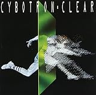

[")](http://www.amazon.co.jp/exec/obidos/ASIN/4906700322/tortoisetau09-22/)

[エレクトロ・ヴォイス 変声楽器ヴォコーダー/トークボックスの文化史 (P-Vine Books)](http://www.amazon.co.jp/exec/obidos/ASIN/4906700322/tortoisetau09-22/)

- 作者: デイヴ・トンプキンズ,新井崇嗣
- 出版社/メーカー: [スペースシャワーネットワーク](http://d.hatena.ne.jp/keyword/%A5%B9%A5%DA%A1%BC%A5%B9%A5%B7%A5%E3%A5%EF%A1%BC%A5%CD%A5%C3%A5%C8%A5%EF%A1%BC%A5%AF)
- 発売日: 2012/05/18
- メディア: 単行本
- クリック: 3回
- [この商品を含むブログ (5件) を見る](http://d.hatena.ne.jp/asin/4906700322/tortoisetau09-22)

　デイヴ・トンプキンズの大著『エレクトロ・ヴォイス　変声楽器[ヴォコーダー](http://d.hatena.ne.jp/keyword/%A5%F4%A5%A9%A5%B3%A1%BC%A5%C0%A1%BC)／[トーク](http://d.hatena.ne.jp/keyword/%A5%C8%A1%BC%A5%AF)ボックスの文化史』を読んだ。通史的な書き方でも物語ちっくな書き方でもなく割と散漫な印象を拭えない（最後の[RAMMELLZEE](http://d.hatena.ne.jp/keyword/RAMMELLZEE)を扱った章なんかは端的にカオスだ）し、何年に[ヴォコーダー](http://d.hatena.ne.jp/keyword/%A5%F4%A5%A9%A5%B3%A1%BC%A5%C0%A1%BC)が生まれて～みたいなさっくりとした記述を求めると特にフラストレーションが貯まるだろうな。そういうわけでちょっと評価に困る本なのだが、面白いエピソードは満載だ。いちばん興味深かったのはじつは[ヴォコーダー](http://d.hatena.ne.jp/keyword/%A5%F4%A5%A9%A5%B3%A1%BC%A5%C0%A1%BC)と軍事技術の関係などではなくて、むしろ[デトロイト・テクノ](http://d.hatena.ne.jp/keyword/%A5%C7%A5%C8%A5%ED%A5%A4%A5%C8%A1%A6%A5%C6%A5%AF%A5%CE)と[ヴェトナム戦争](http://d.hatena.ne.jp/keyword/%A5%F4%A5%A7%A5%C8%A5%CA%A5%E0%C0%EF%C1%E8)の意外な関係だ。

<iframe width="560" height="315" src="https://www.youtube.com/embed/GxM6m1UojjA" frameborder="0" allowfullscreen></iframe>

　[デトロイト・テクノ](http://d.hatena.ne.jp/keyword/%A5%C7%A5%C8%A5%ED%A5%A4%A5%C8%A1%A6%A5%C6%A5%AF%A5%CE)の始祖といえば[Cybotron](http://d.hatena.ne.jp/keyword/Cybotron)であり、テクノの[ゴッドファーザー](http://d.hatena.ne.jp/keyword/%A5%B4%A5%C3%A5%C9%A5%D5%A5%A1%A1%BC%A5%B6%A1%BC)はそのメンバー、[ホアン・アトキンス](http://d.hatena.ne.jp/keyword/%A5%DB%A5%A2%A5%F3%A1%A6%A5%A2%A5%C8%A5%AD%A5%F3%A5%B9)であるというのは広く知られた事実だ。しかし、このClearという代表曲には、アトキンスの相棒であるリック・デイヴィスの[ヴェトナム戦争](http://d.hatena.ne.jp/keyword/%A5%F4%A5%A7%A5%C8%A5%CA%A5%E0%C0%EF%C1%E8)への従軍経験が影を落としているのだという。

> 「クリアー」はクラブから最も遠いところにある。同曲はあくまで、現実に対処しようと、混乱する頭をどうにかクリアーにしようとしている男の歌だ。ワシントンから[サイゴン](http://d.hatena.ne.jp/keyword/%A5%B5%A5%A4%A5%B4%A5%F3)へ、[ヴォコーダー](http://d.hatena.ne.jp/keyword/%A5%F4%A5%A9%A5%B3%A1%BC%A5%C0%A1%BC)を介して何が伝えられたにしろ、リック・デイヴィスはそれを遠い密林の中、自らの手で行った。[キッシンジャー](http://d.hatena.ne.jp/keyword/%A5%AD%A5%C3%A5%B7%A5%F3%A5%B8%A5%E3%A1%BC)の言う「徹底的な」無数の爆撃によってできた空き地の中、文字通り死にもの狂いで。**「“クリアー”は軍事用語だ」とデイヴィスは言う。軍事行動に必要とされる場の確保は、村人全員の虐殺も意味する。「我々の視界をクリアーに」し、やつらの動きを一掃［クリアー］しろ。**[\*1](#f-39178bee "『エレクトロ・ヴォイス』、168頁。強調は筆者が加えた")。

　曲のなかで執拗に反復される「Clear ××（～をクリアーせよ）」は、アトキンスによる来るべき未来へ備えた自己変革を促す啓示であると同時に、デイヴィスを襲う[ヴェトナム戦争](http://d.hatena.ne.jp/keyword/%A5%F4%A5%A7%A5%C8%A5%CA%A5%E0%C0%EF%C1%E8)のトラウマでもあるのだ。デイヴィスのトラウマは相当深刻なものだったようだ。

> “[R-9](http://d.hatena.ne.jp/keyword/R-9)”をレコーディング中のある晩、[ホアン・アトキンス](http://d.hatena.ne.jp/keyword/%A5%DB%A5%A2%A5%F3%A1%A6%A5%A2%A5%C8%A5%AD%A5%F3%A5%B9)は[ミシガン州](http://d.hatena.ne.jp/keyword/%A5%DF%A5%B7%A5%AC%A5%F3%BD%A3)イブシランティの［ティー・ティーズ・スピークイージー］の階上にあったサイボトロンのスタジオに向かった。中に入ると、パジャマ姿のデイヴィスが[アサルトライフル](http://d.hatena.ne.jp/keyword/%A5%A2%A5%B5%A5%EB%A5%C8%A5%E9%A5%A4%A5%D5%A5%EB)を抱えて立っていた。「あいつはよく夜警をしていた。ライフルを構えて、ひとりで機動演習を。いや、頭がおかしいとか、そういうふうには思わなかったよ。親友だったし。まあ、ちょっとびっくりしたのは確かだけど」。アトキンスが大丈夫かたずねると、デイヴィスは言った。「ああ……たまにこういう夢を見るんだ」。[\*2](#f-7e643568 "同上、171-172頁")

　[Cybotron](http://d.hatena.ne.jp/keyword/Cybotron)の不気味な黙示録的音像は[ヴェトナム戦争](http://d.hatena.ne.jp/keyword/%A5%F4%A5%A7%A5%C8%A5%CA%A5%E0%C0%EF%C1%E8)というトラウマから立ち直るためのセラプティックな効果を持っていたわけだ。アルバムの最後を飾るEl Salvadorのアウトロは、[シンセサイザー](http://d.hatena.ne.jp/keyword/%A5%B7%A5%F3%A5%BB%A5%B5%A5%A4%A5%B6%A1%BC)で再現されたヘリコプターの飛行音と、乾いた銃声を模したパーカッシヴなSEに彩られている。　

<iframe width="560" height="315" src="https://www.youtube.com/embed/GEiUnh8zwpo" frameborder="0" allowfullscreen></iframe>

[Clear](http://www.amazon.co.jp/exec/obidos/ASIN/B000000XD1/tortoisetau09-22/)

- アーティスト: [Cybotron](http://d.hatena.ne.jp/keyword/Cybotron)
- 出版社/メーカー: Fantasy
- 発売日: 1995/05/03
- メディア: CD
- クリック: 2回
- [この商品を含むブログ (7件) を見る](http://d.hatena.ne.jp/asin/B000000XD1/tortoisetau09-22)

[\*1](#fn-39178bee):『エレクトロ・ヴォイス』、168頁。強調は筆者が加えた

[\*2](#fn-7e643568):同上、171-172頁
