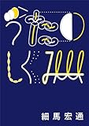

[うたのしくみ](http://www.amazon.co.jp/exec/obidos/ASIN/4835618769/tortoisetau09-22/)

- 作者: [細馬宏通](http://d.hatena.ne.jp/keyword/%BA%D9%C7%CF%B9%A8%C4%CC)
- 出版社/メーカー: ぴあ
- 発売日: 2014/03/18
- メディア: 単行本
- [この商品を含むブログ (13件) を見る](http://d.hatena.ne.jp/asin/4835618769/tortoisetau09-22)

　読みたくて読みたくて、読みた過ぎて読めなかった本を、ようやく読んだ。[細馬宏通](http://d.hatena.ne.jp/keyword/%BA%D9%C7%CF%B9%A8%C4%CC)さんの文章によく触れていたわけでは決してないけれども、たとえば[ドナルド・フェイゲンのナイトフライを扱ったこのコラム](http://modernfart.jp/2014/09/12520/)や雑誌掲載の論考など、よく目にしていた。そこから直観的にこの本はとても良い本だろうと感じていたから、いつか読もうと思いつつ、なぜか敬遠してもいたのだった。もはや読み終えた今、その理由はさだかでないけれど、音楽のみならずアニメーションや視覚文化論までを扱った細馬さんの本をもっと読んでみたくなった。

　そうした思い入れはともかくとして、いかにこの本が素晴らしいかといえば、ミクロな、きわめてミクロな「うた」[\*1](#f-e9a17e8f "ここでは細馬さんにならって、意味のある言葉ともたんなる声とも違う歌に特有の声の意で、かっこつきの「うた」という表記を使う。")の呼吸に寄り添いながら、歌い手の、あるいは歌そのものの持つ奥行きを垣間見せてくれるという点に尽きると思う。その奥行きもまた、ときに「うた」という営みの持つ根源的な性格であったり、あるいは「うた」を支える文化的な枠組であったり、さらにはその「うた」を産んだ（例えば）アメリカ文化という広大な歴史的深みであったり、多様な姿をとって目の前にあらわれてくるかのようだ。

　「語りと歌のあいだ」と題された章では、[文部省唱歌](http://d.hatena.ne.jp/keyword/%CA%B8%C9%F4%BE%CA%BE%A7%B2%CE)の「お正月」が取り上げられる。とるにたらないこどもの歌じゃないか。と思うなかれ、その「うた」をていねいにひらいていくと、ふと次のような洞察が舞い降りてくる。

> こんな風に、わずか四行の「お正月」を歌うとき、わたしたちは歌と語りのあいだを往復する。沿いの結果、ここから遠く離れたお正月へ連れて行かれ、またここに戻ってくる。そして不思議なことに、歌い終わると、この場所は、さっきより少し居心地の良い場所、はやくこいこいとお正月を待つことのできる場所になっている。[\*2](#f-e56af2d5 "『うたのしくみ』43頁")

　文字にすれば四行にすぎない「お正月」の「うた」としての生理をひもとくことで、いつのまにか読者は「語り」と「うた」のあわいがこの「うた」にひそんでいること、そして、そのあわいは「夢」と「いま、ここ」のあわいとひそかに重なり合っていることに気付かされる。短いコラムだけれど、見事だと思う。

　そしてまた、「うた」のミクロな分析を通じて蓄積された納得が、たとえばミュージカル・ナンバーの分析に援用されるとき、どうも馴染みの薄い世界だったミュージカルという表現にも独自のルールがあり、それはまさしく「うた」の生理に基いていることが明かされる。これには驚嘆した。

> ［…］ミュージカルの舞台や映画では、歌は長い物語の一部であり、語りが歌になる理由、そしてその理由を語る方法がある。それが、オープニング・ヴァースや語りという形をとる。「虹の彼方に」は、そのように物語に埋め込まれた歌であり、わたしたちがしばしば耳にする「虹の彼方に」は、そうした物語から取り出された、コーラスなのです。[\*3](#f-1b55e3cb "『うたのしくみ』71頁")

　ほか、メインとなった連載「うたのしくみ」に加えて収録されたライナーノーツほかの文章も、とりわけ[松本隆](http://d.hatena.ne.jp/keyword/%BE%BE%CB%DC%CE%B4)のドラミングと歌詞の関係を考察した「金属の肺、のびあがる体―[松本隆](http://d.hatena.ne.jp/keyword/%BE%BE%CB%DC%CE%B4)の詞とドラマーの生理―」や、[大瀧詠一](http://d.hatena.ne.jp/keyword/%C2%E7%C2%ED%B1%D3%B0%EC)が自身の活動のいたるところに仕掛けた「聞くこと」そのものを挑発する試みを辿った「「聞くこと」を揺らすテクノロジー―[大瀧詠一](http://d.hatena.ne.jp/keyword/%C2%E7%C2%ED%B1%D3%B0%EC)の諸活動にみる「どこにもナイアガラ」現象―」は白眉といえる。

　ひとつ気になったことといえば、装丁が少し独特で、やわらかい[明朝体](http://d.hatena.ne.jp/keyword/%CC%C0%C4%AB%C2%CE)がかえって目に障るところがあった。濁点を見間違えることもあって、これはちょっと困った。星ひとつ引くにもあたわない程度のことだけれど。

[\*1](#fn-e9a17e8f):ここでは細馬さんにならって、意味のある言葉ともたんなる声とも違う歌に特有の声の意で、かっこつきの「うた」という表記を使う。

[\*2](#fn-e56af2d5):『うたのしくみ』43頁

[\*3](#fn-1b55e3cb):『うたのしくみ』71頁
