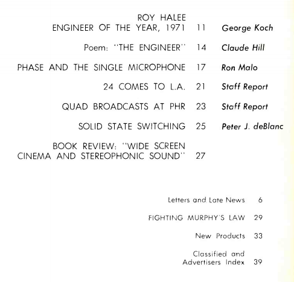
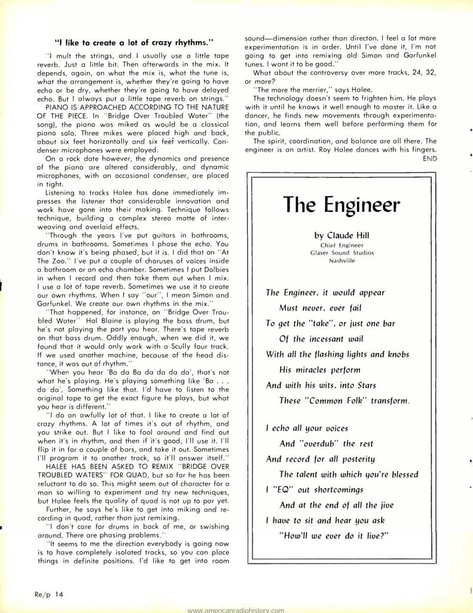
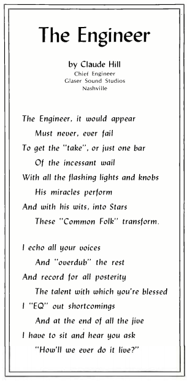
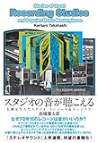

<iframe src="https://hatenablog-parts.com/embed?url=http%3A%2F%2Fwww.americanradiohistory.com%2FRecording_Engineer_Producer.htm" title="RECORDING ENGINEER PRODUCER - Professional Studio and Audio magazine from 1970 to 1992" class="embed-card embed-webcard" scrolling="no" frameborder="0" style="display: block; width: 100%; height: 155px; max-width: 500px; margin: 10px 0px;"></iframe>

[www.americanradiohistory.com](http://www.americanradiohistory.com/Recording_Engineer_Producer.htm)

　上に掲げたリンクは、_Recording Engineer / Producer（略称・Re/P）_といって、1970年から92年にかけて発行されたレコーディング技術に関するアメリカの雑誌をアーカイヴしたものだ。ほんの数冊をのぞいてほぼ全てがPDF化されており、歴史的資料として非常に興味深い。めぼしい記事はないかと目次を眺めていると、奇妙なコンテンツを見つけた。[1971年11・12月号](http://www.americanradiohistory.com/Archive-Recording-Engineer/70s/Recording-1971-12.pdf)の目次にはこうある。

> **Poem: “THE ENGINEER” 14 Claude Hill**

　詩って……　詩が載るの？　レコーディングエンジニアが読む雑誌に？　Re/Pの提供する記事はきわめて専門的で、しばしば電気工学の知識が必要な記事もある。実際、以下のように、「エンジニア・オブ・ジ・イヤー」とか「位相と単独のマイクロフォンについて」とか「ソリッド・ステイト・スウィッチングについて」みたいなコンテンツが並ぶ中、唐突に現れる「ポエム」はちょっと異様だ。

  
_目次ページ（部分）。上から二番目の項目に「ポエム」が見える。_

　果たしてこの「ポエム」はどのようなものなのか。ポエムという名の技術的ノウハウがなにかあるのか、それともエンジニアという職業をめぐる考察を主としたエッセイだったりして。と思って誌面をめくってみたところ、

　**ガチのやつやんか。**ページのおおよそ半分を占める、ABABで韻を踏んだ四行[連詩](http://d.hatena.ne.jp/keyword/%CF%A2%BB%ED)。ちょっと拡大してみよう。

　全体が伝えようとする「エンジニア像」は明快だ――すなわち、クリエイターとしてのエンジニア。エンジニアは巧みにコンソールを操り、音の連なりのなかからベストなテイクやフレーズを取り出す。彼の手にかかれば、「ふつうの人々」だって「スター」になれる。それも後世の人々にあなたの類まれな才能を伝えるという使命を背負ってのこと。しかし最後はちょっとしたオチがつく。あまりにエンジニアの手腕が行き届いているせいで、「これ、どうやってライヴでやんの？」とバンドから質問されるハメになるのだ。

　1940年代後半に第2次大戦が終わると、軍用に開発されていた磁気テープへの録音技術はただちに民生化されることになる。しかし、その主な活躍の場ははじめラジオ業界で、とりわけテープならば音質の劣化も最小限に編集が可能であることが強みになった。その後音楽録音に[もも](http://d.hatena.ne.jp/keyword/%A4%E2%A4%E2)ちろん活用されるようになるが、1960年代に入ると、いわゆる多重録音の急速な進歩[1](#fn:1)にともなって、たとえば[ビートルズ](http://d.hatena.ne.jp/keyword/%A5%D3%A1%BC%A5%C8%A5%EB%A5%BA)と[ジョージ・マーティン](http://d.hatena.ne.jp/keyword/%A5%B8%A5%E7%A1%BC%A5%B8%A1%A6%A5%DE%A1%BC%A5%C6%A5%A3%A5%F3)のようなアーティスト＋エンジニア兼アレンジャーがその可能性を広げていくことになる。しかるに、1971年という年はちょうど、ロックも含めたポピュラー・ミュージックにおけるエンジニアの存在感が増していくただなかにあった。楽器としてのスタジオ、そしてアーティストとしてのエンジニアが切り開く可能性はまだまだ未知ではあったかもしれないが、その変化に思わず筆を執ってしまったのだろうと思う。

　最後に、拙訳ながらこの作品、《エンジニア》を味わってもらいたい。そこには確かな腕の職人としてのプライドが、クリエイターとしての自負へと変わりつつあるさまがありありと映し出されている。

> ## エンジニア
> 
> クロード・[ヒル](http://d.hatena.ne.jp/keyword/%A5%D2%A5%EB) 作  
> [ナッシュヴィル](http://d.hatena.ne.jp/keyword/%A5%CA%A5%C3%A5%B7%A5%E5%A5%F4%A5%A3%A5%EB)、グレイザーサウンドスタジオ、チーフ・エンジニア  
> 　  
> エンジニア、顕れしその姿は  
> 　　　　過去も未来も誤ることがあってはならぬ  
> 「テイク」を、あるいはたった一小節を  
> 　　　　絶え間ない唸りから得ることにかけては  
> 　  
> 光り輝く灯りやノブを操り  
> 　　　　彼は奇跡を起こす  
> 彼の機知によって、スターたちへと  
> 　　　　この「ふつうのひとびと」は変身するのだ  
> 　  
> 私はあなたのすべての声に共鳴し[2](#fn:2)  
> 　　　　そしてのこりを「オーバーダブ」する  
> 記録するのだ、あらゆる未来の人々のため  
> 　　　　あなたに恵まれたその才能を  
> 　  
> 私は瑕どもを「EQ」で始末してやる  
> 　　　　ぜんぶのジャイヴがかたづくと、  
> 私は座ってあなたにこう尋ねられるはめになる  
> 　　　　「これどうやってライヴでやりゃいいのさ？」

[スタジオの音が聴こえる 名盤を生んだスタジオ、コンソール&エンジニア](http://www.amazon.co.jp/exec/obidos/ASIN/4907583516/tortoisetau09-22/)

- 作者: [高橋健太](http://d.hatena.ne.jp/keyword/%B9%E2%B6%B6%B7%F2%C2%C0)郎
- 出版社/メーカー: DU BOOKS
- 発売日: 2015/06/05
- メディア: 単行本
- [この商品を含むブログ (4件) を見る](http://d.hatena.ne.jp/asin/4907583516/tortoisetau09-22)

レコーディング・スタジオとその設備、空間に着目しながら、1970年代を中心とした名盤に秘められたマジックを紐解いていく名著。音源とともに読み進めると、まさしくレコードの向こうに「スタジオの音」が鳴り響いていることに気づかされる。本記事で取り上げたような、スタジオ・ワークによるクリエイションの可能性が模索されていた時期の記録としても。

* * *

1. 4トラックのレコーダーが普及したのは1950年代末、そこからトラック数は8トラック、16トラックと増え、1970年代には24トラックが標準となった。[↩](#fnref:1)
    
2. ここはもちろん「エコーをかける」と原文にはある。が、詩だもんなあ。と思ってやめた。[↩](#fnref:2)
