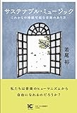
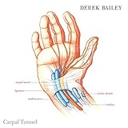

[サステナブル・ミュージック これからの持続可能な音楽のあり方](http://www.amazon.co.jp/exec/obidos/ASIN/4865591664/tortoisetau09-22/)

- 作者: 若尾裕,桑原紗織
- 出版社/メーカー: アルテスパブリッシング
- 発売日: 2017/06/26
- メディア: 単行本（ソフトカバー）
- [この商品を含むブログを見る](http://d.hatena.ne.jp/asin/4865591664/tortoisetau09-22)

　今年の6月に公開された、[元KORGの高橋達也氏へのAphex TwinことRichard D Jamesによるインタヴュー](http://item.warp.net/interview/aphex-twin-speaks-to-tatsuya-takahashi/)（そう、インタヴュアーが[Aphex Twin](http://d.hatena.ne.jp/keyword/Aphex%20Twin)なのだ）で熱心に語られた話題のひとつが、[KORG](http://d.hatena.ne.jp/keyword/KORG)の[シンセサイザー](http://d.hatena.ne.jp/keyword/%A5%B7%A5%F3%A5%BB%A5%B5%A5%A4%A5%B6%A1%BC)monologueに搭載されたマイクロ・チューニングのことだった。かんたんに説明すると、マイクロ・チューニングとは、[微分](http://d.hatena.ne.jp/keyword/%C8%F9%CA%AC)音――半音よりも小さな音程――を含む音律をユーザー自ら設定できる機能のことだ。いま僕たちの身の回りにある音楽のほとんどすべては、1[オクターヴ](http://d.hatena.ne.jp/keyword/%A5%AA%A5%AF%A5%BF%A1%BC%A5%F4)を12等分した[平均律](http://d.hatena.ne.jp/keyword/%CA%BF%B6%D1%CE%A7)という音律に基いて作曲されている。では、なぜ[Aphex Twin](http://d.hatena.ne.jp/keyword/Aphex%20Twin)はそこからの逸脱を望むのだろうか。

<iframe width="560" height="315" src="https://www.youtube.com/embed/hUT01p-C2xo?rel=0" frameborder="0" allowfullscreen></iframe>

　若尾裕『[サステナブル](http://d.hatena.ne.jp/keyword/%A5%B5%A5%B9%A5%C6%A5%CA%A5%D6%A5%EB)・ミュージック　これからの持続可能な音楽のあり方』（アルテス・パブリッシング、2017）に収められたエッセイを紐解くと、それが単なるアーティストの気まぐれや妄執にとどまらない問題の射程をもつことがよくわかると思う。18世紀後半に[平均律](http://d.hatena.ne.jp/keyword/%CA%BF%B6%D1%CE%A7)とほぼ並行して確立した（というか[平均律](http://d.hatena.ne.jp/keyword/%CA%BF%B6%D1%CE%A7)の誕生によってはじめて本格的に可能性が花開いた）、調性の概念や和声法といった技法は、私たちをとりまく音楽をいまだ形式の面から規定し続けている。そればかりではない。調性や和声法の発展を支えた[イデオロギー](http://d.hatena.ne.jp/keyword/%A5%A4%A5%C7%A5%AA%A5%ED%A5%AE%A1%BC)は、むしろより俗化し、強固なものになっているとも言える。本書で用いられていることばで表現するなら、その[イデオロギー](http://d.hatena.ne.jp/keyword/%A5%A4%A5%C7%A5%AA%A5%ED%A5%AE%A1%BC)とは、《音楽による情動の管理》ということになるだろう。すなわち、メジャー・キーの音楽では楽しくなって、マイナー・キーの音楽では哀しくなる、あるいは、特定のコード進行を聴くとヤバいくらいエモくなる、等々。それは単なるポップ・ミュージックのテイストの問題ではない。この[イデオロギー](http://d.hatena.ne.jp/keyword/%A5%A4%A5%C7%A5%AA%A5%ED%A5%AE%A1%BC)は、現代を生きる私たちにとって、深く身体化されてしまっているのだ。実際、ミューザックの例を出すまでもなく、音楽を通した情動の管理は、日々の暮らしに介入し、私たちの身体や精神のあり方に深く影響を及ぼしている。

　本書において一貫しているのは、前述したような[イデオロギー](http://d.hatena.ne.jp/keyword/%A5%A4%A5%C7%A5%AA%A5%ED%A5%AE%A1%BC)への違和感の表明であり、「その後」の音楽のあり方を模索するための思索だ。本書は、近代[音楽史](http://d.hatena.ne.jp/keyword/%B2%BB%B3%DA%BB%CB)からポップ・ミュージック、あるいはサウンド・スケープ論をはじめとする聴覚文化論から[音楽療法](http://d.hatena.ne.jp/keyword/%B2%BB%B3%DA%CE%C5%CB%A1)、そして音楽をめぐるエコ（ロジー／ノミー）システムに至るまで、幅広いテーマを扱う。そのバラエティの豊富さは、臨床[音楽学](http://d.hatena.ne.jp/keyword/%B2%BB%B3%DA%B3%D8)というわりあいに学際的な領域を専門とする若尾ならではの視点によるものだろう。書名にもなっている“[サステナブル](http://d.hatena.ne.jp/keyword/%A5%B5%A5%B9%A5%C6%A5%CA%A5%D6%A5%EB)・ミュージック”とは近年になって応用[民族音楽学](http://d.hatena.ne.jp/keyword/%CC%B1%C2%B2%B2%BB%B3%DA%B3%D8)という新興の分野から提唱され始めた概念だという。そこで問題にされるのは地球環境をめぐる持続性であり、経済的な持続性でもあるのだけれど、それだけにとどまらず、既存の[イデオロギー](http://d.hatena.ne.jp/keyword/%A5%A4%A5%C7%A5%AA%A5%ED%A5%AE%A1%BC)を乗り越えた後に広がる風景を考えるためのキーワードとして、本書の問題意識とよくマッチしている。

<iframe width="560" height="315" src="https://www.youtube.com/embed/hxPsXPCR5MU?rel=0" frameborder="0" allowfullscreen></iframe>

　どのエッセイも印象深く、出て来る固有名詞を列挙するだけでも（たとえばThe [Shaggs](http://d.hatena.ne.jp/keyword/Shaggs)に割かれた一節もある！）その内容の豊かさは保証できるのだが、いかんせんそのすべてを紹介するわけにはいかない。なかでもとりわけ印象的なのは、[デレク・ベイリー](http://d.hatena.ne.jp/keyword/%A5%C7%A5%EC%A5%AF%A1%A6%A5%D9%A5%A4%A5%EA%A1%BC)に捧げられた追悼文だった。全体から見ればささやかな小文かもしれないが、著者のアティチュードがよくあらわれたエッセイであるように思う。

　第3章の4節に収録された「[デレク・ベイリー](http://d.hatena.ne.jp/keyword/%A5%C7%A5%EC%A5%AF%A1%A6%A5%D9%A5%A4%A5%EA%A1%BC)」追悼で取り上げられるのは、フリー・[インプロヴィゼーション](http://d.hatena.ne.jp/keyword/%A5%A4%A5%F3%A5%D7%A5%ED%A5%F4%A5%A3%A5%BC%A1%BC%A5%B7%A5%E7%A5%F3)の追究者としてのストイックな姿勢と、運動[ニューロン](http://d.hatena.ne.jp/keyword/%A5%CB%A5%E5%A1%BC%A5%ED%A5%F3)疾患を発症して以降の彼の足跡だ。[デレク・ベイリー](http://d.hatena.ne.jp/keyword/%A5%C7%A5%EC%A5%AF%A1%A6%A5%D9%A5%A4%A5%EA%A1%BC)は、既存のあらゆるイディオム（音楽的な[ボキャブラ](http://d.hatena.ne.jp/keyword/%A5%DC%A5%AD%A5%E3%A5%D6%A5%E9)リー）に依存することのない、純粋な即興演奏を目指したギタリストだった。しかし彼は病に侵され、次第に身体の自由が効かなくなる運動[ニューロン](http://d.hatena.ne.jp/keyword/%A5%CB%A5%E5%A1%BC%A5%ED%A5%F3)疾患を発症し、2005年に亡くなった。若尾が注目し、そして賛辞を送るのは、ピックを持つこともままならなくなったベイリーが、ギタリストとして選んだ方法だった。若尾が述べるように、病や障害によって身体の自由を奪われた[演奏家](http://d.hatena.ne.jp/keyword/%B1%E9%C1%D5%B2%C8)が、それを克服してみせるという逸話はけっして少なくない。しかしベイリーは、病を克服して演奏生活に復帰することではなく、病に侵されたその身体にあわせて、新たな奏法を編み出し、実験し、探求し続けることを選んだ。音楽に対して身体をアジャストするのではなく、身体にあわせて新しい音楽をつくりだす。そこには、病を喪失として捉え、芸術を通してその喪ったものを取り戻すといったかたちのナラティヴは存在しない。むしろ、新たな可能性を開くものとして病があるかのようでさえある。

<iframe width="560" height="315" src="https://www.youtube.com/embed/MMTnNanbMKE?rel=0" frameborder="0" allowfullscreen></iframe>

　ベイリーのエピソードは、外部から押し付けられた近代的な音楽の[ボキャブラ](http://d.hatena.ne.jp/keyword/%A5%DC%A5%AD%A5%E3%A5%D6%A5%E9)リーから自分自身を解放することの意義を、考えさせてくれる。そのストイックさは、病との付き合い方さえも変えてしまう。本書で若尾はしばしば[フーコー](http://d.hatena.ne.jp/keyword/%A5%D5%A1%BC%A5%B3%A1%BC)の中後期の著作から借りた「生政治」（大雑把にいえば、人間の生や身体の領域にまで及ぶ権力形態）という概念を用いるが、[演奏家](http://d.hatena.ne.jp/keyword/%B1%E9%C1%D5%B2%C8)としてのベイリーの選択は、生政治的な権力を乗り越えた個のあり方を示そうとした、後期[フーコー](http://d.hatena.ne.jp/keyword/%A5%D5%A1%BC%A5%B3%A1%BC)の問題意識に通底するようにも思える。病に侵されたベイリーにおいては、新たな生の様式を発明することと、新たな音楽を産み出すことがほとんどイコールで結ばれるのだ。

　翻って[Aphex Twin](http://d.hatena.ne.jp/keyword/Aphex%20Twin)とマイクロ・チューニングに目を向けなおしてみると、[平均律](http://d.hatena.ne.jp/keyword/%CA%BF%B6%D1%CE%A7)から脱して自分の音律をつくりだすことも、《音楽による情動の管理》という[イデオロギー](http://d.hatena.ne.jp/keyword/%A5%A4%A5%C7%A5%AA%A5%ED%A5%AE%A1%BC)に対する抵抗のひとつのかたちと言えなくもない。とりわけ、[Aphex Twin](http://d.hatena.ne.jp/keyword/Aphex%20Twin)のように、ダンスミュージックという身体性の強い音楽においてそれを実践することは、単なるギミック以上のものを意味するように思える。とりわけSyro以降の諸作の、過剰なセンチメンタリズムから離れて、音と自在に戯れてみせるかのような音色やメロディラインに特にそれを感じる（あるいは[AFX](http://d.hatena.ne.jp/keyword/AFX)名義だともともとそんな感じではあったのだけれど）。

　ちなみに、ごく個人的な意味でこの本から得た最大の収穫は、[アンフォルメル](http://d.hatena.ne.jp/keyword/%A5%A2%A5%F3%A5%D5%A5%A9%A5%EB%A5%E1%A5%EB)のキーパーソンであり、[アール・ブリュット](http://d.hatena.ne.jp/keyword/%A5%A2%A1%BC%A5%EB%A1%A6%A5%D6%A5%EA%A5%E5%A5%C3%A5%C8)の名付け親であるJean Dubuffetがテープ音楽を手がけていたことを知れたという点にある。実際にその作品を聴いてみると、[アンフォルメル](http://d.hatena.ne.jp/keyword/%A5%A2%A5%F3%A5%D5%A5%A9%A5%EB%A5%E1%A5%EB)期のDubuffetの絵画をそのまま音楽化したみたいな曲もあって、非常に面白かった。その音楽は徹底的にローファイで、緻密にプロセスされたミュジック・コンクレートやケージなんかのコラージュ的なテープ作品なんかとは違う、愛らしさがある。自身の展覧会にあわせて発表されたテープ作品《Music pour Coucou Bazar》は[Apple Music / iTunes Store](https://geo.itunes.apple.com/jp/album/coucou-bazar/id881888277?mt=1&app=music)や[Spotify](<iframe src="https://open.spotify.com/embed/album/7M2ZIuwIXC3CQSvSPjNVjz" width="300" height="380" frameborder="0" allowtransparency="true" allow="encrypted-media"></iframe>)上でも聴くことができる。

[KORG モノフォニック・アナログ・シンセサイザー monologue-BK モノローグ ブラック](http://www.amazon.co.jp/exec/obidos/ASIN/B01MXVWGSW/tortoisetau09-22/)

- 出版社/メーカー: [KORG](http://d.hatena.ne.jp/keyword/KORG)
- メディア: エレクトロニクス
- [この商品を含むブログを見る](http://d.hatena.ne.jp/asin/B01MXVWGSW/tortoisetau09-22)

ちなみに先日monologue買っちゃったんですが、めっちゃ良いシンセです。ステップ[シーケンサー](http://d.hatena.ne.jp/keyword/%A5%B7%A1%BC%A5%B1%A5%F3%A5%B5%A1%BC)がよくできてて、さくさくっとかなりアシッドっぽい音が出せます。まだ使いこなせてないけど！　また今度記事書きます。

[Carpal Tunnel](http://www.amazon.co.jp/exec/obidos/ASIN/B01N6LR05D/tortoisetau09-22/)

- アーティスト: [デレク・ベイリー](http://d.hatena.ne.jp/keyword/%A5%C7%A5%EC%A5%AF%A1%A6%A5%D9%A5%A4%A5%EA%A1%BC)
- 出版社/メーカー: Tzadik
- 発売日: 2005/08/09
- メディア: MP3 ダウンロード
- [この商品を含むブログを見る](http://d.hatena.ne.jp/asin/B01N6LR05D/tortoisetau09-22)

[Coucou Bazar](http://www.amazon.co.jp/exec/obidos/ASIN/B00FHG25NM/tortoisetau09-22/)

- アーティスト: Jean Dubuffet
- 出版社/メーカー: Sub Rosa
- 発売日: 2013/11/12
- メディア: CD
- [この商品を含むブログ (1件) を見る](http://d.hatena.ne.jp/asin/B00FHG25NM/tortoisetau09-22)
