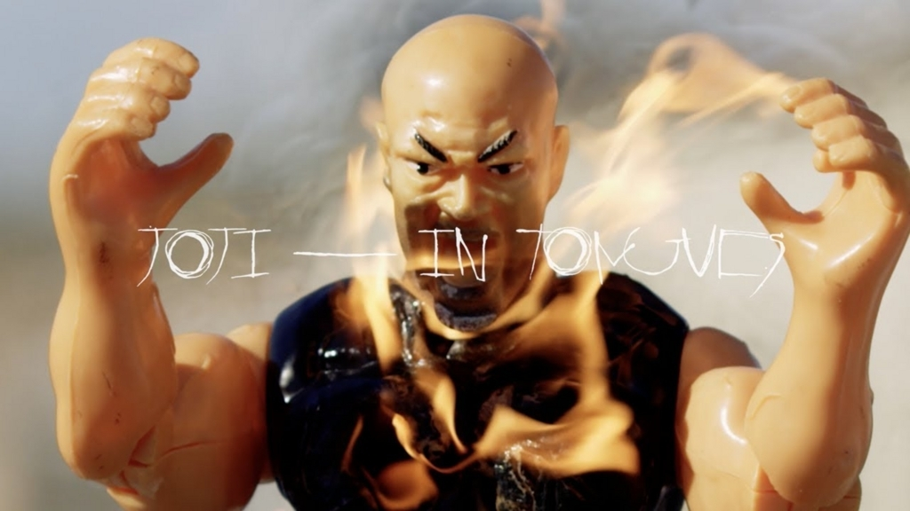

　インターネット発の[ミーム](http://d.hatena.ne.jp/keyword/%A5%DF%A1%BC%A5%E0)・ミュージックといえばVaporwaveを挙げる人は多いだろうと思う。が、Vaporwaveが一種のカルト的なステータスをほしいままにしている一方で、地味に勢力を伸ばしてきた[ミーム](http://d.hatena.ne.jp/keyword/%A5%DF%A1%BC%A5%E0)・ミュージックがある。ローファイ・ヒップホップだ。ローファイ・ヒップホップ、と言うとざらついたラフな音像のハードコアなヒップホップを想像してしまう人もいるかもしれないが、インターネットでローファイ・ヒップホップといえば、流麗でジャジーなサンプルをヨレたビートに乗せたインスタントなビートのことを指す。インスタントな、というのは決して悪い意味ではなくて、Vaporwaveの美学と通底する反技巧的な「何気なさ」を持った感じ、と言葉を補ったほうがいいかもしれない。

<iframe width="560" height="315" src="https://www.youtube.com/embed/RdPHfyFRF9E" frameborder="0" allowfullscreen></iframe>

<iframe width="560" height="315" src="https://www.youtube.com/embed/V3uEPETNJW0" frameborder="0" allowfullscreen></iframe>

　ローファイ・ヒップホップは、この4,5年くらい、[SoundCloud](http://d.hatena.ne.jp/keyword/SoundCloud)や[YouTube](http://d.hatena.ne.jp/keyword/YouTube)を通じて広く流布し、近年では[Spotify](http://d.hatena.ne.jp/keyword/Spotify)や[Apple](http://d.hatena.ne.jp/keyword/Apple) Musicといったストリーミングサービスでも聴くことができるようになった。特に[YouTube](http://d.hatena.ne.jp/keyword/YouTube)にはローファイ・ヒップホップに特化した[ライブストリーミング](http://d.hatena.ne.jp/keyword/%A5%E9%A5%A4%A5%D6%A5%B9%A5%C8%A5%EA%A1%BC%A5%DF%A5%F3%A5%B0)チャンネルや楽曲配信チャンネルも数多く存在していて、日本産のアニメからサンプリングしたアートワークと共に、底知れぬコアなリスナー層を獲得している。アーティスト名や曲名での日本語の使用や、アニメからのサンプリングといった要素はVaporwave～Future Funkと共振するもので、実際Vaporwave界でいまもっとも重要なアーティストのひとりと言ってよい猫 シ Corp.もローファイ・ヒップホップのアルバムをリリースしている。

<iframe style="border: 0; width: 100%; height: 120px;" src="https://bandcamp.com/EmbeddedPlayer/album=3433195316/size=large/bgcol=ffffff/linkcol=0687f5/tracklist=false/artwork=small/transparent=true/" seamless=""><a href="http://catsystemcorp.bandcamp.com/album/lofi">lofi by 猫 シ Corp.</a></iframe>

　機材面で言えばこのジャンルにおいて多用されるのが[Roland](http://d.hatena.ne.jp/keyword/Roland)の[サンプラー](http://d.hatena.ne.jp/keyword/%A5%B5%A5%F3%A5%D7%A5%E9%A1%BC)SP-404SXで、以下のMujo 情のように[SP-404](http://d.hatena.ne.jp/keyword/SP-404)一台でパフォーマンスする様子を[YouTube](http://d.hatena.ne.jp/keyword/YouTube)で配信するビートメイカーも数多い。[SP-404](http://d.hatena.ne.jp/keyword/SP-404)は価格も手ごろで扱いやすく、SPシリーズならではの高品質なエフェクトが搭載されている点も人気を呼んでいるのであろうと思う。ポスト・[ダブステップ](http://d.hatena.ne.jp/keyword/%A5%C0%A5%D6%A5%B9%A5%C6%A5%C3%A5%D7)系のバンドがサンプルを鳴らすのに404を使っているのを見ることも多々ある。

<iframe width="560" height="315" src="https://www.youtube.com/embed/H2qULo7SpBw" frameborder="0" allowfullscreen></iframe>

　こうしたローファイ・ヒップホップの流れが地下から浮上しつつある、と思う出来事が今月の頭にあった。大阪出身、日豪ハーフのアーティスト、jojiのリリースだ。jojiはもともとFilthy Frankという名前でYouTuberをやっていて、例のHarlem Shakeの[ミーム](http://d.hatena.ne.jp/keyword/%A5%DF%A1%BC%A5%E0)に一枚噛んでいることでも知られている。ピンクの全身タイツに身を包んだ彼のちょっとお下品なパフォーマンスを眼にしたことがある人も少なくないと思う。

<iframe width="560" height="315" src="https://www.youtube.com/embed/hjT7OlYB5C8" frameborder="0" allowfullscreen></iframe>

　音楽活動としてはPink Guy名義でマジでとんでもなく下世話なラップを披露するアルバムを今年の頭にリリースしていて、なんかやべー奴という感じだったのだが、一転joji名義ではローファイ・ヒップホップ的な優しく切ないサウンドに乗せて朴訥とした歌声を披露し、失恋をテーマにしたシリアスな内容もあってリスナーを驚かせもした。

<iframe width="560" height="315" src="https://www.youtube.com/embed/0c_mhrB7LlQ" frameborder="0" allowfullscreen></iframe>

<iframe width="560" height="315" src="https://www.youtube.com/embed/VNyGaTO0dU0" frameborder="0" allowfullscreen></iframe>

　耳馴染みのよいローファイ・ヒップホップ的なサウンドと内省的なリリックで、jojiは正式リリースのないまま話題を呼んでいた。[SoundCloud](http://d.hatena.ne.jp/keyword/SoundCloud)に発表されていた楽曲を集めたブートも[YouTube](http://d.hatena.ne.jp/keyword/YouTube)にアップロード数多くリリースされた。88risingというここ一年でもっとも勢いのあるメディアにフックアップされていたこともあって、ネット上ではすっかりバズを起こしていた。そして、満を持して11月3日、初のEP『In Tongues』がリリースされた。

<iframe width="560" height="315" src="https://www.youtube.com/embed/kU7LF5mYZkw" frameborder="0" allowfullscreen></iframe>

　EPのタイトルは、意訳するなら「うわごと」みたいな感じだろうか。熱に浮かされてつぶやくかのように綴られる、恋に敗れた男のうわごと。ローファイ・ヒップホップというには洗練されている、というところもないではないが、[SP-404](http://d.hatena.ne.jp/keyword/SP-404)一台を操りながら歌うjojiの姿はローファイ・ヒップホップ的な文脈を多分に想起させてやまない。

<iframe width="560" height="315" src="https://www.youtube.com/embed/cw4-bqSpVdo" frameborder="0" allowfullscreen></iframe>

　しかし、メディアや[SNS](http://d.hatena.ne.jp/keyword/SNS)上のバズに反して、ローファイ・ヒップホップのコミュニティではあいまいな評価が与えられているようだ。もう少し早くリリースされていれば、とか、もっと良いローファイ・ヒップホップのトラックはたくさんある、とか。言わんとすることはわからないではないし、joji本人だってローファイ・ヒップホップだと思ってそこで評価されるためにやっているわけではないだろう。とはいえ、ローファイ・ヒップホップの文脈のうえにひとりのスターが生まれたことはけっこう大事なことなんじゃないかと思ってしまう。

　ローファイ、という冠がつくサウンドといえば、同じくネット[ミーム](http://d.hatena.ne.jp/keyword/%A5%DF%A1%BC%A5%E0)的な広がりを見せるローファイ・ハウスというのもあるけれど、その代表選手といってよいDJ Seinfeldも先ごろアルバムをリリースした。変に色気を出さずにローファイハウス一直線のアルバムで結構好感を持った。あるいはニューヨークの韓国系女性シンガーのYaejiもぼんやりとローファイ・ハウスのかおりをまとっているようでもあり、jojiも含めてこうしたアーティストたちがインターネット上の「ローファイ」な文化をネット時代の[アンダーグラウンド](http://d.hatena.ne.jp/keyword/%A5%A2%A5%F3%A5%C0%A1%BC%A5%B0%A5%E9%A5%A6%A5%F3%A5%C9)から浮上させつつあるのは面白い。それがジャンルの終焉の兆しである可能性も十分あるのだが。

　一方、Vaporwaveは相変わらず地下で独自の道を突き進んでいて、陽の光なんか気にもしていないようで、それはそれで頼もしくもある。なんかとりとめなくなっちゃったな。
