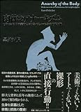

<iframe src="https://hatenablog-parts.com/embed?url=http%3A%2F%2Fashiya-museum.jp%2Fexhibition%2Fexhibition_new%2F11161.html" title="芦屋市立美術博物館　 小杉武久　音楽のピクニック" class="embed-card embed-webcard" scrolling="no" frameborder="0" style="display: block; width: 100%; height: 155px; max-width: 500px; margin: 10px 0px;"></iframe>

[ashiya-museum.jp](http://ashiya-museum.jp/exhibition/exhibition_new/11161.html)

芦屋市立美術博物館『[小杉武久](http://d.hatena.ne.jp/keyword/%BE%AE%BF%F9%C9%F0%B5%D7)　音楽のピクニック』へ。けっして規模の大きい展覧会ではないが、圧倒的な物量の資料展示とコンパクトながら選りすぐられた代表作の展示のバランスがよく、充実した内容だった。

[Instagram](https://www.instagram.com/p/BeUMg4ElWNG/)

[ハイレッド・センター](http://d.hatena.ne.jp/keyword/%A5%CF%A5%A4%A5%EC%A5%C3%A5%C9%A1%A6%A5%BB%A5%F3%A5%BF%A1%BC)の面々を中心とした1960年代のネオ・ダダ、反芸術を出発点とするアーティストの回顧展がここ数年続いていることもあり、間接的に小杉の活動初期の資料を目にする機会は多かった。それゆえ第一章から第二章にかけての資料はわりあいに目になじみのあるものがそこかしこに。その点、やはり、タージ・マハル旅行団以降の資料が興味深い。

1960年代から1970年代にかけては、[アヴァンギャルド](http://d.hatena.ne.jp/keyword/%A5%A2%A5%F4%A5%A1%A5%F3%A5%AE%A5%E3%A5%EB%A5%C9)な若いアーティストたちを週刊誌のような非専門誌、あるいはテレビがとりあげることがしばしばあった。いまや日常語となった「ハプニング」は、マスメディアと前衛アートの蜜月期にあったこの時代が生んだ、稀有な「アート専門用語の流行語化→定着」の例だ。

そういうわけでタージ・マハル旅行団もまた例に漏れず、我が道を行く革命的な若き音[楽家](http://d.hatena.ne.jp/keyword/%B3%DA%B2%C8)たちといったたたずまいで誌面を賑わせていた（「音楽で世界を駆ける怒涛の青春」『[平凡パンチ](http://d.hatena.ne.jp/keyword/%CA%BF%CB%DE%A5%D1%A5%F3%A5%C1)』1971年6月21日号）。あるいは[内田裕也](http://d.hatena.ne.jp/keyword/%C6%E2%C5%C4%CD%B5%CC%E9)、[かまやつひろし](http://d.hatena.ne.jp/keyword/%A4%AB%A4%DE%A4%E4%A4%C4%A4%D2%A4%ED%A4%B7)といったロックミュージシャンと肩を並べて出演した日比谷ロックフェスのフライヤーにしても、当時の混沌としたカルチャーが生み出す熱気をつたえてやまない。そうした文脈の副読本としては、黒ダライ児の『肉体の[アナーキズム](http://d.hatena.ne.jp/keyword/%A5%A2%A5%CA%A1%BC%A5%AD%A5%BA%A5%E0)』を越えるものはないと思うので一読を勧めたい。

[肉体のアナーキズム 1960年代・日本美術におけるパフォーマンスの地下水脈](http://www.amazon.co.jp/exec/obidos/ASIN/4903341127/tortoisetau09-22/)

- 作者: 黒ダライ児
- 出版社/メーカー: grambooks
- 発売日: 2010/09/16
- メディア: 単行本
- クリック: 101回
- [この商品を含むブログ (13件) を見る](http://d.hatena.ne.jp/asin/4903341127/tortoisetau09-22)

その後、マース・カニンガム舞踊団の音楽監督を経てサウンド・アーティストとして活動してゆく近年までの流れも、その向こう側に透けて見える時代の変化を含めて見るとなかなか興味深い（芸術祭がちらほら見えてくるな、とか）。

一方、最初期の作品から最新作までを10点展示した第五章は、吹き抜けの空間と回廊を活かした展示構成となっていて、1F中央に設置された《Heterodyne II》が会場全体の空気をゆるやかに支配しているのが印象的だった。AMラジオと発振器が波打つノイズを静かに発する初期の代表作《Mano-dharma, electronic》や、近作の《Illuminated Summer II》といった作品も、照明を抑えた空間に溶け込んでいて見事だった。

ちり、ちり、と断続的なノイズのパルスを発するデ[バイス](http://d.hatena.ne.jp/keyword/%A5%D0%A5%A4%A5%B9)を組み合わせるシリーズ作品《Interspersion》が空間にリズムをつくり、陽の光がさしこむ窓辺には、[太陽電池](http://d.hatena.ne.jp/keyword/%C2%C0%CD%DB%C5%C5%C3%D3)で音を発する《Light Music》のシリーズが設置されてざわめく。音を使う作品は空間をつっきって互いに干渉し合ううえ、小杉の作品の音量は比較的小さいから、埋もれてしまったりかえって目立ってしまったり、このように開放的な空間に展開するのは存外に難しいものだと思うのだけれど、的確に配置されていた。

それぞれの作品は、その原理と動作の様子を見ればだいたいのア[イデア](http://d.hatena.ne.jp/keyword/%A5%A4%A5%C7%A5%A2)は把握できてしまうもので、ごくプリミティブな装いをしている。そこから出てくる音も、短波ノイズだったり、シンプルな[オシレーター](http://d.hatena.ne.jp/keyword/%A5%AA%A5%B7%A5%EC%A1%BC%A5%BF%A1%BC)からのパルスだったり、目新しいものではない。にもかかわらず、小杉の作品を前にすると、ゆるやかに変化していくその音の持続であったり、その音の響き方、あるいは余白へと注意が惹きつけられる。それゆえ、鑑賞しようと思えばそれこそいつまででも鑑賞し続けていられる強度がある。

ともすれば、1960年代以降、端的に言えば[フルクサス](http://d.hatena.ne.jp/keyword/%A5%D5%A5%EB%A5%AF%A5%B5%A5%B9)とその同時代人以降のアートの文脈に寄った音楽作品は、根本のア[イデア](http://d.hatena.ne.jp/keyword/%A5%A4%A5%C7%A5%A2)そのものが物象化され、もてはやされるきらいがある（先駆者として、ケージの《4'33"》がどのように[通俗的](http://d.hatena.ne.jp/keyword/%C4%CC%C2%AF%C5%AA)に受容されているかを考えればよい）。しかし、ア[イデア](http://d.hatena.ne.jp/keyword/%A5%A4%A5%C7%A5%A2)とその実装、そして演奏（展示）は質的にまったく異なっているのだ、ということを再確認する機会となった。
