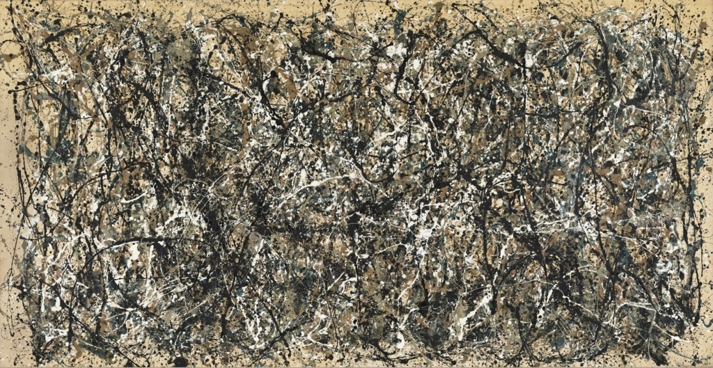
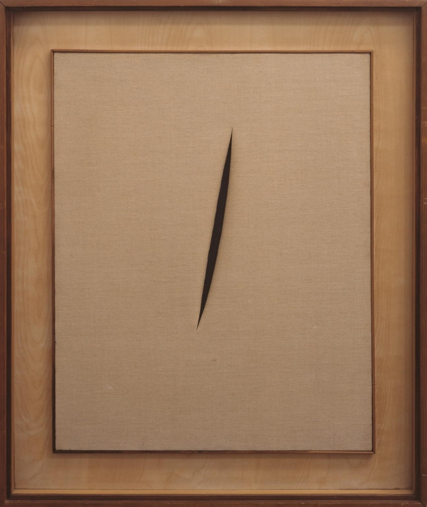

　たとえばあなたは、一見なんのことやらわからない意味不明な絵画やオブジェを前にして、こんなことを思ったことがあるかもしれない。「こんなの、誰でもできるんじゃないの？」と。それはたとえば[ジャクソン・ポロック](http://d.hatena.ne.jp/keyword/%A5%B8%A5%E3%A5%AF%A5%BD%A5%F3%A1%A6%A5%DD%A5%ED%A5%C3%A5%AF)の絵の具が撒き散らされた巨大な絵画かもしれないし、カール・[アンドレ](http://d.hatena.ne.jp/keyword/%A5%A2%A5%F3%A5%C9%A5%EC)の、床に整然と並べられたタイルかもしれない。あるいはそれはルチオ・フォンタナによって切り裂かれたカンヴァスかもしれないし、ダン・フレヴィンの蛍光灯かもしれない。いずれにせよ、20世紀以降のいわゆる[現代アート](http://d.hatena.ne.jp/keyword/%B8%BD%C2%E5%A5%A2%A1%BC%A5%C8)に、そんな例は枚挙に暇がない。めくるめく物語も、心安らぐ風景も、こころ動かす人物像も見当たらない。そのうえ、どうやら表面上、技巧らしい技巧は見えてこない。どうにもつかみどころのないこれらの作品の、なにがすごいんだろうか？

　しばしば、「これのなにがすごいの？」と聞かれたアート好きは、答えにすこし窮してから、こう答える。「アートの歴史のなかで、いちばん最初にあれこれのことをやったのが、この作品なんだ」。一番最初にカンヴァスに絵の具を撒き散らし、一番最初に床にタイルを並べ、一番最初にカンヴァスを切り裂き、一番最初に蛍光灯を作品に使い……　たとえそれがぱっと見誰にでもできそうなことでも、「一番最初」という刻印があるがゆえにこの作品はすごいのだ。それを聞いたあなたは、「そんなものなのか」とひととき納得するかもしれないが、同時にこうも思うだろう。「『一番最初』だからって、なにがそんなにすごいわけ？」。けっきょく疑問は先延ばしになっただけで、本質的な解決を見ない。

　「最初にやったからすごい」というのは確かに間違いではない。誰も思いつかなかった斬新なア[イデア](http://d.hatena.ne.jp/keyword/%A5%A4%A5%C7%A5%A2)というのも、アートの歴史を前進させる重要な要素のひとつだからだ。しかし、「歴史上はじめて」だったらなんでも偉いのかといえば、決してそうとは限らない。「歴史上はじめてだったけれど、大して評価されずに消えていったもの」もたくさんあるだろう。もとよりアートの歴史に名前を残す作品やアーティストなど、ごくごく一部にすぎない。「最初にやった」以外のプラスアルファがいくつもあってはじめて、有象無象の作品の海の中から頭一つ抜け出して、後世の私たちの目にとまるようになるのだ。

　こういう「最初にやったからすごい」式の説明が問題なのは、まるでアートが「新奇なア[イデア](http://d.hatena.ne.jp/keyword/%A5%A4%A5%C7%A5%A2)合戦」であるかのような誤解を与えてしまうことだ。とりわけ[現代アート](http://d.hatena.ne.jp/keyword/%B8%BD%C2%E5%A5%A2%A1%BC%A5%C8)に対しては、そういう戯画化がしばしば見られる。スキャンダラスで奇抜な作品で世を騒がせるアーティスト、などというのはもはや非常に[通俗的](http://d.hatena.ne.jp/keyword/%C4%CC%C2%AF%C5%AA)なステレオタイプになっている。しかし、作品の価値基準を「新しさ」にばかり求めてしまうと、ア[イデア](http://d.hatena.ne.jp/keyword/%A5%A4%A5%C7%A5%A2)や表現そのものの意図や効果から注意が逸らされてしまう。また、そうした表面的な「新しさ」は時間の経過に伴って古く、陳腐になってゆく。良いアート作品というものは、そういった時間の圧力を押しのけてなお僕たちに新鮮な魅力を提示してくれるものだ。少なくとも、いま僕たちがアート作品として受容しているものの大半は、そうした時間の経過を経てなお評価されているものばかりなのだ（込み入った話にはなるが、その評価基準の是非については次回論じる）。そう考えれば、「最初にやったからすごい」式の説明は、作品の魅力の大部分をざっくりと切り捨ててしまっていると言える。

　時間をかけて見極めるべきなのはつねに、「それがどれだけ新しい（新しかった）か」ではなく、むしろ「それが僕たちになにを与えてくれているか」ということである。そのために必要なのは、第一に、観察である。次いで、観察から得られた事実や印象から、その作品がどんな経験を自分に与えているかを、試しに言語化することだ。

　たとえば[ジャクソン・ポロックの作品、《ワン 31番, 1950 / One Number 31, 1950》（1950年）](https://www.moma.org/collection/works/78386)を例に見てみよう。

　僕は学生時代にニューヨークに行く機会にめぐまれ、この作品の実物を見たことがある。縦が2.7mほど、幅は5.3mほどにもなるこの作品に、僕は圧倒された。僕は身長が180cmあるそこそこの大男なのだけれど、それでもなおこの作品の巨大さは、まるで見ている僕を包み込むようだった。と同時に、ぎりぎりまで近寄って見てみると、そのディテイルは思いの外繊細で、イメージとも紋様ともつかない独特の感触をもってこちらに迫ってくる。また、それがただ絵の具をぶちまけたのではなく、この絵画全体が「ダイナミックな線の集積」であることも次第にわかってくる。線そのものは画家の豊かで大胆な動きを感じさせつつも、隙間なく幾重にも重ねられたその厚みは、むしろ慎重なコン[トロール](http://d.hatena.ne.jp/keyword/%A5%C8%A5%ED%A1%BC%A5%EB)の気配を覚えさせた。編み目のように複雑な全体像は、見るたびに色彩の焦点がかわり、そのためめまぐるしく画面の印象は変わっていく。あるいはひとつひとつの線をたどろうとしてみれば、めまいを催させるようなめくるめく視覚体験を僕たちは経験することになる。

　それは、たとえば風景画や人物がを味わうのとはまったく異なる経験だ。「現実にどれだけ似ているか」あるいは「現実からどれだけ飛躍しているか」といった評価軸とも、「その人の[人間性](http://d.hatena.ne.jp/keyword/%BF%CD%B4%D6%C0%AD)があらわれているかどうか」といった評価軸ともかけ離れて、純粋に、絵画をみる、描かれたものを見るという行為そのものの愉しみがそこにはある。[ポロック](http://d.hatena.ne.jp/keyword/%A5%DD%A5%ED%A5%C3%A5%AF)の用いたポアリングという手法――粘度の低いエナメル塗料をカンヴァス上に滴らせる――がたとえ新奇さを喪ったとしても（じっさい彼がこの技法を用いてから半世紀以上が過ぎ、珍しくもなんともない表現になっているのだが）、それによって生み出された絵画が僕たちに見せてくれる世界そのものは古びない、と僕は思う。

　また、[ルチオ・フォンタナの《空間概念「期待」/ Concetto spaziale 'Attesa'》（1960年）](http://www.tate.org.uk/art/artworks/fontana-spatial-concept-waiting-t00694)はどうだろう。

　カンヴァスに大胆に開かれた裂け目。これを「単にカンヴァスを切り裂いただけ」と片付けてしまうのは簡単だ。けれども、この作品の切り裂かれたカンヴァスの向こうには暗色の裏地が張られ、裂け目の向こう側にはあたかも漆黒の、無限の空間が広がっているかのようにしつらえられている。つまり、「切り裂くこと」そのものが重要だったのではなく、「切り裂くという行為の向こう側に見えてくるもの」までが、フォンタナにとっては肝心だったのだ。それは、伝統的に（具体的には[ルネサンス](http://d.hatena.ne.jp/keyword/%A5%EB%A5%CD%A5%B5%A5%F3%A5%B9)以来）空間を絵として描きこむ対象であったカンヴァスを僕たちの目の前の空間そのものに引き戻し、さらにはその向こう側に果てしない空間を想起させる試みだったわけだ。

　そういうわけで、僕がまずおすすめしたいのは、「これのなにがすごいんだろう？」と思ったならば、まずは自分の目にうつるものすべてに気を配って、隅々まで観察することだ。そのときは、観察している自分の心の動きも気に留めておくと良いだろう。思い浮かんだ感想や連想は、鑑賞の大事な材料になる。これにはなかなか忍耐がいるが、美術館をうろついていてふと気になった作品をひとつだけでも、何分も、何十分もかけて見てみて欲しい。たとえば絵画なら、画家の動きや、使われている画材の特徴、質感まで気を配りながら。もちろん、こうしたアプローチでは歯が立たない作品もたくさんある。それについてもいつか話さなければならないと思うけれど、今回はここまで。さようなら。

　作品画像はそれぞれ、所蔵館である[ニューヨーク近代美術館](http://d.hatena.ne.jp/keyword/%A5%CB%A5%E5%A1%BC%A5%E8%A1%BC%A5%AF%B6%E1%C2%E5%C8%FE%BD%D1%B4%DB)（[MoMA](http://d.hatena.ne.jp/keyword/MoMA)）及びテート・ギャラリーのウェブサイトから引用した。

　[Jackson Pollock. One: Number 31, 1950. 1950 | MoMA](https://www.moma.org/collection/works/78386)

　[‘Spatial Concept ‘Waiting’’, Lucio Fontana, 1960 | Tate](http://www.tate.org.uk/art/artworks/fontana-spatial-concept-waiting-t00694)

<iframe src="https://hatenablog-parts.com/embed?url=http%3A%2F%2Fcaughtacold.hatenablog.com%2Fentry%2F2018%2F03%2F06%2F003344" title="なぜ「直感で楽しむ」のではいけないのか――現代アートのたしなみ方覚書、はじめに - ただの風邪。" class="embed-card embed-blogcard" scrolling="no" frameborder="0" style="display: block; width: 100%; height: 190px; max-width: 500px; margin: 10px 0px;"></iframe>

[caughtacold.hatenablog.com](http://caughtacold.hatenablog.com/entry/2018/03/06/003344)
