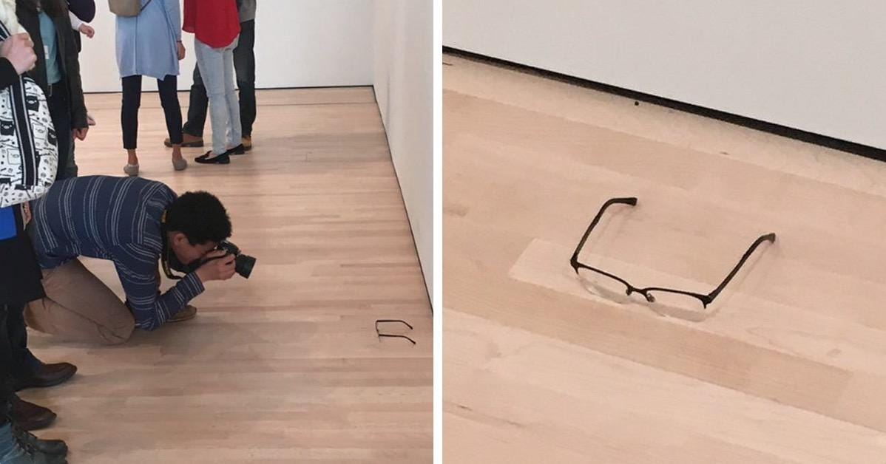

<iframe src="https://hatenablog-parts.com/embed?url=https%3A%2F%2Fwww.independent.co.uk%2Farts-entertainment%2Fart%2Fnews%2Fa-pair-of-glasses-were-left-on-the-floor-at-museum-and-everyone-mistook-it-for-art-a7049551.html" title="A pair of glasses were left on the floor at a museum and everyone mistook it for art" class="embed-card embed-webcard" scrolling="no" frameborder="0" style="display: block; width: 100%; height: 155px; max-width: 500px; margin: 10px 0px;"></iframe>

[www.independent.co.uk](https://www.independent.co.uk/arts-entertainment/art/news/a-pair-of-glasses-were-left-on-the-floor-at-museum-and-everyone-mistook-it-for-art-a7049551.html)

　とある美術館（アートギャラリー）で、こんないたずらがあったそうだ。なんの変哲もないただの眼鏡を床に放置してみたところ、たくさんの観客がそれを作品と勘違いして、しげしげと眺めた、という。この話をどういうふうに考えるべきだろうか。たわいもない冗談？　「芸術作品とただのモノの区別もつかない観客たち」を嘲笑するちょっと悪趣味な皮肉？　「アート好きなんて、ほんとはなにがしかわかったふりをしてるだけで、アート作品とただのモノの区別もつかない」と言ってその[スノビズム](http://d.hatena.ne.jp/keyword/%A5%B9%A5%CE%A5%D3%A5%BA%A5%E0)にひとこと釘を刺したくなる人もいるだろう。

　しかし、このいたずらをアート好きのはなをあかしたり、あるいは大衆の無知を明るみにだしたりするだけのものだと考えるのももったいない。むしろ、「なぜこんないたずらが成立するか？」ということが重要だと思う。アートを観る――とりわけ美術館で――という行為がどのようなモノやコトに支えられているかを考える良い例だからだ。

　僕が提案したいのは、基本的に美術館と観客のあいだには一種の信頼関係が構築されている、ということだ。美術館は観客がある程度自分たちの意図したような前提を持って展示を見てくれると（ひとまずは）考えるし、観客も、美術館が自分たちを不当に騙したり、貶めたりしないという前提を持って展示を見る。美術館にいってアートを見るということは、単にアート作品という独立したモノを見に行くというだけではなくて、この信頼関係にのっかって、その場にあるモノを主体的に解釈していくプロセスであると僕は考える。

　その構図は、たとえば演劇に似ている。演劇では、舞台上で起こる出来事のおおかたすべてを、「フィクション」ないし「演じられた／演出されたもの」として、いちどかっこに入れて鑑賞するということが当たり前に行われる。よく考えるとこれは奇妙なことだ。眼の前にいる生身の人間を、彼・彼女自身ではない、誰かほかの人（役柄）として見る。観客は「劇場っていうのはそういう場所だから」とほとんど無意識に考えるし、劇場側も「観客はそういう前提で見てくれるはずだ」ということをあてにしている（これを専門用語で「不信の宙吊り」という）。そして大抵の場合、それはそこそこうまくいっている。

　同じように、美術館では、そのなかに配置されるオブジェや出来事のおおかたすべてを、モノそのものであるよりも、アート作品であるとか、アートを楽しみ、理解するための手がかりとして見るということが行われているわけだ。作品、キャプション、テクスト、監視員、ソファ、カタログ、照明、etc...展示室のなかにあるあらゆるモノは、それぞれが特有の役割を果たし、理解されることを待っている。

　床に（意図的に）放置されたただの眼鏡は、この信頼関係のなかに入り込んだエラーだ。美術館と観客の信頼関係のうちに紛れ込むことによって、たんなるモノだったはずのものが、あたかも意味をもつオブジェであるかのように見えてしまう。もちろん、「もしかしてただの落とし物かもしれない」とか、そういう可能性を折り込みつつも、アートを鑑賞する美術館という場のもつ特性を考慮したうえで、そのモノの意味、あるいはそのモノがそこに置かれている意味を考えざるを得ない。

　絵画や彫刻といったアート作品としてのステータスが比較的堅固なものであればともかく、20世紀以降のアート作品にはしばしば私たちが日常的に触れるモノとほとんど見た目上区別がつかないものも多い。したがってなおのこと、「果たしてそれが芸術作品かどうか」「芸術作品だとすればどんな意味を持っているのか」を「じっくりと見る」ことを通じて見極めなければならない。だから、「ただの眼鏡をしげしげと眺める」という行為は、[スノビズム](http://d.hatena.ne.jp/keyword/%A5%B9%A5%CE%A5%D3%A5%BA%A5%E0)のあかしでも無知の証拠でもなく、アートを見るという行為にはつきものの、熟慮と判断をあらわしていると僕は思う。

　このいたずらは、美術館という場とその観衆が共有している信頼関係のひとつのありようを明るみに出しているといえる。その信頼関係にのっとっている限り、展示室のなかに配置されたオブジェは等しくアートの鑑賞の手がかりになる。たとえそれがエラーだったとしても、ひとまずは美術館の善意を信頼するほかないのだ。この仕組を鮮やかに示したという点で、これはただのいたずらを超えた、ひとつのアート作品（行為）だとさえ言えるかもしれない。かつてBanksyが自分の作品を勝手に美術館に展示してしまったように。

<iframe width="560" height="315" src="https://www.youtube.com/embed/fQwO6lh6rgQ" frameborder="0" allow="autoplay; encrypted-media" allowfullscreen></iframe>

　だから、「アート作品とそれ以外のモノの区別がつけられない」ことをもって、「アート好きはわかったふりをしているだけ」と言うのは根本的に的を外している。アート好きは、手に入る材料から一所懸命自分なりの意味を紡ごうと、どうにかしてわかろうとしているのだ。たとえそこにエラーが含まれていようとも、ひとまずその可能性をかっこに入れてでも、わかろうとする。そして、眼の前に提示されるわからなさにあえて留まることに、深い愉しみを覚える。そもそも、すべてが十分にわかってしまったら、おもしろくもなんともないじゃないか、とさえ思う。

　僕が大学時代にお世話になった先生は、こういう比喩を好んでいた。いわく、人間関係において、「わかった」というのはたいてい、別れのことばなのだ、と。「あなたのことはもう十分にわかった」――だから、もうそれ以上あなたを理解しようとは思わない。さようなら。

　アートも同じだ。僕を惹きつけてやまないアート作品はいつでも、天啓のような理解を与えると同時に、どこかに「わからなさ」を残している。常に「わからなさ」につきまとわれつつも、まさにその「わからなさ」に引き寄せられて、自分で自ら意味を紡いでいく経験。アートに限らず、良質なエンターテインメントというのは共通してこの「わからなさ」を湛えているように思う。いわく言い難い魅力にとりつかれて何度も同じ映画やアニメを見てしまうことってあるでしょう。しかしアートは、その純度がきわめて高いのだ。それは、観客に委ねられた解釈の幅が、他のエンタメよりも大きいことに由来すると思う。

　「わかったふりをしている」だなんてとんでもない。「わからない」からこそ魅了され、とりつかれたように見つづけてしまうのだ。この「わからなさ」の魅力をどう伝えるべきか、まだ答えは出ていないけれど、今後書くいくつかのケース・スタディでプレゼンできればと思う。
