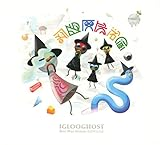

<iframe src="https://hatenablog-parts.com/embed?url=http%3A%2F%2Fwww.thefader.com%2F2018%2F08%2F06%2Figlooghost-interview-brainfeeder-tamei-mogu" title="How Iglooghost makes some of the freakiest music in the world" class="embed-card embed-webcard" scrolling="no" frameborder="0" style="display: block; width: 100%; height: 155px; max-width: 500px; margin: 10px 0px;"></iframe>

[www.thefader.com](http://www.thefader.com/2018/08/06/iglooghost-interview-brainfeeder-tamei-mogu)

　The FADER magに2つの新作EPのリリースを控えたIglooghostのインタビューが掲載されていた。彼は昨年リリースしたBRAINFEEDERからのアルバム『Neo Wax Bloom』も好評の弱冠20歳（今年で21だろうか？）。いわゆるビーツものともトラップとか[ダブステップ](http://d.hatena.ne.jp/keyword/%A5%C0%A5%D6%A5%B9%A5%C6%A5%C3%A5%D7)系のベース・ミュージックともなんか違う、プラスティックな質感の音色がころころと変わっていく風景のなかで跳ね回ってるみたいな、謎のエレクトロニック・ミュージック。

<iframe width="560" height="315" src="https://www.youtube.com/embed/eWku6kzJA80" frameborder="0" allow="autoplay; encrypted-media" allowfullscreen></iframe>

プロモーション映像もなんか妙だし、いかにも一筋縄ではいかないキャ[ラク](http://d.hatena.ne.jp/keyword/%A5%E9%A5%AF)ターも印象的だ。

<iframe width="560" height="315" src="https://www.youtube.com/embed/p4nIb8T4eUs" frameborder="0" allow="autoplay; encrypted-media" allowfullscreen></iframe>

　インタビューで興味深かったのは、「なんでフルレングスじゃなくて2枚のEPをリリースするの？」という質問に対する答え。以下、引用してみよう。

> たぶん正直に言うと[ポケモン](http://d.hatena.ne.jp/keyword/%A5%DD%A5%B1%A5%E2%A5%F3)で育ったからだと思う。それが僕の頭の中に居座ってるコンセプトなんだ。（[ポケモン](http://d.hatena.ne.jp/keyword/%A5%DD%A5%B1%A5%E2%A5%F3)には）ダイアモンド・パールがあって、もともとは赤と青があった。たんなる詐欺なんだけどね――だってゲームはおんなじなんだから――でもだからこそ、僕は2つのEPを出すというア[イデア](http://d.hatena.ne.jp/keyword/%A5%A4%A5%C7%A5%A2)が気に入ってる。僕はモノを集めるのが好きで、（2つのEPを出すというのも）自分が好きな行為を模してるんだ。いろんな意味で、子どものときに持ってた商品にはインスパイアされている。そんなのぜんぶ資本主義的なものなんだけれど、あなたもそういうものから美しさを得られるはずだよ。（そういう美こそ）子供だった僕を刺激していたものだ。僕が抽出しようとしているのはそれ。たぶん商品を売るっていうよりは、モノを手に入れたときに覚える感覚のほうが近い。

　自分のプロジェクトの[参照元](http://d.hatena.ne.jp/keyword/%BB%B2%BE%C8%B8%B5)が[ポケモン](http://d.hatena.ne.jp/keyword/%A5%DD%A5%B1%A5%E2%A5%F3)（しかもダイアモンド・パール）だというのもおもしろいけど、なにより、自分が資本主義社会のなかで消費行為から得ている快楽や美とはなにかを、創作を通じて抽出しようという試みはとてもおもしろい。消費そのものを罪悪とみるよりは、それを換骨奪胎して、異なる美へと結晶化させてみよう、という意志。僕はVaporwave的な[シニシズム](http://d.hatena.ne.jp/keyword/%A5%B7%A5%CB%A5%B7%A5%BA%A5%E0)にシンパシーを覚える世代なので、こうしたIglooghostのスタンスは新鮮に思えた。

<iframe width="560" height="315" src="https://www.youtube.com/embed/GmDFbNYFi-Q" frameborder="0" allow="autoplay; encrypted-media" allowfullscreen></iframe>

　ある意味でそれは、消費を記号の生産と流通の問題に還元したポップ・アート以降の感覚から離れて、消費という行為そのものの正体に迫ろうというちょっとした試みのようだ。そのときに考慮されるのは、抽象化、ないしはゲーム化された消費という行為のモデルであって、ポップ・アートのように「記号の生産様式・生産手段」ではない。再生速度の変化や[カットアップ](http://d.hatena.ne.jp/keyword/%A5%AB%A5%C3%A5%C8%A5%A2%A5%C3%A5%D7)、ループなど、制作に用いられる諸操作を露悪的に誇示してみせるVaporwaveはこの意味でポップ・アートの領域にとどまっているけれど、Iglooghostのナンセンスと寓意ってその[ネクス](http://d.hatena.ne.jp/keyword/%A5%CD%A5%AF%A5%B9)トステージなのかもなあ、と大風呂敷を広げたくなった。

[")](http://www.amazon.co.jp/exec/obidos/ASIN/B000HIDYOY/tortoisetau09-22/)

[ポケットモンスター ダイヤモンド(特典なし)](http://www.amazon.co.jp/exec/obidos/ASIN/B000HIDYOY/tortoisetau09-22/)

- 出版社/メーカー: [任天堂](http://d.hatena.ne.jp/keyword/%C7%A4%C5%B7%C6%B2)
- 発売日: 2006/09/28
- メディア: Video Game
- 購入: 4人 クリック: 130回
- [この商品を含むブログ (327件) を見る](http://d.hatena.ne.jp/asin/B000HIDYOY/tortoisetau09-22)

[Neo Wax Bloom](http://www.amazon.co.jp/exec/obidos/ASIN/B074KWJ3JS/tortoisetau09-22/)

- アーティスト: Iglooghost
- 出版社/メーカー: Brainfeeder
- 発売日: 2017/09/29
- メディア: CD
- [この商品を含むブログを見る](http://d.hatena.ne.jp/asin/B074KWJ3JS/tortoisetau09-22)
