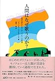

[細野晴臣 とまっていた時計がまたうごきはじめた](http://www.amazon.co.jp/exec/obidos/ASIN/4582836704/tortoisetau09-22/)

- 作者: [細野晴臣](http://d.hatena.ne.jp/keyword/%BA%D9%CC%EE%C0%B2%BF%C3),[鈴木惣一朗](http://d.hatena.ne.jp/keyword/%CE%EB%CC%DA%C1%DA%B0%EC%CF%AF)
- 出版社/メーカー: [平凡社](http://d.hatena.ne.jp/keyword/%CA%BF%CB%DE%BC%D2)
- 発売日: 2014/11/25
- メディア: 単行本
- [この商品を含むブログ (6件) を見る](http://d.hatena.ne.jp/asin/4582836704/tortoisetau09-22)

　[鈴木惣一朗](http://d.hatena.ne.jp/keyword/%CE%EB%CC%DA%C1%DA%B0%EC%CF%AF)が聞き手をつとめた[細野晴臣](http://d.hatena.ne.jp/keyword/%BA%D9%CC%EE%C0%B2%BF%C3)のインタビュー集『[細野晴臣](http://d.hatena.ne.jp/keyword/%BA%D9%CC%EE%C0%B2%BF%C3)　とまっていた時計がまたうごきはじめた』（[平凡社](http://d.hatena.ne.jp/keyword/%CA%BF%CB%DE%BC%D2)、2014年）を読んでいたら、興味深いくだりがあった。細野の1989年作『オムニ・サイト・シーイング』に収録された「Esashi」についての発言だ。[江差追分](http://d.hatena.ne.jp/keyword/%B9%BE%BA%B9%C4%C9%CA%AC)に伴奏をつけくわえたこの曲で同作は始まる。

<iframe src="https://open.spotify.com/embed/track/18rHZFEajsnCp4bVFDr3iG" width="300" height="380" frameborder="0" allowtransparency="true" allow="encrypted-media"></iframe>

> 民謡にコードを付けるっていうあのスタイルは、やってみたかったからやったんだけど、あとで後悔したんだ。コードを付けちゃいけなかったなと思ったの。特定の色を付けちゃうことになってしまったからね。そのあとに、そんな傾向が流行ったこともあって、余計に落ち込んだね。

　続けて聞き手の鈴木は、論を補うようにこう語る。

> ――コードを付けるってことは、[ボイシング](http://d.hatena.ne.jp/keyword/%A5%DC%A5%A4%A5%B7%A5%F3%A5%B0)によって、歌の心情を説明しちゃうことになるわけですよね。

　そしてまた、

> ――ブルーズなんかもそうですけど、本当は単旋律のままで、聴き手が感じるべき音楽の世界がある。それを、西洋的なハーモニーで説明してはいけないということですね。

　つまり、和声の概念がないモノフォニックな民謡に対して和声をつけくわえることが、果たしてその曲が本来持っている可能性を閉ざしているのではないか、という問いだ。

　しばしば現在のポップスでは、主旋律に対して別の和声進行をあてるリハーモナイズという手法が制作過程のなかで用いられることがある。同じ旋律でも異なる進行が添えられることでそのニュアンスが変わる様はクレショフ効果さながらであって、音楽がかきたてる私たちの情動は、メロディそのものというよりも和声の時間的な進行と旋律との関係性によって規定されていると言ってよい。

　とはいえ、よく指摘されることだけれどもこういう旋律に対する和声の優位が確立されたのはせいぜい18世紀とかそのくらいであって、たまたまそれが[西洋音楽](http://d.hatena.ne.jp/keyword/%C0%BE%CD%CE%B2%BB%B3%DA)のスタンダードになって、現在のポップ・ミュージックまで地続きになったにすぎない。

　人類史とかそういうスパンで見れば[西洋音楽](http://d.hatena.ne.jp/keyword/%C0%BE%CD%CE%B2%BB%B3%DA)においてさえ和声が音楽の主要な要素に数えられるようになった期間はほんのわずかでしかない。和声を伴う合唱みたいなものは洋の東西を問わず広くみられる（むしろ単旋律の厳密なモノフォニーのほうが少ないという）ものだけれど、それにしたって近代的な和声の体系とはまったく異なる、身体化された対位法のような原理で働くものだ。

[人間はなぜ歌うのか? 人類の進化における「うた」の起源](http://www.amazon.co.jp/exec/obidos/ASIN/4901213598/tortoisetau09-22/)

- 作者: [ジョー](http://d.hatena.ne.jp/keyword/%A5%B8%A5%E7%A1%BC)ゼフ・ジョルダーニア,森田稔
- 出版社/メーカー: [アルク](http://d.hatena.ne.jp/keyword/%A5%A2%A5%EB%A5%AF)出版企画
- 発売日: 2017/04/13
- メディア: 単行本
- [この商品を含むブログ (1件) を見る](http://d.hatena.ne.jp/asin/4901213598/tortoisetau09-22)

[アフリカ音楽の正体](http://www.amazon.co.jp/exec/obidos/ASIN/4276135702/tortoisetau09-22/)

- 作者: 塚田健一
- 出版社/メーカー: [音楽之友社](http://d.hatena.ne.jp/keyword/%B2%BB%B3%DA%C7%B7%CD%A7%BC%D2)
- 発売日: 2016/05/16
- メディア: 単行本
- [この商品を含むブログ (1件) を見る](http://d.hatena.ne.jp/asin/4276135702/tortoisetau09-22)

　そのように考えたとき、「和声が旋律の意味を規定する」ことにあまりにも慣れた自分は旋律そのものの力に対してどれほど敏感たりえているかと思ってしまう。はたして[江差追分](http://d.hatena.ne.jp/keyword/%B9%BE%BA%B9%C4%C9%CA%AC)をそのものとして鑑賞しつくすことが自分にはできるのか、と。いくら無調以後の現代音楽に触れたり、あるいは和声の体系から逸脱する構造を持つブルースやジャズ、あるいはこれが一番自分にとって馴染み深いところのダンス・ミュージックに触れたところで、もしかしたら身体から剥ぎおとされた旋律への感受性があるのではないか。

　まあそんなことは杞憂でしかないんだけれど、改めてさまざまな音楽に対して耳をオープンにしていくことを心にきめるきっかけになった対話だった。それは例えば歌やそのメロディへの意識を変えていく必要の予感をもたらしたりもしたのだった。

<iframe width="560" height="315" src="https://www.youtube.com/embed/_EA2Ioxs4CQ" frameborder="0" allow="autoplay; encrypted-media" allowfullscreen></iframe>

<iframe width="560" height="315" src="https://www.youtube.com/embed/9iDS8X3bW9M" frameborder="0" allow="autoplay; encrypted-media" allowfullscreen></iframe>
