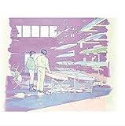

<iframe width="560" height="315" src="https://www.youtube.com/embed/wWhFE18ecsc" frameborder="0" allow="autoplay; encrypted-media" allowfullscreen></iframe>

[FANTASY CLUB](http://www.amazon.co.jp/exec/obidos/ASIN/B06XXTT98N/tortoisetau09-22/)

- アーティスト: [tofubeats](http://d.hatena.ne.jp/keyword/tofubeats)
- 出版社/メーカー: [ワーナーミュージック・ジャパン](http://d.hatena.ne.jp/keyword/%A5%EF%A1%BC%A5%CA%A1%BC%A5%DF%A5%E5%A1%BC%A5%B8%A5%C3%A5%AF%A1%A6%A5%B8%A5%E3%A5%D1%A5%F3)
- 発売日: 2017/05/24
- メディア: CD
- [この商品を含むブログ (1件) を見る](http://d.hatena.ne.jp/asin/B06XXTT98N/tortoisetau09-22)

　[tofubeats](http://d.hatena.ne.jp/keyword/tofubeats)の前作『FANTASY CLUB』に収録された「SHOPPINGMALL」は、先駆けて[YouTube](http://d.hatena.ne.jp/keyword/YouTube)で公開されるなり2016年話題のトラックとなった。メジャーデビュー以降、ヒップホップあがりのダンス・ミュージックのプロデューサーとして、J-POPにいかにして食い込むかに腐心してきたように見える彼が、その集大成といえる盛りだくさんのコラボレーションに彩られた『POSITIVE』を経て、唐突につきつけた鋭い言葉。ショッピングモールを背景に「最近好きなアルバムはあるかい？」と問いかけるこの曲は、彼の持ち味である批評精神を改めて知らしめた。

　またそれは、[tofubeats](http://d.hatena.ne.jp/keyword/tofubeats)を語る上で無視することができないインターネット・カルチャーの文脈を強く意識させるものだった――とりわけ、vaporwaveと呼ばれる[ミーム](http://d.hatena.ne.jp/keyword/%A5%DF%A1%BC%A5%E0)・ミュージックの文脈を。しばしば本人も語ることだが、vaporwaveの記念碑的作品である[Macintosh](http://d.hatena.ne.jp/keyword/Macintosh) Plus『Floral Shoppe』のリリースにほんの少し先駆けて、彼はポップスをスクリューして過剰なエフェクトを施した[ダウンテンポ](http://d.hatena.ne.jp/keyword/%A5%C0%A5%A6%A5%F3%A5%C6%A5%F3%A5%DD)主体のEP『スローモーション（ひみつの）』をリリースしている。

<iframe style="border: 0; width: 100%; height: 120px;" src="https://bandcamp.com/EmbeddedPlayer/album=3791021030/size=large/bgcol=ffffff/linkcol=0687f5/tracklist=false/artwork=small/transparent=true/" seamless=""><a href="http://tofubeats.bandcamp.com/album/slowmotion-himitsu-no">スローモーション(ひみつの)/Slowmotion(himitsu no) by tofubeats</a></iframe>

　この[シンクロニシティ](http://d.hatena.ne.jp/keyword/%A5%B7%A5%F3%A5%AF%A5%ED%A5%CB%A5%B7%A5%C6%A5%A3)が予見していたように、[tofubeats](http://d.hatena.ne.jp/keyword/tofubeats)はvaporwaveに一時期深い共感を覚え、[Macintosh](http://d.hatena.ne.jp/keyword/Macintosh) Plusの同作より「リサ・フランク420／現代のコンピュー」をしばしばフロアを「清め」るためにかけたりもしていた。

<iframe width="560" height="315" src="https://www.youtube.com/embed/aQkPcPqTq4M" frameborder="0" allow="autoplay; encrypted-media" allowfullscreen></iframe>

　vaporwaveにおいてショッピングモールは特権的なアイコンの位置を占めている。その象徴性はたとえば猫 シ Corp.によって広められたMall Softなるコンセプチュアルな派生ジャンルを生み出した。ショッピングモールはローカルな特色を貫通してしまうその空間的な均質性から、[ポップカルチャー](http://d.hatena.ne.jp/keyword/%A5%DD%A5%C3%A5%D7%A5%AB%A5%EB%A5%C1%A5%E3%A1%BC)においてヴァナキュラーなものが消失した高度資本主義社会の象徴として描かれてきた。その文脈をひきついだうえで、インターネットというこれもまた均質的で空間性の消失した空間――すでにこの時点で自己撞着が起こってしまっているのだが、われわれにとってインターネットはあいかわらず「空間」のメタファーで語られる――に対するフェ[ティッシュ](http://d.hatena.ne.jp/keyword/%A5%C6%A5%A3%A5%C3%A5%B7%A5%E5)となかば混同されるかたちで、vaporwaveの文脈のなかに取り入れられていった。

<iframe style="border: 0; width: 100%; height: 120px;" src="https://bandcamp.com/EmbeddedPlayer/album=909594336/size=large/bgcol=ffffff/linkcol=0687f5/tracklist=false/artwork=small/transparent=true/" seamless=""><a href="http://catsystemcorp.bandcamp.com/album/palm-mall">Palm Mall by 猫 シ Corp.</a></iframe>

　しかしvaporwaveにおけるショッピングモールは徹底的に空虚であり、しばしば「廃墟」のイメージに重ね合わされる。スクリューとチョップによる徹底的な文脈の破壊、チープな音色による意図的な凡庸さ。文脈と差異化のゲームから降りて、無意味な操作、凡庸なテクスチャそのものに浴するvaporwaveの美学にとってモールは最適の舞台であると同時に、そのモールでさえすでに機能不全に陥っているという徹底的な[シニシズム](http://d.hatena.ne.jp/keyword/%A5%B7%A5%CB%A5%B7%A5%BA%A5%E0)の徴候をも示す「空間」なのだ。

<iframe width="560" height="315" src="https://www.youtube.com/embed/unN7QvSWSTo" frameborder="0" allow="autoplay; encrypted-media" allowfullscreen></iframe>

　vaporwaveの方法論的な始祖として位置づけられるDaniel Lopatin（Oneohtrix Point Never）の『Chuck Person's Eccojams Vol.1』（2010年）はすでに、ポップソングの断片を楽曲構造を無視した恣意的なループとエコーによって音響に還元し、ポップ・ミュージックを成立させる音響空間（＝録音芸術にまつわる言説においてしばしば空間的なメタファーが飛び交うことに留意したい）そのものを現出させた。その抽象的な音響空間はポップ・ミュージックの周縁／限界を示す「廃墟」であり、その「廃墟」に具体的なアイコンと批評的な象徴性を付与したものがモール・ミュージックとしてのvaporwaveである、とひとまずはまとめることができるだろう。

　とはいえ、「ポップスの音響空間＝均質的なショッピングモール」のなかでその無意味さや触覚そのものと戯れるという美学は次第に当初のラディカルさを失い、文脈を際限なく拡張しながら、ノスタル[ジー](http://d.hatena.ne.jp/keyword/%A5%B8%A1%BC)の境域へと近づいていってしまった。それはvaporwaveの再ポップ化とでも言うべき現象であって、2010年代も末になってこの音楽にふたたび脚光があたりつつあるいま、むしろvaporwaveとは特定の時代を想起させる記号や肌触りの集積と大雑把に定義したほうがよくなったのかもしれない。あらゆるカルチャーの彼岸と思えた「廃墟」は実はまったく廃墟などではなく、未だ機能する――というか過剰なまでに機能し、われわれの生活をとりかこむ――現実の空間そのものであったことが明るみに出たわけだ。

<iframe src="https://hatenablog-parts.com/embed?url=http%3A%2F%2Fgamelifehack.hatenablog.com%2Fentry%2F2018%2F07%2F07%2F090000" title="スプラトゥーン2DLC『オクト・エキスパンション』がシングルモードとして非常に「えもい」仕上がりだったから遊んでくれ - GAME LIFE HACK" class="embed-card embed-blogcard" scrolling="no" frameborder="0" style="display: block; width: 100%; height: 190px; max-width: 500px; margin: 10px 0px;"></iframe>

[gamelifehack.hatenablog.com](http://gamelifehack.hatenablog.com/entry/2018/07/07/090000)

　しかし、だからといって初期vaporwaveの[シニシズム](http://d.hatena.ne.jp/keyword/%A5%B7%A5%CB%A5%B7%A5%BA%A5%E0)とぎりぎりの批評精神を復興させよう、というのもまた単なるノスタル[ジー](http://d.hatena.ne.jp/keyword/%A5%B8%A1%BC)に過ぎないだろう。[モダニズム](http://d.hatena.ne.jp/keyword/%A5%E2%A5%C0%A5%CB%A5%BA%A5%E0)の[進歩主義](http://d.hatena.ne.jp/keyword/%BF%CA%CA%E2%BC%E7%B5%C1)や歴史的[アヴァンギャルド](http://d.hatena.ne.jp/keyword/%A5%A2%A5%F4%A5%A1%A5%F3%A5%AE%A5%E3%A5%EB%A5%C9)の反骨精神をそのまま反復することはできない。それはすでに1960年代のネオ・ダダが試みて、断念したことだ。むしろネオ・ダダはその後の[ポストモダン](http://d.hatena.ne.jp/keyword/%A5%DD%A5%B9%A5%C8%A5%E2%A5%C0%A5%F3)の展開への結節点として、モダンにそもそも内在していた「不純さ」（おおざっぱにいって、フリード的な意味での、あるいはケージ的な意味での「演劇性」）を抽出し、換骨奪胎したものと言えるだろう。むしろわれわれが習うべきはネオ・ダダ的なスタンスであり、vaporwaveの[シニシズム](http://d.hatena.ne.jp/keyword/%A5%B7%A5%CB%A5%B7%A5%BA%A5%E0)に内在していた別個の可能性を再び開かせる方向へと、意図するにせよ意図せざるにせよ向かうほかないものと思われる。

　ふたたび「SHOPPINGMALL」に戻ってみる。結論直前まで一気にすっ飛ばすと、この曲は、vaporwave的な無意味との戯れ、時代を象徴する感性に一度距離を置きながら、現実のショッピングモールに足を踏み入れる曲だと言える。地方に住まう人びとにとってはあまりにも自明なことだが、ショッピングモールは思想的な遊戯の舞台である以前に、われわれの生活を支える文化的インフラである。ファスト・ファッション、ファスト・フード、シネマ・コンプレックス、中途半端な品揃えの新刊書店、あるいは「[ヴィレッジ・ヴァンガード](http://d.hatena.ne.jp/keyword/%A5%F4%A5%A3%A5%EC%A5%C3%A5%B8%A1%A6%A5%F4%A5%A1%A5%F3%A5%AC%A1%BC%A5%C9)」。それらが都市生活者からどれほど批判され、嘲笑されようとも、殺風景なロードサイドにかろうじて文化をもたらす一大拠点なのである。

　ポップ・ミュージックと「わたし」との関係を自問自答する[tofubeats](http://d.hatena.ne.jp/keyword/tofubeats)の煩悶は、ほかでもないショッピングモールを歩き回るなかで発される。だだっぴろい空間の各所で鳴り響く無意味なオートチューンとか、流行りのバンドのヒットソングに満たされた空間のなかで孤独に歩くなかで問われるのは、自分がほんとうに求めているものはなにか、といういささかナイーヴな問題だ。このショッピングモールに自分がほんとうに求めるものがある気はしない。しかし、まさしくここにおいて、自分は文化を実践していかなければならない。

　つまり、この問いは[tofubeats](http://d.hatena.ne.jp/keyword/tofubeats)の端的に実存的な問題であると同時に、「この空虚さのうえに文化は可能か」という彼のプロデューサーとしての実践――ビジネスを続けられるか、ではなく、ビジネスにモチベーションを注ぎ続けられるか――に関わる問題でもある。そしてまた、リスナーにとっても、「それでもなお音楽を信じられるか」、ないし、「信じ続けられているか」というアクチュアルな問いとして響くのである。

　机上の空論じみた「廃墟としてのショッピングモール」を、われわれの文化的な生活を支える実在の「ショッピングモール」に引き戻す。vaporwaveの[シニシズム](http://d.hatena.ne.jp/keyword/%A5%B7%A5%CB%A5%B7%A5%BA%A5%E0)を、我がこととして再び捉え直す。単にそこに限界を、終焉を重ね見て事足れりとするのではなく、ここからはじまるなにかはありうるのかと問う。「SHOPPINGMALL」とはそのような曲であるし、『FANTASY CLUB』はその果実でもある。神という絶対的な対象を欠く「[祈り](http://d.hatena.ne.jp/keyword/%B5%A7%A4%EA)」に包まれた『FANTASY CLUB』については筆者の以下の記事を参照されたい。

<iframe src="https://hatenablog-parts.com/embed?url=http%3A%2F%2Fcaughtacold.hatenablog.com%2Fentry%2F2017%2F05%2F24%2F121404" title="青春を脱ぎ捨てて、イノセンスから遠く離れて――tofubeats《FANTASY CLUB》をめぐって（A面） - ただの風邪。" class="embed-card embed-blogcard" scrolling="no" frameborder="0" style="display: block; width: 100%; height: 190px; max-width: 500px; margin: 10px 0px;"></iframe>

[caughtacold.hatenablog.com](http://caughtacold.hatenablog.com/entry/2017/05/24/121404)

<iframe src="https://hatenablog-parts.com/embed?url=http%3A%2F%2Fcaughtacold.hatenablog.com%2Fentry%2F2017%2F05%2F24%2F121827" title="“post-truth”に反対する唯一の手段は。――tofubeats《FANTASY CLUB》をめぐって（B面） - ただの風邪。" class="embed-card embed-blogcard" scrolling="no" frameborder="0" style="display: block; width: 100%; height: 190px; max-width: 500px; margin: 10px 0px;"></iframe>

[caughtacold.hatenablog.com](http://caughtacold.hatenablog.com/entry/2017/05/24/121827)

　加えて、JEVAの「イオン」、あるいは田我流のその名も「vaporwave」といった話題曲もまた、同様の文脈から語られうるだろう。

<iframe width="560" height="315" src="https://www.youtube.com/embed/qQu7cnPHAZM" frameborder="0" allow="autoplay; encrypted-media" allowfullscreen></iframe>

<iframe width="560" height="315" src="https://www.youtube.com/embed/7NTN8HvExGM" frameborder="0" allow="autoplay; encrypted-media" allowfullscreen></iframe>

　自明視されているショッピングモール像やvaporwaveの美学＝ａｅｓｔｈｅｔｉｃを、日本のローカルな文脈からふたたび照らし直す。われわれの足場がほかならぬこの空虚さやもどかしさにあることを明るみに出しつつ、そこから始まる文化の可能性を示唆する。こうした戦略は、単にａｅｓｔｈｅｔｉｃの「誤解」あるいは「曲解」と言われるかもしれない。本来は現実世界から隔絶された仮想空間で展開された文化を現実にそのまま移植することの是非は問われるだろうし、「vaporwaveはそういうもんじゃない」という反発も生まれるかもしれない。けれども、自分はあえてこれらをａｅｓｔｈｅｔｉｃの批判的な反復であり、有意義であると擁護したい。

　そもそもvaporwaveをめぐる言論は、もとから多い方ではないうえに、過剰に欧米中心的、あるいは[アメリ](http://d.hatena.ne.jp/keyword/%A5%A2%A5%E1%A5%EA)カ中心的すぎるきらいがある（たとえば過去のこの書評を参照のこと。[Vaporwaveは誰のものか、と思ってしまった――Grafton Tanner, "Babbling Corpse: Vaporwave And The Commodification Of Ghosts," Zero Books, 2016. - ただの風邪。](http://caughtacold.hatenablog.com/entry/2017/04/20/114559)）。vaporwaveのつくり手はグローバルに分散しており、その文脈も拡散しているはずである。われわれはショッピングモールを[アメリ](http://d.hatena.ne.jp/keyword/%A5%A2%A5%E1%A5%EA)カ人のようには見ない。「廃墟としてのショッピングモール」は日本でも冗談ではなくなってきているものの、[アメリ](http://d.hatena.ne.jp/keyword/%A5%A2%A5%E1%A5%EA)カの比ではないだろうし、向こうではよりアクチュアルな感覚としてこの「廃墟」は受け止められている可能性はある。それを、インターネットの均質性、非‐場所性だけを担保に「グローバルに共有された時代の感性」などとくくることは可能なのか。もちろんそうした国境を超えた共感、[シンクロニシティ](http://d.hatena.ne.jp/keyword/%A5%B7%A5%F3%A5%AF%A5%ED%A5%CB%A5%B7%A5%C6%A5%A3)は起こりうるし、まさしく[tofubeats](http://d.hatena.ne.jp/keyword/tofubeats)とvaporwaveの共振はそうした現象だったわけだけれども、改めて「われわれは同じものをみているか」と問い直す必要があるのではないか。

　あるいは、アジアにおけるvaporwave的表象の受容は、なかば[オリエンタリズム](http://d.hatena.ne.jp/keyword/%A5%AA%A5%EA%A5%A8%A5%F3%A5%BF%A5%EA%A5%BA%A5%E0)の視線を感じるアジア外のものとは異なる文脈のうえにあるのではないか。たとえばそれは中国にとってはノスタル[ジー](http://d.hatena.ne.jp/keyword/%A5%B8%A1%BC)というよりもバブル期の日本という具体的な繁栄の象徴として自らに重ね合わせうるものかもしれないし、韓国にとってはプレ[K-POP](http://d.hatena.ne.jp/keyword/K-POP)期であり現在に通じる韓国大衆音楽が形成されつつあった80年代という文化的原点への回帰といいうるかもしれない――少し時代は異なるけれど、たとえばIUによる大衆歌謡のカヴァー（「어젯밤 이야기（昨日の夜の話）」など）にそうした香りをかぎとることも可能だろう。

<iframe width="560" height="315" src="https://www.youtube.com/embed/cxcxskPKtiI" frameborder="0" allow="autoplay; encrypted-media" allowfullscreen></iframe>

　グローバルに浸透したvaporwaveを、その[アメリ](http://d.hatena.ne.jp/keyword/%A5%A2%A5%E1%A5%EA)カ中心的な言説布置から改めてローカルな、アクチュアルな問題に接続しなおす。そのうえで、vaporwaveの操作の美学（チョップ、スクリュー、[カットアップ](http://d.hatena.ne.jp/keyword/%A5%AB%A5%C3%A5%C8%A5%A2%A5%C3%A5%D7)）に立ち返り、「ここからなにが生まれるか」を、無意味の戯れとしてではなく、文化の未来の問題として考える。[tofubeats](http://d.hatena.ne.jp/keyword/tofubeats)「SHOPPINGMALL」はその契機であった、とここでは結論づけたい。

　ちなみに、vaporwaveの操作の美学がもともとヒップホップの文脈から生じたもの（チョップド＆スクリュードはヒップホップのミックステープで用いられた手法が一般化したものだ）であることを考慮すると、vaporwave的な美学の批判的継承の受け皿としてヒップホップのミュージシャンが浮上しているのはきわめて興味深いし、的を射ている。田我流「vaporwave」はもちろん、Future Funk的なアニメの引用や80'sノスタル[ジー](http://d.hatena.ne.jp/keyword/%A5%B8%A1%BC)、映像加工をふんだんに用いたDJ CHARI & DJ TATSUKI「ビッチと会う feat. Weny Dacillo, Pablo Blasta & JP THE WAVY」も例として挙げておくべきか。

<iframe width="560" height="315" src="https://www.youtube.com/embed/qkg2st1CWKg" frameborder="0" allow="autoplay; encrypted-media" allowfullscreen></iframe>

　最後に、まもなくリリースが控える[tofubeats](http://d.hatena.ne.jp/keyword/tofubeats)の新譜『RUN』のいくつかの部分に、この論が触発されていることを告白しておく。「操作の美学」の向こうでわれわれを待つえもいわれぬ「何か」の姿が『RUN』で描かれ、そして語られる――あくまで個人的な見方だけれど――ことを予告して本論を閉じる。

<iframe width="560" height="315" src="https://www.youtube.com/embed/W4TtTzSxqv8" frameborder="0" allow="autoplay; encrypted-media" allowfullscreen></iframe>

[」付)")](http://www.amazon.co.jp/exec/obidos/ASIN/B07H2K2S45/tortoisetau09-22/)

[【Amazon.co.jp限定】RUN(未発表音源「RIVER (tofubeats remix)」付)](http://www.amazon.co.jp/exec/obidos/ASIN/B07H2K2S45/tortoisetau09-22/)

- アーティスト: [tofubeats](http://d.hatena.ne.jp/keyword/tofubeats)
- 出版社/メーカー: [ワーナーミュージック・ジャパン](http://d.hatena.ne.jp/keyword/%A5%EF%A1%BC%A5%CA%A1%BC%A5%DF%A5%E5%A1%BC%A5%B8%A5%C3%A5%AF%A1%A6%A5%B8%A5%E3%A5%D1%A5%F3)
- 発売日: 2018/10/03
- メディア: CD
- [この商品を含むブログを見る](http://d.hatena.ne.jp/asin/B07H2K2S45/tortoisetau09-22)
