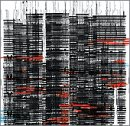

<iframe src="https://hatenablog-parts.com/embed?url=https%3A%2F%2Frealsound.jp%2F2018%2F10%2Fpost-269732.html" title="小沢健二『Eclectic』は“早すぎた作品”だったーー15年を経て理解された「ビート」という技術" class="embed-card embed-webcard" scrolling="no" frameborder="0" style="display: block; width: 100%; height: 155px; max-width: 500px; margin: 10px 0px;"></iframe>

[realsound.jp](https://realsound.jp/2018/10/post-269732.html)

[Eclectic](http://www.amazon.co.jp/exec/obidos/ASIN/B00005UTEE/tortoisetau09-22/)

- アーティスト: [小沢健二](http://d.hatena.ne.jp/keyword/%BE%AE%C2%F4%B7%F2%C6%F3)
- 出版社/メーカー: EMIミュージック・ジャパン
- 発売日: 2002/02/27
- メディア: CD
- 購入: 4人 クリック: 98回
- [この商品を含むブログ (178件) を見る](http://d.hatena.ne.jp/asin/B00005UTEE/tortoisetau09-22)

　そういえば[小沢健二](http://d.hatena.ne.jp/keyword/%BE%AE%C2%F4%B7%F2%C6%F3)の『Eclectic』とかとんと聴いてないと思い[Apple](http://d.hatena.ne.jp/keyword/Apple) Musicで視聴。あー、今になって（[リテラシー](http://d.hatena.ne.jp/keyword/%A5%EA%A5%C6%A5%E9%A5%B7%A1%BC)が上がって）聴くとたしかにこれは面白いアルバムだ。結局[オザケン](http://d.hatena.ne.jp/keyword/%A5%AA%A5%B6%A5%B1%A5%F3)はこういう「ビート」の方向には進まなかったわけだけど[cero](http://d.hatena.ne.jp/keyword/cero)まで連なるような日本流のネオソウルの流れを用意したんだと思うと偉大だ。

<iframe allow="autoplay *; encrypted-media *;" frameborder="0" height="450" style="width:100%;max-width:660px;overflow:hidden;background:transparent;" sandbox="allow-forms allow-popups allow-same-origin allow-scripts allow-storage-access-by-user-activation allow-top-navigation-by-user-activation" src="https://embed.music.apple.com/jp/album/eclectic/1437611848?app=music"></iframe>

　ネオソウル的なグルーヴ（ここではざっくり『Voodoo』とか、[J Dilla](http://d.hatena.ne.jp/keyword/J%20Dilla)～[The Roots](http://d.hatena.ne.jp/keyword/The%20Roots)、Questloveらへんの流れを想定する）は[サンプラー](http://d.hatena.ne.jp/keyword/%A5%B5%A5%F3%A5%D7%A5%E9%A1%BC)がもたらしたループミュージックの再身体化というふうにひとまずまとめることができると思うんだけど、『Eclectic』はそうした身体性への志向（演奏において、聴取においても）をいっぺん捨てておいて、リズムの構造を解体して[コンポジション](http://d.hatena.ne.jp/keyword/%A5%B3%A5%F3%A5%DD%A5%B8%A5%B7%A5%E7%A5%F3)することに重きを置いたのだ、というふうに思える。3 1/2小節単位（14拍）で進行する「あらし」や3小節単位で進行する「1つの魔法(終わりのない愛しさを与え)」に見られる、ダンスミュージック一般の定型を崩すような楽曲構成にそれは明らかではないだろうか。また、バックビートを強調するのではなく、むしろパーカッションの絡み合いやそれによって暗示されるクラーベによってグルーヴを支配するビートの作り方（「∞(infinity)」とか「bassline」、「甘い旋律」に明確だ）は、実は『文化系のためのヒップホップ入門2』で提示されているような「南部化」、もしくはもっとマクロな観点でいうならば、「ラテン化」を先取りしているようでもある。

[")](http://www.amazon.co.jp/exec/obidos/ASIN/4903951472/tortoisetau09-22/)

[文化系のためのヒップホップ入門 (いりぐちアルテス002)](http://www.amazon.co.jp/exec/obidos/ASIN/4903951472/tortoisetau09-22/)

- 作者: [長谷川町蔵](http://d.hatena.ne.jp/keyword/%C4%B9%C3%AB%C0%EE%C4%AE%C2%A2),大和田俊之
- 出版社/メーカー: アルテスパブリッシング
- 発売日: 2011/10/07
- メディア: 単行本（ソフトカバー）
- 購入: 9人 クリック: 121回
- [この商品を含むブログ (76件) を見る](http://d.hatena.ne.jp/asin/4903951472/tortoisetau09-22)

　[菊地成孔](http://d.hatena.ne.jp/keyword/%B5%C6%C3%CF%C0%AE%B9%A6)が『Eclectic』について、「［…］このご時世に［…］こんな弾力の無い、要するに昔の歌[謡曲](http://d.hatena.ne.jp/keyword/%CD%D8%B6%CA)みたいな緩いトラック作れる方がよっぽど稀少的才能」（『歌舞伎町のミッドナイト[フットボール](http://d.hatena.ne.jp/keyword/%A5%D5%A5%C3%A5%C8%A5%DC%A1%BC%A5%EB)』[小学館](http://d.hatena.ne.jp/keyword/%BE%AE%B3%D8%B4%DB)文庫版、p.73）と言っているけれども、ヒップホップや[R&B](http://d.hatena.ne.jp/keyword/R%26amp%3BB)のトラックとして見た場合には、不可欠のグルーヴが欠けているというのは事実だろうと思う。それは本人の適性もあるだろうし、そもそも狙いが違ったのかもしれない。一方で上の引用に菊地が続けて言う次のような指摘はかなり興味深い。

> ［…］[野口五郎](http://d.hatena.ne.jp/keyword/%CC%EE%B8%FD%B8%DE%CF%BA)のNY期～[フュージョン](http://d.hatena.ne.jp/keyword/%A5%D5%A5%E5%A1%BC%A5%B8%A5%E7%A5%F3)期とか、[郷ひろみ](http://d.hatena.ne.jp/keyword/%B6%BF%A4%D2%A4%ED%A4%DF)のNY期とか、[松崎しげる](http://d.hatena.ne.jp/keyword/%BE%BE%BA%EA%A4%B7%A4%B2%A4%EB)とか元ラッツの[鈴木雅之](http://d.hatena.ne.jp/keyword/%CE%EB%CC%DA%B2%ED%C7%B7)とかまで含めて、要するに「日本の[AOR](http://d.hatena.ne.jp/keyword/AOR)」「歌謡[AOR](http://d.hatena.ne.jp/keyword/AOR)」っていう物が過去にはあって、[久保田利伸](http://d.hatena.ne.jp/keyword/%B5%D7%CA%DD%C5%C4%CD%F8%BF%AD)以降のNY入った音楽は[田島貴男](http://d.hatena.ne.jp/keyword/%C5%C4%C5%E7%B5%AE%C3%CB)まで含めて総てそれの代替品、もしくは到達点に見えつつも実は別物だという事で、それの本流の方の系譜を[小沢健二](http://d.hatena.ne.jp/keyword/%BE%AE%C2%F4%B7%F2%C6%F3)は現在一人で継いでいるとも言える。（pp.73-74）

　読む人によっては揶揄のように思えるかもしれないが、10年代というディケイドをかけてシティポップ再評価の波に価値観をまるごと書き換えられた僕のような人間には、ものすごくまっすぐに的を射た指摘であるように思える。

[")](http://www.amazon.co.jp/exec/obidos/ASIN/4094085424/tortoisetau09-22/)

[歌舞伎町のミッドナイト・フットボール -世界の9年間と、新宿コマ劇場裏の6日間- (小学館文庫)](http://www.amazon.co.jp/exec/obidos/ASIN/4094085424/tortoisetau09-22/)

- 作者: [菊地成孔](http://d.hatena.ne.jp/keyword/%B5%C6%C3%CF%C0%AE%B9%A6)
- 出版社/メーカー: [小学館](http://d.hatena.ne.jp/keyword/%BE%AE%B3%D8%B4%DB)
- 発売日: 2010/09/07
- メディア: 文庫
- 購入: 3人 クリック: 34回
- [この商品を含むブログ (15件) を見る](http://d.hatena.ne.jp/asin/4094085424/tortoisetau09-22)

　いま「シティポップ」のレッテルのもとで受容されている音楽とここで言及されている「歌謡[AOR](http://d.hatena.ne.jp/keyword/AOR)」には細いが深い溝があるのかもしれないけれど、少なくともそういう布置において見た場合、[小沢健二](http://d.hatena.ne.jp/keyword/%BE%AE%C2%F4%B7%F2%C6%F3)がビートの実験に勤しみながら日本流の[AOR](http://d.hatena.ne.jp/keyword/AOR)を（無意識に？）引き継いだ『Eclectic』がいまになって重みを持っているのは自然な流れだろう。「流動体について」のリリースから本格化した日本での活動再開以降は『Eclectic』期を忘れたかのようにギターを鳴らしてポップスを歌いあげている[オザケン](http://d.hatena.ne.jp/keyword/%A5%AA%A5%B6%A5%B1%A5%F3)だけれども、たとえば「フクロウの声が聞こえる」の[カップ](http://d.hatena.ne.jp/keyword/%A5%AB%A5%C3%A5%D7)リングである「シナモン（都市と家庭）」の打ち込みベースのファンキーなビートにその面影は浮かんでいる。

<iframe width="560" height="315" src="https://www.youtube.com/embed/VQA6_-bzzk0" frameborder="0" allow="autoplay; encrypted-media" allowfullscreen></iframe>

[")](http://www.amazon.co.jp/exec/obidos/ASIN/B074C989D6/tortoisetau09-22/)

[フクロウの声が聞こえる(完全生産限定盤)](http://www.amazon.co.jp/exec/obidos/ASIN/B074C989D6/tortoisetau09-22/)

- アーティスト: [小沢健二](http://d.hatena.ne.jp/keyword/%BE%AE%C2%F4%B7%F2%C6%F3)と[SEKAI NO OWARI](http://d.hatena.ne.jp/keyword/SEKAI%20NO%20OWARI)
- 出版社/メーカー: [Universal Music](http://d.hatena.ne.jp/keyword/Universal%20Music) =music=
- 発売日: 2017/09/06
- メディア: CD
- [この商品を含むブログ (7件) を見る](http://d.hatena.ne.jp/asin/B074C989D6/tortoisetau09-22)
