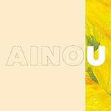

<iframe src="https://open.spotify.com/embed/album/6OfjyI10e9vEFFzWdcmwqW" width="300" height="380" frameborder="0" allowtransparency="true" allow="encrypted-media"></iframe>

　中村佳穂『AINOU』凄まじい作品、歌い方から伺えるビートに対する解釈が円環的じゃなくて、拍を重ねていく感覚と小節を分割していく感覚を自在に行き来しているのが個人的には一番ぐっとくるのだけれど、さらに発声のコン[トロール](http://d.hatena.ne.jp/keyword/%A5%C8%A5%ED%A1%BC%A5%EB)のきめ細かさが半端じゃない。非音楽的な声の「震え」をこんなに巧みに使いこなせる人はそうそういないだろう。言ってみれば崎山蒼志さんの唱法とかに近いのかもしれないけど、やっぱグルーヴに対する感覚は圧倒的に際立ってる。音域の広さや声量に還元されない巧さがある。ところどころにグ[ラニ](http://d.hatena.ne.jp/keyword/%A5%E9%A5%CB)ュラーというかスタッターみたいな[グリッチ](http://d.hatena.ne.jp/keyword/%A5%B0%A5%EA%A5%C3%A5%C1)が挟み込まれるんだけど、1曲目「You may they」でいきなり自分のボーカルを[グリッチ](http://d.hatena.ne.jp/keyword/%A5%B0%A5%EA%A5%C3%A5%C1)させようというその肝の座り方も凄いよ。作品の突き放し方というかさ。

<iframe src="https://hatenablog-parts.com/embed?url=https%3A%2F%2Fwww.cinra.net%2Finterview%2F201811-nakamurakaho" title="中村佳穂という「歌」の探求者。魂の震えに従う音楽家の半生" class="embed-card embed-webcard" scrolling="no" frameborder="0" style="display: block; width: 100%; height: 155px; max-width: 500px; margin: 10px 0px;"></iframe>

[www.cinra.net](https://www.cinra.net/interview/201811-nakamurakaho)

> 中村：とにかく話し合いが大事だと思っていました。たとえば、Mockyとか[Dirty Projectors](http://d.hatena.ne.jp/keyword/Dirty%20Projectors)を同じように「かっこいい」と思って聴いていても、[レミ街](http://d.hatena.ne.jp/keyword/%A5%EC%A5%DF%B3%B9)の人たちはビートやバランスを、私は歌や流れを聴いてるんですね。根本的に音楽の聴き方が違うのに、でも同じように「寂しい曲だね」って感じる。「それはなぜなんだろう？」ってことに向き合う時間を大事にしました。
> 
> 中村：［……］バラードとか一部の曲以外は、ビートミュージック的にこういうメロディーがかっこいいっていう、彼らの提案を膨らませたものが基本になっています。今までは、ずっと弾き続けてきたフレーズなりパートなりをトリミングして、かっこいいと思った部分を即興的に膨らませるっていう曲作りだったので、メロディーの尺が先に決まっているのが苦しくて。

　楽曲からはいかにも自然な印象を受けてたんだけど、インタビューを読むと凄い時間をかけて「[サウンド](http://d.hatena.ne.jp/keyword/%A5%B5%A5%A6%A5%F3%A5%C9)メイクにこだわった作品をつくる」って課題に向き合った結果がこれなんだな。ビートに対する解釈が新鮮に聞こえるのは中村さん自身の資質と彼女がビートミュージックに感じた魅力を丹念にすり合わせた結果なのだろうし、それが孤独な作業じゃなくてなによりもコラボレーションの結果だったということが胸を打つ。「次のアルバムは[サウンド](http://d.hatena.ne.jp/keyword/%A5%B5%A5%A6%A5%F3%A5%C9)メイキングを中心に、一緒に話し合いながら作っていきたいです。あなたの人生を一定期間奪うことになってしまいますが、協力していただけませんか？」と人にお願いする勇気というか、そうまでしないとつくれないものがある、そうまでしてつくりたいものがある、という思いってそうそうないし、彼女自身の持てる力と求める音楽像ががっちりと融合していることがはっきりとリスナーに伝わってくる、そんな作品が実際に出来上がってしまった、それが驚異だろう。

　おれは4曲目の「FoolFor日記」がほんとに心掴む名曲やと思います。全曲そうなんだけどさ。ここから折坂悠太に通じる道もある。ビートミュージック、ソウル、フォーク、民謡の土臭さ、全部通過したあとに残る音響の豊かさ、なんも言うことないっす。『平成』と『AINOU』の2018年でした。もうそれでいい。

[AINOU](http://www.amazon.co.jp/exec/obidos/ASIN/B07GVSKBDH/tortoisetau09-22/)

- アーティスト: 中村佳穂
- 出版社/メーカー: [SPACE SHOWER MUSIC](http://d.hatena.ne.jp/keyword/SPACE%20SHOWER%20MUSIC)
- 発売日: 2018/11/07
- メディア: CD
- [この商品を含むブログを見る](http://d.hatena.ne.jp/asin/B07GVSKBDH/tortoisetau09-22)

[平成](http://www.amazon.co.jp/exec/obidos/ASIN/B07G1ZHWTS/tortoisetau09-22/)

- アーティスト: 折坂悠太
- 出版社/メーカー: ORISAKAYUTA / Less+ Project.
- 発売日: 2018/10/03
- メディア: CD
- [この商品を含むブログを見る](http://d.hatena.ne.jp/asin/B07G1ZHWTS/tortoisetau09-22)
