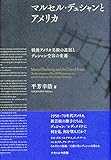

　[東博](http://d.hatena.ne.jp/keyword/%C5%EC%C7%EE)の[デュシャン](http://d.hatena.ne.jp/keyword/%A5%C7%A5%E5%A5%B7%A5%E3%A5%F3)展、第一部は思いの外ためになった。第二部は、まぁ……。

　まずこの展示を通じて[デュシャン](http://d.hatena.ne.jp/keyword/%A5%C7%A5%E5%A5%B7%A5%E3%A5%F3)の仕事にまとめて触れると、[立体視](http://d.hatena.ne.jp/keyword/%CE%A9%C2%CE%BB%EB)への関心やロト[レリーフ](http://d.hatena.ne.jp/keyword/%A5%EC%A5%EA%A1%BC%A5%D5)、遺作のディテイル（両眼用に開けられた2つの穴、はたから見ると見世物用の[ジオラマ](http://d.hatena.ne.jp/keyword/%A5%B8%A5%AA%A5%E9%A5%DE)のような内部構造など）からは美術から排除されてきた視覚文化に対する意識が感じられたし、その文脈で精密光学なるタームも考えるべきなのだろう。

　また、大量生産品を作品に転用する[レディメイド](http://d.hatena.ne.jp/keyword/%A5%EC%A5%C7%A5%A3%A5%E1%A5%A4%A5%C9)もさることながら、大量のマルティプル、出版物やポスターへの自作イメージの再利用、逆に広告に由来するイメージの自作への転用、また「産業」の文脈におかれるロト[レリーフ](http://d.hatena.ne.jp/keyword/%A5%EC%A5%EA%A1%BC%A5%D5)等々、作品の多くが工業化・資本主義化された近代の消費社会にまつわるモチーフや形式を援用していることも、改めて興味深い（[フルクサス](http://d.hatena.ne.jp/keyword/%A5%D5%A5%EB%A5%AF%A5%B5%A5%B9)のインスピレーション源としての[デュシャン](http://d.hatena.ne.jp/keyword/%A5%C7%A5%E5%A5%B7%A5%E3%A5%F3)の理解が深まったというか）。

　第一の点（美術の制度外の視覚文化に対する関心）と第二の点（消費社会へのアジャスト）を自分なりにまとめると、興行師・経営者としての[デュシャン](http://d.hatena.ne.jp/keyword/%A5%C7%A5%E5%A5%B7%A5%E3%A5%F3)、というフレーズに行き着く。近代的な「アーティスト」なる職業が世の中の諸生産体制の変化によって揺らいだことへの応答として、より直接消費社会にコミットしうるような「アーティスト」像の模索として、見世物屋や技術者への擬態と、（度重なるマルティプルの制作などのかたちで）いささか戯画化されたつくる＝売るのサイクルそのものを活動の軸とした起業家・経営者への擬態が彼の活動のなかにあるのではないかということだ。

　ただそれは消費社会の論理にアジャストして生き抜くことのみを目的としたものではない。あくまでそれは擬態であり批評的営為である。言葉遊びによるユーモアやいささか露悪的にも思える性的なモチーフへの[オブセッション](http://d.hatena.ne.jp/keyword/%A5%AA%A5%D6%A5%BB%A5%C3%A5%B7%A5%E7%A5%F3)（この展示においては[デュシャン](http://d.hatena.ne.jp/keyword/%A5%C7%A5%E5%A5%B7%A5%E3%A5%F3)の若年期からのささやかな執着として異性が位置づけられていたように思う）といった作品に内在する余剰や、需給にもとづく市場原理のほかにも価値体系をもつ美術なる領域を生活に隣接させようという試みそのものが、すでにして撹乱的だからだ。

　美術なる領域、あるいは制度の読み替えと共に、[市場経済](http://d.hatena.ne.jp/keyword/%BB%D4%BE%EC%B7%D0%BA%D1)がすっかり浸透した生活の領域への侵犯という、ふたつの試みが限りなく隣接する場所に[デュシャン](http://d.hatena.ne.jp/keyword/%A5%C7%A5%E5%A5%B7%A5%E3%A5%F3)はいるのであって、そう考えてみると[千利休](http://d.hatena.ne.jp/keyword/%C0%E9%CD%F8%B5%D9)の日常の美が云々みたいな悠長なことを言う第二部は、もちろんそれ以外にも言うことはいろいろあるのだが、美術や工芸の伝統とか制度といったもののなかに安住しきっていてまったくつまらないと思う。

　個人的には[立体視](http://d.hatena.ne.jp/keyword/%CE%A9%C2%CE%BB%EB)やロト[レリーフ](http://d.hatena.ne.jp/keyword/%A5%EC%A5%EA%A1%BC%A5%D5)、遺作の問題系に連なる消費社会における視覚文化の脈絡において[デュシャン](http://d.hatena.ne.jp/keyword/%A5%C7%A5%E5%A5%B7%A5%E3%A5%F3)を考えるっていうの面白そうだなあと思ったのでまあいろいろ読みたい、暇があればね……　平芳さんの本からかな……。

[マルセル・デュシャンとアメリカ: 戦後アメリカ美術の進展とデュシャン受容の変遷](http://www.amazon.co.jp/exec/obidos/ASIN/4779510635/tortoisetau09-22/)

- 作者: [平芳幸浩](http://d.hatena.ne.jp/keyword/%CA%BF%CB%A7%B9%AC%B9%C0)
- 出版社/メーカー: ナ[カニ](http://d.hatena.ne.jp/keyword/%A5%AB%A5%CB)シヤ出版
- 発売日: 2016/07/30
- メディア: 単行本
- [この商品を含むブログ (2件) を見る](http://d.hatena.ne.jp/asin/4779510635/tortoisetau09-22)

　そういえば平芳さんの[美術手帖](http://d.hatena.ne.jp/keyword/%C8%FE%BD%D1%BC%EA%C4%A1)でのレビューよかったっすね。

<iframe src="https://hatenablog-parts.com/embed?url=https%3A%2F%2Fbijutsutecho.com%2Fmagazine%2Freview%2F18848" title="なぜ《泉》ばかりが注目されるのか？ 平芳幸浩評「マルセル･デュシャンと日本美術」展｜MAGAZINE" class="embed-card embed-webcard" scrolling="no" frameborder="0" style="display: block; width: 100%; height: 155px; max-width: 500px; margin: 10px 0px;"></iframe>

[bijutsutecho.com](https://bijutsutecho.com/magazine/review/18848)
