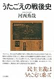

[うたごえの戦後史](http://www.amazon.co.jp/exec/obidos/ASIN/4409520644/tortoisetau09-22/)

- 作者: 河西秀哉
- 出版社/メーカー: [人文書院](http://d.hatena.ne.jp/keyword/%BF%CD%CA%B8%BD%F1%B1%A1)
- 発売日: 2016/10/31
- メディア: 単行本
- [この商品を含むブログ (3件) を見る](http://d.hatena.ne.jp/asin/4409520644/tortoisetau09-22)

　河西秀哉『うたごえの戦後史』（[人文書院](http://d.hatena.ne.jp/keyword/%BF%CD%CA%B8%BD%F1%B1%A1)、2016年）を読了。戦後の合唱運動が戦前・戦中の厚生運動から思想的においても関わる人物の点でも地続きであることをはじめとして面白い話が数多い。戦前は[全体主義](http://d.hatena.ne.jp/keyword/%C1%B4%C2%CE%BC%E7%B5%C1)に奉じる国民の育成のために、戦後はいわゆる「[戦後民主主義](http://d.hatena.ne.jp/keyword/%C0%EF%B8%E5%CC%B1%BC%E7%BC%E7%B5%C1)」に適した「近代的な市民」の教育のために、ほとんど同じロジックを展開しつつ、全国的な合唱運動が組織されたわけだ。また、[共産党](http://d.hatena.ne.jp/keyword/%B6%A6%BB%BA%C5%DE)の影響下で政治色が強かったうたごえ運動とか、あるいは日本独特の「おかあさんコーラス（ママさんコーラス）」のような敗戦から高度経済成長までの合唱運動に関する記述もきわめて興味深い。求められる役割、あるいは合唱が奉仕すべき対象を少しずつ変えながらも合唱運動は脈々と続いてきた。

　ここで両義的なのは、さまざまな理念や目的のもとで組織化される合唱運動が、音楽を手段として社会や個人を変えようというものであった一方で、また同時に音楽という文化を広く大衆へ根付かせるための手段でもあった――つまり手段と目的が常に曖昧に重なり合っていた――ということだ。音楽はメッセージを伝える「声」であり「活動」である。そしてまた、「声」や「活動」は音楽を世に根付かせる役割も果たす。社会なり政治なりと音楽とは切り離し難い、というのはまさにこの点にこそ見出されるべきかもしれない。

　さて、ざっくりとまとめると合唱運動が理想とした運動の参加者像は、戦前・戦中は[全体主義](http://d.hatena.ne.jp/keyword/%C1%B4%C2%CE%BC%E7%B5%C1)に奉ずる国民、戦後には民主主義社会を支える近代的な市民であったのだけれども、本書では高度経済成長以降、そもそも合唱のような集団によるレクリエーションの文化が衰えることによって合唱運動全般が退潮してゆくことが指摘される。問題をこと音楽に絞った場合、レコードの普及やマスメディアの急速な発達によって、ポップ・ミュージックが「ともに歌うもの」から「聴取し、消費するもの」へ移行したことで、合唱が社会全体に対して持つ影響力が衰えていったことは想像がつく。本書では、社会運動のなかに音楽を組み込み、その有用性をプレゼンテーションする合唱運動の戦略を「音楽の社会化」と繰り返し呼んでいるが、「音楽の社会化」よりも先に、消費文化の発達による社会そのものが変容し、そもそもそうした役割を音楽のような娯楽に求めること自体が低調になっていったものと思われる。

　昨今、音楽を社会から切り離されたある種の余剰、「無駄なもの」として位置づけたうえで、「無駄だからこそ意味がある」というような論の展開をする人が多いけれども、歴史を紐解けば音楽がよかれあしかれいかに「有用」なものかは嫌というほど例が出てくる。「音楽は本当は世の中に必要ない（でもだからこそ必要なのだ）」というのはそうした「有用性」の危うさに対する防御反応なんじゃないだろうか。そこを認識したうえで戦略的に音楽の無用さを訴えるぶんにはいいと思うんだけれども、単に音楽の有用性を否認しているだけだとそれはそれで誰かさんに足元すくわれてもしゃあないんではという気がする。

<iframe src="https://hatenablog-parts.com/embed?url=https%3A%2F%2Fnatalie.mu%2Fmusic%2Fcolumn%2F304809" title="十代とダンス 第４回 | 社会性と自主性を育んで浸透したチアダンス - 音楽ナタリー" class="embed-card embed-webcard" scrolling="no" frameborder="0" style="display: block; width: 100%; height: 155px; max-width: 500px; margin: 10px 0px;"></iframe>

[natalie.mu](https://natalie.mu/music/column/304809)

　ナタリーで大石始さんと高岡謙太郎さんがやっている連載は、録音物やパフォーマンスとしての音楽のみならず、その外側に広がっている音楽の裾野に分け入っていくような内容で毎回おもしろい。上掲のチアダンスを取り上げた回なんかはここまで書いてきた音楽の「有用性」をよく示していて、人によってはきわめて不純に感じられるかもしれない。しかしそうした価値判断や好き嫌いは別として、果たしてチアダンスを通じて音楽が示そうとしている「有用性」の正体はなんなのか、という批判的な考察は常に必要だろう。

　[全体主義](http://d.hatena.ne.jp/keyword/%C1%B4%C2%CE%BC%E7%B5%C1)に奉じる臣民の教育から、自立した近代的な市民の教育へと変遷を辿った合唱運動（戦後の合唱運動に大きな流れをつくった「おかあさんコーラス」は[ジェンダー](http://d.hatena.ne.jp/keyword/%A5%B8%A5%A7%A5%F3%A5%C0%A1%BC)化された女性の役割分担という問題も含んでいてそう簡単にまとめられるものでもないのだが）の流れの後に位置づけられるであろうチアダンスの求める理想の個人像は、「リーダーシップ」や「問題解決能力」といった言葉にあらわれているように、資本主義社会における理想的な[ビジネスパーソン](http://d.hatena.ne.jp/keyword/%A5%D3%A5%B8%A5%CD%A5%B9%A5%D1%A1%BC%A5%BD%A5%F3)像に重なる。だいたい高度経済成長時代くらいまでは、近代的な民主主義国家をつくりあげるために個々人に自発性とか主体性が求められていたのが、いつしか奉仕の対象が国家とか民主主義という理念ではなく資本主義社会にすり替わっている。もちろん「有用」な音楽は、そうした主体の教育にも適している――必ずしも最も適しているわけでもないと思うけれども。

　芸術とか文化がこのような「有用性」を見せるのは個人的にもあんまり好きなもんじゃないのだが、しかし一方で芸術は無用なものであるとただ唱えることで現実を否認するのも気に入らない。最近はとくに愛国ソングとか[BTS](http://d.hatena.ne.jp/keyword/BTS)のあれこれなんかで「音楽と政治」の危うい関係が取りざたされることが多いけれど、そうしたポップ・ミュージックの世界の外側に広がる音楽の外延において音楽が重宝されるその「有用性」への意識もまた重要であることを再認識した。『うたごえの戦後史』はその点できわめてアクチュアルに読める一冊ではないかと思う。
