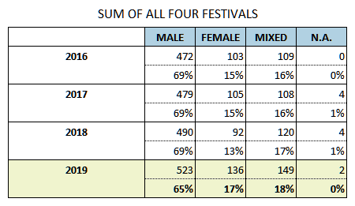
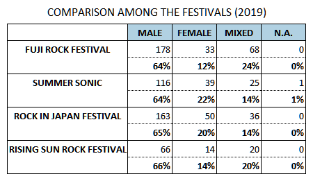
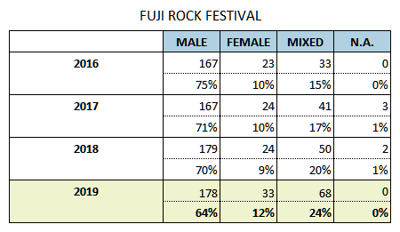
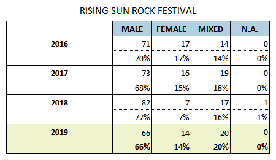
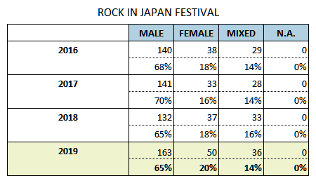

In February 2018, PRS Foundation launched a campaign named [Keychange](https://keychange.eu/). By encouraging music festivals to achieve a 50:50 gender balance by 2022, it aims to make the music industry more inclusive and create a better future. Initially, their partners were 45 festivals around the world but now they include more than 130 festivals.

Nowadays, music festivals are the industry's most important opportunity to reach a major audience. Moreover, as some big festivals started to stream their stages via YouTube, music festivals became not only a place for the live experience but also a crucial platform of the business. So Keychange's activity is to the point. Festivals could epitomize the whole industry in many ways.

While Keychange aims to create the future, some media is examining the status quo statistically with vivid visualization. In May 2018, Pitchfork published the result of their own research for the festival's gender equity in America. According to the report, in 2017, festivals' lineup in the US festivals had **74% male** acts, **14% female**, and **12% mixed**. The next year's had **70% male**, **19% female**, and **11 % mixed**. For a more detailed investigation, you can read [this article](https://pitchfork.com/features/festival-report/tracking-the-gender-balance-of-this-years-music-festival-lineups/).

## Then, how's it going here in Japan?

Since the first Fuji Rock Festival in 1997, music festivals in Japan saw rapid growth throughout the 00s. By the early 2010s, music festivals became one of the most popular leisure activity. This given situation even encouraged some rock bands to invent "Festival Rock," which features uplifting four-on-the-floor drum beats and sing-along friendly melodies.

Thus, although music festivals have been playing a pivotal role in Japan's music industry, there are few mentions on gender equality. I couldn't find statistics on it so I decided to collect data by myself.

There are four major music festivals in Japan: Fuji Rock Festival, Summer Sonic, Rock In Japan Festival, and Rising Sun Rock Festival. The former two are known for their international lineup in contrast to the latter two focus on acts that are based in Japan. I limited the scope of this research to those four festivals' lineup for the last five years. I scraped those festivals' web site by Python and checked out each acts' gender as far as I could find.

Below is what I found.

## SUMMARY

- In 2019, the lineup for major festivals in Japan was **65% male** acts and **35% female or mixed** acts.
    - Comparing those festivals, it seems there's no big difference between them as far as concerning male : female (or mixed) ratio.
    - The festival that included **the most female acts** in 2019 was **Summersonic (22%)**.
    - The festival that included **the least female acts** in 2019 was **Fuji Rock Festival (12%)**.
- From 2016 to 2018, the lineup for major festivals in Japan had been **69% male** acts and **31% female or mixed** acts.
    - Looking at annual changes, there is hardly a particular tendency on the male : female ratio.
    - However, some festivals' transitions show possible intentions to reduce the male ratio.
        - In 2016, **Fuji had 75% male acts and Rock In Japan did 68%**. On the other hand, in 2019, **the former was 64% (11 points lower) and the latter was 65% (3 points lower)**.
        - Given that, I'm planning further research for the transition throughout Fuji's and Rock In Japan's entire history.

## Then, is Japan's gender equality in music festivals better than the US?

As seen above, Japan's gender equality in the festivals' lineup seems a bit better than the US. There might be many explanations for this, but I don't have any clear opinion now.

Having said that, I am not so optimistic. It's because Japan's society as a whole seems very sexist. I've been disappointed at our society's indifference to any kind of gender gap. (One of the most shocking news was this... worth reading. [Two more Japanese medical schools admit discriminating against women | World news | The Guardian](https://www.theguardian.com/world/2018/dec/12/two-more-japanese-medical-schools-admit-discriminating-against-women))

I think the gender ratio I mentioned above is a baseless and arbitrary consequence of the society's indifference. Even though the score looks better than other countries, it doesn't mean there's less gender inequality in Japan. If we don't consciously deal with the problem, it can be worse in the future.

Anyway, this is merely a score just calculated numbers on spreadsheets. A more precise analysis is needed. I hope this would motivate someone (and help me tidying data...).

## Tables

- 
- 
- 
- 
- 
- 
