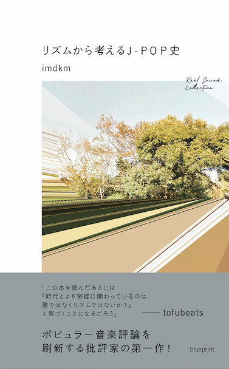

　わたくしimdkm（イミヂクモ）の単著『リズムから考えるJ-POP史』が10月に発売になります。3日には書店に並ぶようです。

imdkm『リズムから考えるJ-POP史』  
blueprintより2019年10月3日（木）発売  
四六判・二百六十四頁、1,800円+税  
全国書店、もしくは[Amazon](https://www.amazon.co.jp/dp/4909852034/)にて予約受付中

　この本は[RealSound](https://realsound.jp/)で連載していた同名の企画「[リズムから考えるJ-POP史](https://realsound.jp/tag/%e3%83%aa%e3%82%ba%e3%83%a0%e3%81%8b%e3%82%89%e8%80%83%e3%81%88%e3%82%8bj-pop%e5%8f%b2)」をもとにしたもので、1989年を起点とするJ-POPの歩みを「リズム」という観点から考察する内容になっています。

　重要なポイントで登場してくるミュージシャンをざっと挙げてみると、折坂悠太、cero、星野源、宇多田ヒカル、trf（小室哲哉）、MISIA、m-flo、capsule（中田ヤスタカ）、ASIAN KUNG-FU GENERATION、Base Ball Bear、DOPING PANDA、KOHH、BES、S.L.A.C.K.（現5lack）、DA PUMP、RADIOFISH、サカナクション、UNISON SQUARE GARDEN、宇多田ヒカル、三浦大知……　とまあ、他にもいろいろ出てくるんですが、いわゆる「J-POPの30年がまるわかり！」みたいな本ではぜんぜんないです。あくまで、「このリズムヤバいよね」とか「このリズムってなんだったんだろうね」みたいな発想ありきなので。とはいえ、内容を読むとある程度クロノロジカルにトピックが並んでいるのもわかっていただけると思います。

　どんな話してんの？　って言われたらまあ連載をチェックしてみて欲しいところ、しかしよい動画を以前アップロードしていたのを思い出しました。



　まあこういう話を延々一冊やってるようなもんだと思ってください。そうとも限らないですがまあ……。

　とはいえ、一点注意しておきたいところに、リズムといってもいろんなリズムがある、ということ。ドラムやパーカッションが奏でるリズム（ここにベースも加えていわゆる「リズム隊」というのがいわゆる音楽におけるリズム像の定番でしょう）、メロディがつくりだすリズム、あるいは各パートのアンサンブルのなかに浮かび上がってくるリズム、ジャンルに固有のパターン（4つ打ちとか2stepとかね）、時代に固有のパターン……等々、リズムという概念が指すところはさまざまです。この本はある意味で音楽におけるリズムが持つこのあいまいさに思いっきりよっかかっています。でもそれでいいんだ、と思って書きました。なんですかね、時間の感覚を司るものは全部リズムです。極論。

　そのあたりの思いは「あとがき」にも書いたので、まあ、読んでくれッて感じです。

　いつか理論的に整理して…みたいな仕事もできたらいいんでしょうが、そんなん一生モンですよね。本書でも度々参照している佐藤利明『ニッポンのうたはどう変わったか 増補改訂 J-POP進化論』（平凡社ライブラリー、2019年）や、同書で理論的枠組として採用されているピーター・ファン＝デル・マーヴェ著・中村とうよう訳 『ポピュラー音楽の基礎理論』（ミュージック・マガジン、1999年）みたいな偉大な仕事であったり、あるいは小泉文夫の歌謡曲論とか、膨大な蓄積を前にして呆然とするばかりですな……。

　そういえば、なんかtofubeatsに解説文を書いてもらってるんですが、これが結構よくて、あの人もっとこういうこと書きゃいいのにと思いました。頼んでみるもんですね。トーフファンの人も必読です。こないだ彼の事務所にお邪魔したときも面白い意見がけっこう飛び出してきました。9月25日に予定されているトークイベントではそんな話もできたらいいなーと思ってます。
