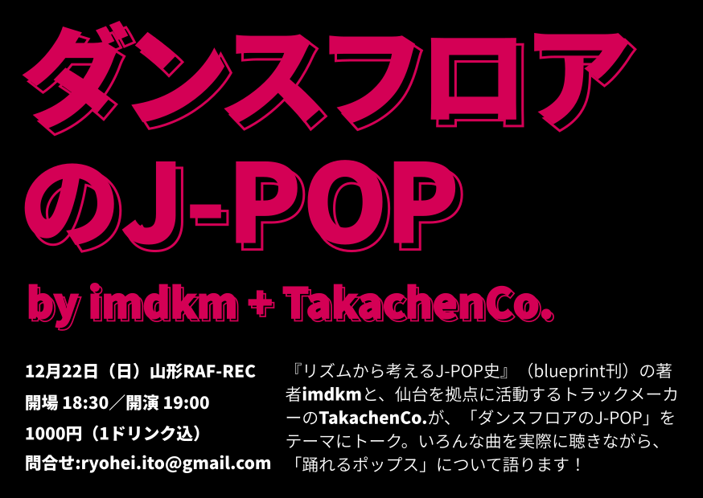

この度、[『リズムから考えるJ-POP史』](https://www.amazon.co.jp/dp/4909852034/)刊行記念トークイベントとして、「ダンスフロアのJ-POP by imdkm + TakachenCo.」を12月22日（日）に[山形RAF-REC](http://rankandfilerec.com)にて開催します。

30年にわたるJ-POPの歴史を「リズム」という切り口から論じた『リズムから考えるJ-POP史』。その著者imdkmが、仙台を拠点に活動するトラックメーカーのTakachenCo.をゲストに招いてトークイベントを開催。「ダンスフロアのJ-POP」をテーマに、ダンスミュージックのリスナー／作り手の立場から、いろんな曲を実際に聴きながら、「踊れるポップス」について語ります。

## 概要

日時：12月22日（日）18:30開場、19:00スタート  
料金：1000円（1ドリンク込み）  
会場：山形RAF-REC（[http://rankandfilerec.com/](http://rankandfilerec.com/)）  
※問合せはryohei.ito@gmail.comまで

## 出演者紹介

### imdkm

山形県出身、天童市在住。ライター、批評家。ティーンエイジャーのころからビートメイクやDIYな映像制作に親しみ、Maltine Recordsなどゼロ年代のネットレーベルカルチャーにいっちょかみする。以後、京都で8年間に渡り学生生活を送ったのち、2016年ごろ山形に戻ってブログを中心とした執筆活動を開始。ダンスミュージックを愛好し制作もする立場から、現代のポップミュージックについて考察する。

### TakachenCo.

岩手県出身で仙台在住。実の弟C.Sayidと共にリミキサーユニットThe LASTTRAKとして活動中。2010年よりアニソンをハウスやドラムンベースなどDJ仕様のダンスミュージックにリミックスし次々とネット公開、秋葉原mograを中心にアニソンクラブシーンから注目を受けるようになる。これまでにアイドル、ボカロ、ヒップホップ、ゲームなど様々なシーンのリミックスを手掛けている。近年ではUsagi ProductionによるVtuberコンピレーションVirtuREAL.00で人気急上昇中のVtuber"somunia"と楽曲を制作、東方projectアレンジの大手サークルIOSYS「TOHO BOOTLEGS」に楽曲提供している。
