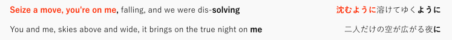
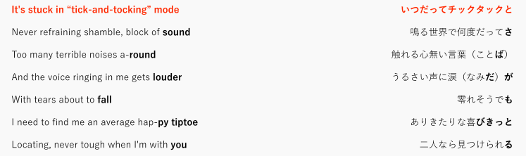
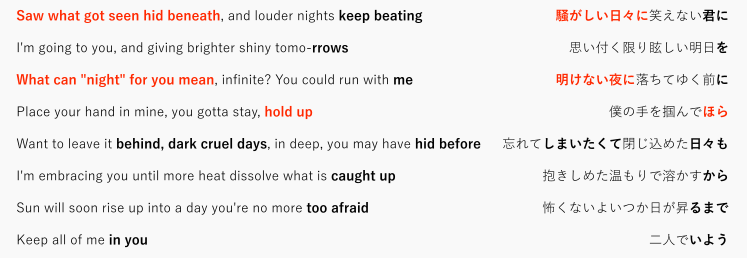
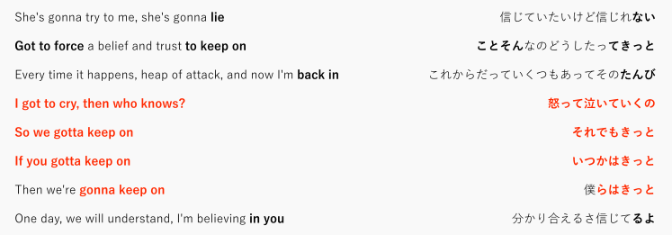
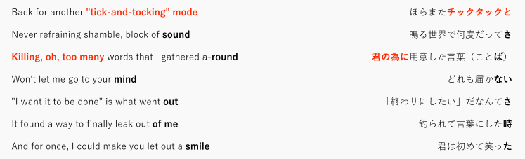
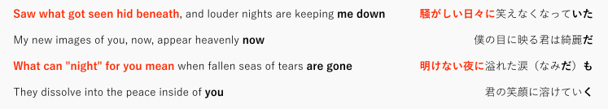
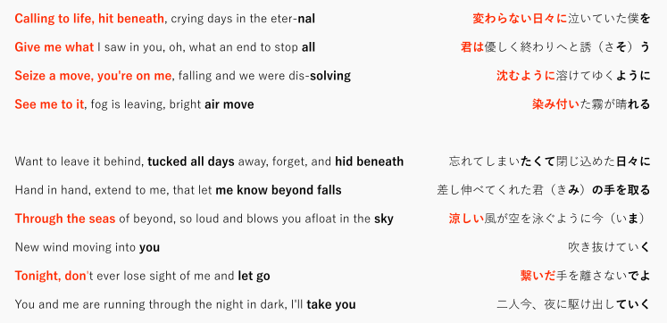

YOASOBIが代表曲「夜に駆ける」の英語詞バージョン「Into the Night」を発表した。

\_fg

聴いた人ならわかると思うが（まだなら上の動画をクリック！　あとそもそも原曲聴いてない場合は原曲も→[YOASOBI「夜に駆ける」 Official Music Video - YouTube](https://www.youtube.com/watch?v=x8VYWazR5mE)）、冒頭からびっくりするような仕上がりだ。趣向を凝らしているというか、それともなんというか、笑ってしまうというか……。単純に言うといわゆる「空耳」がたくさん含まれているのだ。空耳は（空耳アワーの流儀に従うなら）「日本語ではないのにたまたま日本語に聴こえる」だけれど、「Into the Night」は意図的に日本語へがっつり寄せている。

しかし内容としては「音を優先して意味が破綻する」ようなことをうまく避けて、かなり忠実に原詞を英語にうつしかえている。そのバランスがすごいっていうか、よくそんなことやったもんだと思う。ちなみに英語詞バージョンの作詞はKonnie Aoki。

あんまり空耳部分が気になったので英詞と原詞を照らし合わせて、さらに両バージョンを同時再生してなにが一致しているか（自分が聴こえた範囲で）チェックしてみた。英語の専門家でもないし、辞書で発音をチェックしつつ「そうはならんやろ……（なっとるやろがい）」の感じで、耳を信じて……。多少読み書きはできてもそんな喋れないし。あくまで「聴こえた」なので、それなりに経験を積んだ英日話者から見たら「なに言ってんだよ」みたいになるかもしれません。

まず、頭サビのイントロから空耳だ。以下、**赤太字**は空耳パートで、**黒太字**は特に行の末尾を中心に音が**それなりに**一致しているポイント（ほんとはシラブル／モーラごとに「ここ合ってる！」とか無限に言えそうな気がするけど、行末と、加えて特に気になったところだけ……）。空耳度は特に高く、なにしろ「沈むように」と"Seize a move, you're on me"は、まず直訳ではないし、意訳とも言い難い。もたらすイメージもかなり違うからだ。むしろ"falling, and we were dissolving"が「沈むように溶けてゆくように」に対応している。原詞に"Seize a move..."と直接対応するパートは見当たらないので、完全に音の一致を優先してつくられているのがわかる。

続くAメロには空耳パートはない（ので図は略）。少なくともそう聴こえない。ただ、行の末尾（およそ小節上のまとまりの最後のアクセント）は日本語の響きとある程度合わせてあって、かならずしも完全に一致していなくても、発音のニュアンスを残してある。

Bメロでは最初の一行がまず"It's stuck in "tick-and-tocking" mode"と「いつだってチックタックと」で音がかなり近い。空耳だ。しかもここは内容もかなり近い。っていうか"tick-and-tocking"ってもろだし。ただ、"tick-tock"とは言っても"tick-and-tocking"ってそんな言うのかわからない。だからあえてダブルクォーテーションでくくってあるんだろう。進行形にして動名詞化してあるのもふくめて、「チッ**ク**タッ**ク**」と無声音が有声化している日本語の発音と辻褄を合わせるために工夫してある。

そして最初のサビ。「騒がしい日々に」が"Saw what got seen hid beneath"となってかなり空耳。意味も直訳ではない（し、楽曲のイメージを汲んだうえでの創作という感じ）。一行開けて「明けない夜に」が"What can "night" for you mean"は空耳度はやや落ちるもののかなり空耳。「ほら」が"hold up"なのは**黒太字**でもいいのだけれども、サビの後半につないでタメる重要なフレーズであり、かつ意味もそこまで遠くない（「ほら」だとまだ手を掴んでない「君」に呼びかけているみたいだけど、"hold up"だともう掴んでる感じではある）。

頭サビもサビも、ビートが抜けてヴォーカルに耳をひきつけて始まるから（頭サビはまるごとそうだし、サビもアウフタクトの部分がビートなし）、ここで絶対に音を一致させようという狙いがあったのは想像できる。あとは物語を伝えることに重きが置いてありそうだ。

もうひとつサビで面白いのは「いよう」と"in you"で、これは普通に考えるとあんまり音として一致しないんだけど、比べて聴くとかなり似ている。ここはいったんビートにキメが入ったあとでビートが抜け、間奏に勢いづけると同時に声の余韻を出す部分だから、あえて寄せたんじゃないか。実際、ここ以外、たとえばBメロ末尾の"you"はけっこうはっきり「う」の音になっている。

2度めのAメロ（長さはハーフ）はちょっと飛ばして、Cメロ。

ここの「それでもきっと　いつかはきっと　僕らはきっと」を"gotta keep on"の畳み掛けで再現しているのが面白い。空耳度はそこまで高くないけど。発音記号で比べたら一致していないだろうけど、日本語の「っ（促音）」がつくるアクセントと英語の強弱アクセントをうまく一致させて、聴いてる感じはかなり近いものにしてあるというか……（知らんけど……）。

Dメロも飛ばして二度目のBメロ。ここで面白いのは「笑った」と"smile"で、「た～あ～あああ～」と最後の母音を伸ばす歌い方と、"smile"の\[άɪ\]の音を伸ばして最後に無声の"l"に着地する歌い方でなんか帳尻が合っている。

続いて落ちサビ（最後のサビの前でビートが抜けてヴォーカルが前に出てくるところ）。ここは一旦無音が入った上に転調しての落ちサビという「ここでヴォーカルを聴かせなかったらどうする！」みたいなパート。もともとのサビの前半をほぼリピートしている構成ということも手伝って、安定の空耳。

そして、ラストのサビ。落ちサビで下に転調したと思ったら駆け上がって元のキーより高いところに転調するところで、楽曲と物語のクライマックスでもある。畳み掛けるように空耳が連発され（"Calling to life"は空耳と言っていいかやや迷う気もするけど。それを言い出すとだいたい「聴こえるっちゃ聴こえるけど」になっていく……）、このパートの響きがいかに重要だったかが伺える。

というふうに比べていくと、手当たりしだいに空耳というよりは、ある程度「ここが勘所」というポイントで空耳が使われているんじゃないかと思える。第一に、声に注意が向くポイント。第二に、意味よりも感情の伝達を重視するクライマックスのポイント。第三にはそもそも響きが面白いところ（「きっと」の連発とか）。

以上です。特に落ちはないです。
