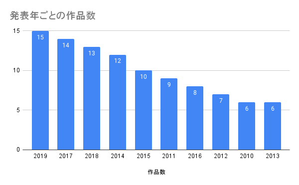
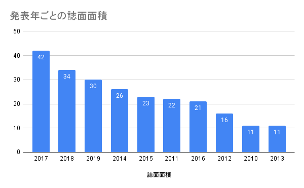

ミュージック・マガジン2021年3月号の特集は「［決定版］2010年代の邦楽アルバム・ベスト100」だった。その内容（なにがランクインしているか？）自体にはそこまで関心がないのだが、ふとよぎるのは「ミューマガって毎年ベストアルバム発表してるよな」ということだ。2010年代のベスト・アルバム企画を集めて眺めてみたらどうなるんだろう、と思ってしばらくバックナンバーを集めていた。そのかんたんなメモ。

ちなみに該当号の購入リンクは[こちら](https://amzn.to/3hzYMdG)（アフィリエイトリンクになっています）。

## ［決定版］2010年代の邦楽アルバム・ベスト100を撫ぜる

まずは、件の「［決定版］2010年代の邦楽アルバム・ベスト100」を見ていくことにする。

### 年ごとの集計結果（作品数、誌面面積）

以下は、100作品をそれぞれの発表年に着目してカウントし、グラフ化したものだ。1つ目は単純に「作品数」を合計したもので、2つ目は「誌面面積」を合計したもの。

「誌面面積」というのはかなり妙な指標だと思われるかもしれない。単純に言うと、誌面に対してその作品がどのくらいの面積を割いて紹介されているかをかんたんに数値化したものだ。最大で6、最小で1となる。これは一作ごとに添えられるレビューの文字数とも相関する。したがって、この数値を用いることで、どの程度のプライオリティでもってその作品が紹介され、位置づけられているかを、あまり細かすぎない程度に、かつ誌面の印象と乖離しないかたちで指標化することができる。「トップ10」というように10刻みにしたり、なんとなく恣意的に「トップ30」みたいな切り取りをするよりは、ランキングの性質に即しているのではないか。

というのをふまえてグラフを見ていく。単純に作品数で言えば最多は2019年（15作）であり、以下2017年（14作）、2018年（13作）と2010年代末の3年間が連なる。一方で誌面面積を見ていくと、2017年が逆転して最大になり、ついで2018年（34）、2019年（30）と続く。いずれにしてもこの3年間に評価された作品が集中していることは間違いなく、見方によっては2017年が（ミューマガ的には）もっとも豊作だった、のかもしれない。

他方、2010年代の初頭はいささか作品数も少なければ誌面面積も小さい。「最近の作品のほうが記憶に残っているからこうなるのでは？」と言いたくなるところだが、2014年は2017～2019年に次いでいる。あるいは2016年が思いのほか後ろの方にいるのも面白い。2011年は2010年代初頭のなかでは頭一つ抜けている。そう考えると、「過去になればなるほど振り返られる作品数が少ない」と単純化できるわけでもなさそうだ。このあたりは「具体的にその年のどんな作品がランクインしているか？」とか見ていくと楽しそうだけれど、際限なくなるのでやめておく。

### 複数作ランクインしたアーティスト

続いて、100作品中、複数の作品がランクインしたアーティストを見ていく。

**坂本慎太郎**＝3作品：6位『ナマで踊ろう』（2014年、ゼローン）誌面面積：4、11位『できれば愛を』（2016年、ゼローン）誌面面積：4、60位『幻とのつきあい方』（2011年、ゼローン）誌面面積：2

**大森靖子**＝2作品：25位『TOKYO BLACK HOLE』（2016年、エイベックス・トラックス）誌面面積：3、59位『絶対少女』（2013年、ピンク）誌面面積：2

**サニーデイ・サービス**＝2作品：4位『DANCE TO YOU』（2016年、ローズ）誌面面積：5、55位『Popcorn Ballads』（2017年、ローズ）誌面面積：2

**tofubeats**＝2作品：35位『FANTASY CLUB』（2017年、アンボルデ）誌面面積：3、58位『lost decade』（2013年、ワーナー）誌面面積：2

**PIZZICATO ONE**＝2作品：29位『11のとても悲しい歌』（2011年、ユニバーサル）誌面面積：3、38位『わたくしの二十世紀』（2015年、ヴァーヴ）誌面面積：3

**cero**＝2作品：5位『Obscure Ride』（2015年、カクバリズム）誌面面積：5、14位『POLY LIFE MULTI SOUL』（2018年、カクバリズム）：誌面面積：4

坂本慎太郎が3作品選出されているほかは、大森靖子、サニーデイ・サービス、tofubeats、PIZZICATO ONE、ceroが2作品選出されている。ここでも誌面面積の指標を持ち出すと、坂本慎太郎の総誌面面積が10であるのに対してceroが9と迫っているのが面白い。誌面面積で順番をつけるならば、坂本（10）・cero（9）・サニーデイ・サービス（7）・PIZZICATO ONE（6）・大森靖子（5）・tofubeats（5）となる。

## 年次ベスト企画も撫ぜる

さらに、「2010年代の邦楽アルバム・ベスト100」を頭の片隅に置きつつミューマガが毎年行っているベストアルバム企画も見ていく。

### 2010年代ベストには入ったのに年次ベストには入っていない作品

全100作品中、ミュージック・マガジンが毎年行っているジャンル別ベストに掲載されなかったアルバムは52作品。

すべてを列挙するのは難しいが、たとえば9位にランクインした中村佳穂『AINOU』（2018年、アイノウ）は当時のランキングに入っていない。これはけっこう意外だった。ほか、16位一十三十一『CITY DIVE』（2012年、ビルボード）や19位森は生きている『グッド・ナイト』（2014年、Pヴァイン）も同様。以上はトップ20、誌面面積4に相当するものだ。

ほか、気まぐれにピックアップすると、24位星野源『YELLOW DANCER』（2015年、スピードスター）、27位三浦大知『球体』（2018年、ソニック・グルーヴ）あたりが当時のランキングに入っていないのはちょっと意外かもしれない。

年次ベストとディケイドベストでは選盤の方法も基準もまったく違うので比較すること自体がナンセンスだろうけれども、これを出発点に「じゃあ、当時はどういう評価だったのか？」をバックナンバーを拾い読みしてみるのも面白いかもしれない。

### ジャンル分けの変遷

年次ベストとディケイドベストでは方法も基準も違う……と言ったけれど、そもそも年次ベストも結構10年で変化している。唯一さまざまなジャンルごとに識者があつまって選盤・順位付けをするというのは変わらないけれども、そのジャンル分けの変遷が結構面白い。

2010年代で大きな変動があったのはまず2012年1月号の「ベスト・アルバム2011」で、ここで新たに「東アジア」の項目が登場している。また、2011年1月号の「ベスト・アルバム2010」では15ジャンル中14番目に位置していた「ラップ／ヒップホップ［日本］」が、「～2011」では16ジャンル中12番目に移動。

続いて2016年1月号の「ベスト・アルバム2015」では「音楽DVD」と「東アジア」の項目がなくなっている。以降、14ジャンルとなる。

2018年1月号の「ベスト・アルバム2017」では「ラップ／ヒップホップ［日本］」が見開き2ページに増量（これまでは1ページ）し、したがって選盤も5枚から10枚に増え、特集中の位置も14ジャンル中7番目に移動。それ以前から同ジャンルを担当していた二木信は「今回からこのジャンルの年間ベストが10枚になった。嬉しい。」（p.35）と率直な感想を述べている。また、「ジャズ」も1ページから見開き2ページに増量したうえ、前年までは全ジャンル中11番目だった位置が8番目に移動している。松尾史朗は「2001年以来、実に久しぶりに10枚選出の復活である。」と選評を書き出し、「来年も5枚に逆戻りしない活況を期待したい。」と締めくくる（p.37）。

2019年1月号の「ベスト・アルバム2018」では、それまで「ハウス／テクノ／ブレイクビーツ」と呼ばれていたジャンルが「エレクトロニック・ミュージック」に改称。その経緯は「～2017」の「ハウス／テクノ／ブレイクビーツ」の選評において言及されている。ムードマンは「世界の潮流を眺めると実はハウスやテクノというくくり自体がもはやポピュラーではなくなりつつある。」と指摘（p.38）。渡辺健吾も「「ハウス／テクノ」がほとんどない！　という話になったが、「エレクトロニック」という括りにするのはどうか？」（p.39）と書いている。

## だからなんだという話

だからなんだという話ではある。しかしたかだか10年くらいでも並べてみると結構おもしろいもので、もっと時代の範囲を広げてみるとなお面白いだろうし、単なる思いつき以上の意義も見いだせそうだ。以前夏フェスでやってみたジェンダー比率の調査も選盤・選者双方でやろうと思えばできなくもないけれどもちょっと故あって保留としている。あと、ジャンルごとの分類をかませるとか。

ここまでやるとミューマガになんか思い入れがあるのかと思われそうだけれども（何度か書いてもいるし）、「定期的にベスト企画をやっている」「入手が（自分の環境では）容易である」という物理的な条件、そしてなにより「今年に入ったタイミングで2010年代ベストみたいな企画が行われた」というモチベーションがそろっただけのことで、同じような条件が揃うのであれば他の雑誌でもよい。たとえばMUSICAも年ごとの振り返りを毎年やっている（こっちも揃えてあるので、そちらをデータに起こすのもやりたい）。rockin' onもやってたような。

雑誌というのは（ウェブメディアでもそうだけど）蓄積されるアーカイヴであって、アーカイヴとしての雑誌に目を向けると「この企画はいい、悪い」みたいな判断とはまた別の価値が見いだせる。これをきちんとデータの読み書きできる人がやったら面白いんだろうなと思う。なんかふんわりした終わり方になってしまった。もし関心がある方いたらinfo@imdkm.comまで問い合わせください。
