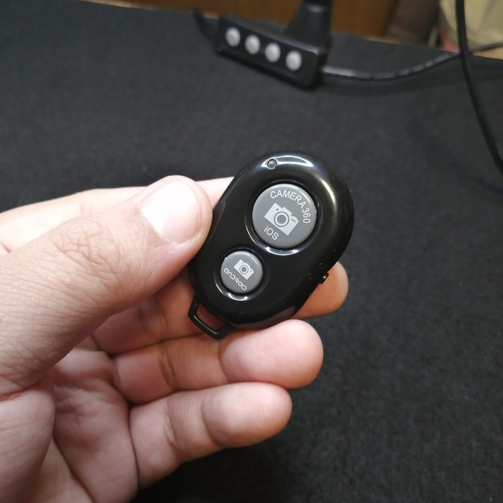
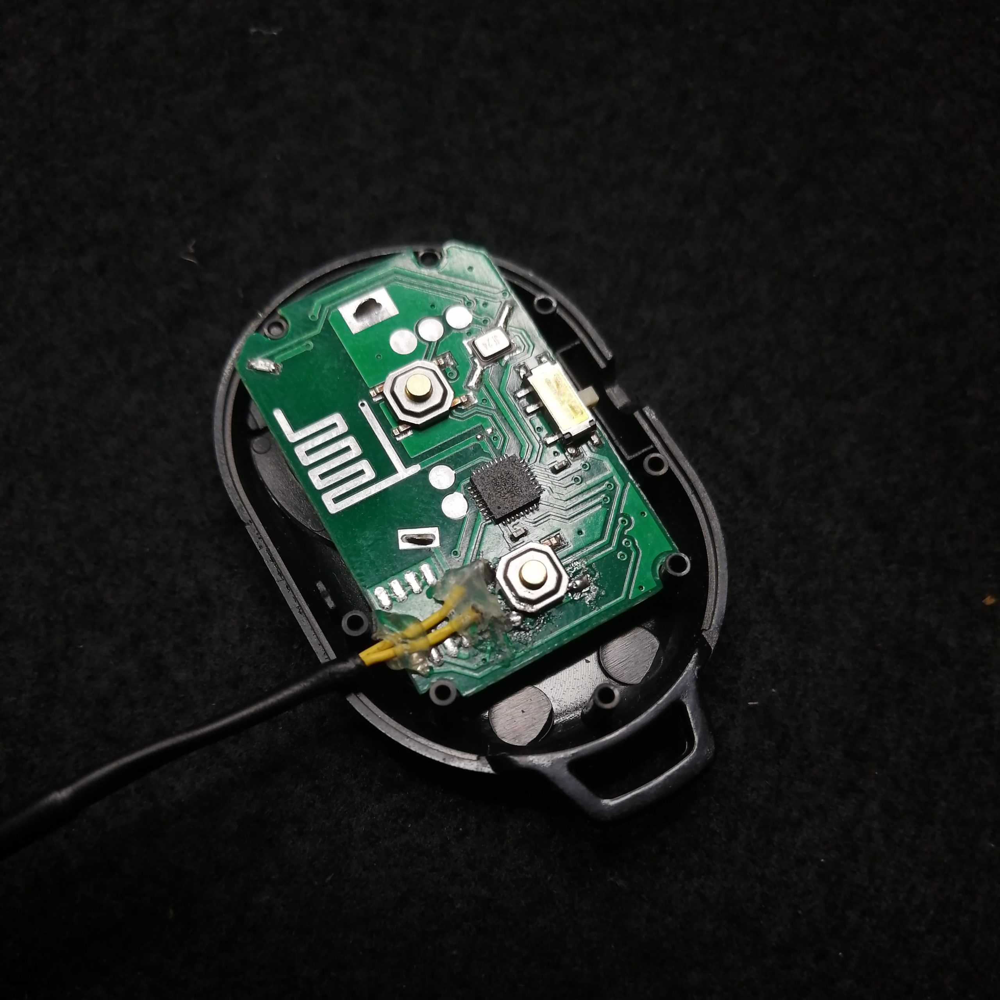
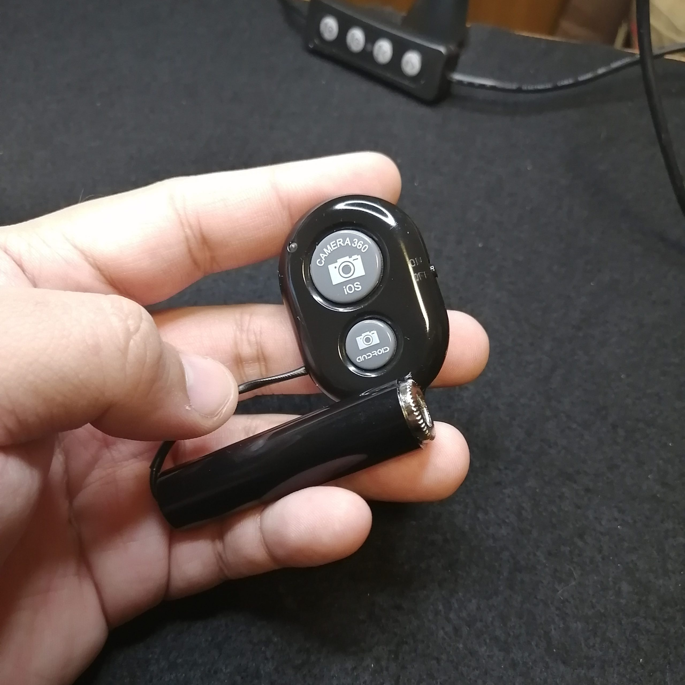
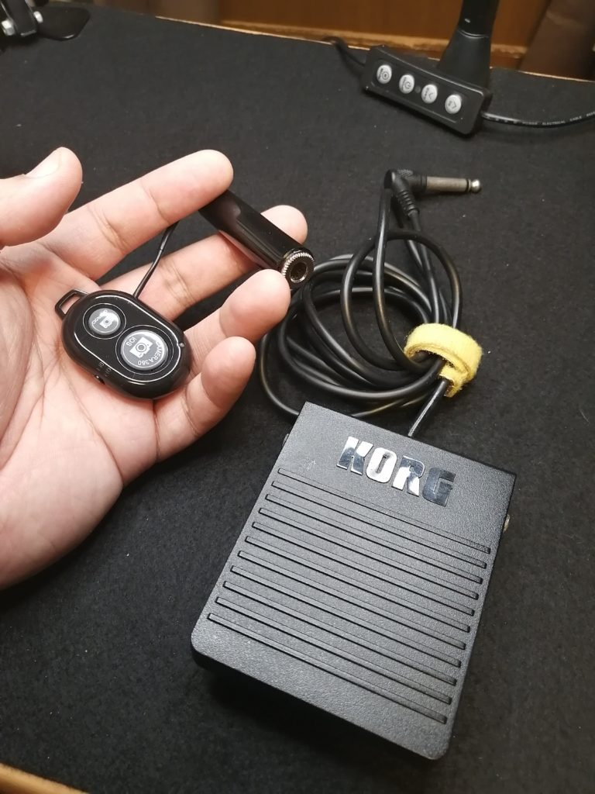

Bluetoothで接続する100均のスマホ用シャッターがある。自撮りとか遠隔撮影で使うものだけれど三脚に固定した上で手ブレを防止したいときにも便利だ。

<figure>

<figcaption>

ダイソーかどっかで買ったスマホシャッター。買ってきたあとでリングライトにもまったく同じものがついてきてたのを発見し、無駄にダブっている。

</figcaption>

</figure>

たとえばAdobe Scanなどのアプリでスマホを簡易オーバーヘッドスキャナとして使っているときなど（以下の画像を参照）、このシャッターがあると変に画角がズレたり文字や図版がブレたりしなくて済む。

https://www.instagram.com/p/CTO18diB1DA/

しかし、上のような資料だといいんだけど厚みのある雑誌の見開きを撮影する時なんかは、なるべくたいらに撮影したいから、両手で撮影対象を押さえつけたくなることがある。ふつうの撮影でも、両手があいているほうが都合のいいときがあるだろう。100均のスマホ用シャッターはほんとに親指サイズみたいなもんで、やろうとおもえば足の指で操作できるけれども（実際にやっていた）なかなかめんどくさい。

そこで、スイッチ部分からケーブルを出して6.3mmのフォンジャックを追加、楽器なんかで使うフットペダルを接続できるようにした。スマホ用シャッターの内部をみてみると、単にタクトスイッチをかちかちやってるだけのシンプルな設計なので、はんだづけが細かくてめんどくさい以外に大変そうなことはない。パーツも以前に楽器の自作をしていたときのあまりがたくさんあった。

ものはためし、とつくってみた。

<figure>

<figcaption>

小さいタクトスイッチにがんばって細いケーブルをつなげた様子。ケーブルが切れると嫌なのでグルーガンで固定した。

</figcaption>

</figure>

からの

<figure>

<figcaption>

完成品。ジャックが野暮ったいけどこれすごく安くて昔買いだめしていたの。

</figcaption>

</figure>

こうじゃ。

<figure>

<figcaption>

KORGのペダルと共に。

</figcaption>

</figure>

これ（KORGのペダル）をつないで使います。鍵盤ひかないけどMIDIコンのトリガーとして一時期つかっていて、2つくらい持っている。

特になにがあるわけでもなく無事に動作し、足で踏むシャッターが完成したのであった……。
