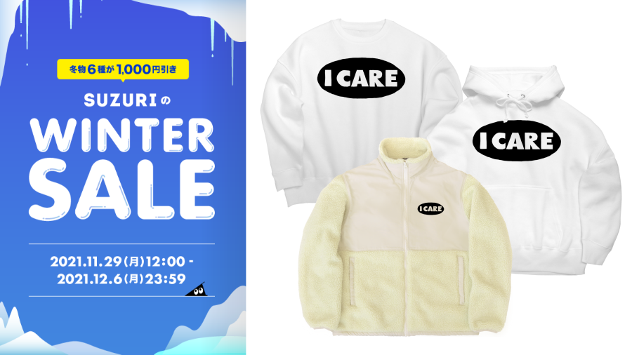

[imdkm / Ryohei ITO ( imdkm )のオリジナルアイテム・グッズ通販 ∞ SUZURI（スズリ）](https://suzuri.jp/imdkm)

11月29日（月）正午～、SUZURIにて冬物セールがあってるらしい。パーカーやスウェットなどが1000円引き。この機会に「I CARE」グッズいかが。

「A面で恋をして」……　つまり「AMENで恋をして」だな……　なんて思いついて、まあ何千人というひとが思いついて何百というひとが実行しただろうしゃれを自分もやってしまった。公開しないけど。Amenのブレイクをチョップ＆加工してSampleOne XT（Studio Oneのサンプラー）にアサインし、いつでもAmenを打ち込めるようにプリセットをつくるなどした。なんのためだ……。

都市伝説や陰謀論を「わかったうえで楽しむ」みたいな話、そもそも都市伝説や陰謀論の類がしばしば現実の差別や偏見を下敷きにし、「ネタ」のように見せかけてその再生産に加担している、ということを抜きにしてはいけない（うめこまれたバイアスや政治性にじゅうぶん注意せよ）と思うのだが、そこまで意識している人がどれだけいるだろうか。「隠された真実」に近づこうとする人びとが根強い差別意識をむき出しにしているのを見るにつけ思い出す。

なんだか調子がでず（「AMENで恋をして」とか言ってるからだろ）ピチカート・ファイヴを聴きながら買い物に行ったりもやもやと部屋にいたりなどする。

<iframe src="https://open.spotify.com/embed/track/4BeF21iDrZEWGdKCWI129i" width="300" height="380" frameborder="0" allowtransparency="true" allow="encrypted-media"></iframe>?si=c7dee7c84eae4b50

原作は谷川俊太郎・黛敏郎の手掛けたミュージカルナンバー。「アメリカでは……」と執拗に反復される内容はどれも言葉とその意味がぴったりと重なり合う明晰さをアイロニカルに言祝ぐもので、トートロジーが頻出する（緑は緑、赤は赤）。トートロジーの絶対的な正しさがそのまま戯画化されたアメリカ的（と戦後日本において形容されてきた）な合理主義のイメージと結びつくと同時にいろんなコノテーションをまとって不思議なおかしみを醸し出していく。ナンセンスだなぁと思うとともに、こういうアメリカのイメージ（及びそこから逆に照らし出される日本の自画像）っていまだに根強いよな。



あ・め・り～か　では！

Shazamって優秀で、Nash Music Libraryなんかのライブラリ系楽曲もぜんぜんひっかかるんだよね。テレビやラジオでよく聴くあのBGMなんなんだろうと思ってShazamかけるとあっさり見つかる。「ら～ららっら～」みたいな女性ボーカルのやつが気になって探したらこれでした。

<iframe src="https://open.spotify.com/embed/track/3uX9WDChj0TzhrpImk6FHu" width="300" height="380" frameborder="0" allowtransparency="true" allow="encrypted-media"></iframe>?si=245dc1a86c3a43dd

某アイドルグループの改名前バラエティ番組のオープニングであり、某シーサイド・コミュニケーションズの人気番組（現在は終了）のオープニングでもあるやつはこれだった。

<iframe src="https://open.spotify.com/embed/track/44CgpPp80sNkrMeji5YTtN" width="300" height="380" frameborder="0" allowtransparency="true" allow="encrypted-media"></iframe>?si=b7a6e55fc3f54e64

いつでも洲崎西をはじめられる音源。

<iframe src="https://open.spotify.com/embed/track/6gJ8PLkQv0fs3GPzSdIdU3" width="300" height="380" frameborder="0" allowtransparency="true" allow="encrypted-media"></iframe>?si=782a12cf88d64b95

Future Bassもある、Nash Music Library。

<iframe src="https://open.spotify.com/embed/track/0y0Rq8FSr7U6005LNYtiva" width="300" height="380" frameborder="0" allowtransparency="true" allow="encrypted-media"></iframe>?si=5fa91be8095d4bc7

これをやるとなにみてShazamしてんのかわかる人にはわかってしまうけど、まあいい。

<iframe src="https://open.spotify.com/embed/track/0iQoCcUjUcJx4GxFOBYcRg" width="300" height="380" frameborder="0" allowtransparency="true" allow="encrypted-media"></iframe>?si=babaaa23fb4f41e8

これ結構好き。
