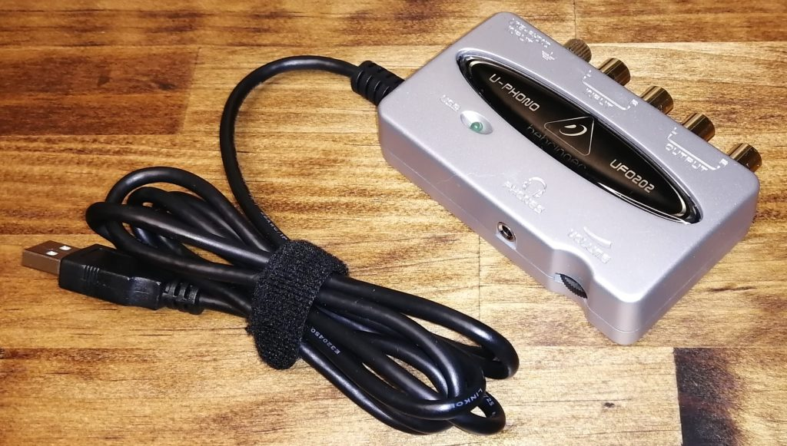
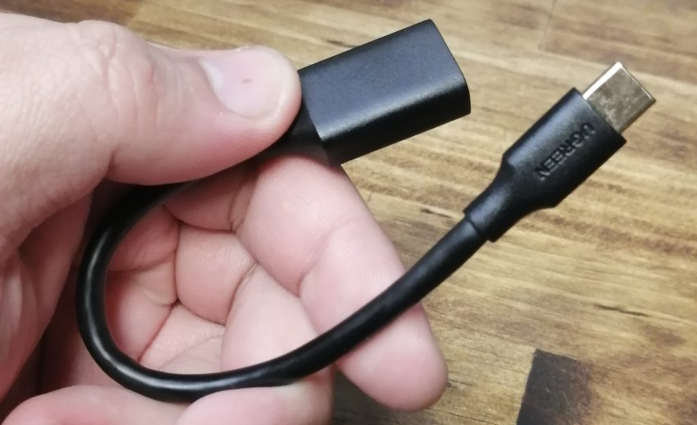

<figure>

<figcaption>

UFO-202、買っちゃった

</figcaption>

</figure>

BEHRINGERの出している超低価格オーディオインターフェース[UCA-202](https://amzn.to/32GhVWF)/[UFO-202](https://amzn.to/3ptDIJP)及び[UCA-222](https://amzn.to/3pu44vi)（アフィリンク注意）。基本的にRCAで2in/2out、モニタリング用のステレオミニ出力がついているだけという必要最低限の仕様だが、3000円程度で購入できるので地味に支持されている。現状、自分にはあまり必要ではなかったのだけれど、Androidのスマホにも接続できるということだけ気になっていた。こないだHARDOFFに行ったら2000円しない価格で置いてあったので衝動買い。スマホ用のインターフェースとしてどう使えるのか試してみることにした。

購入したのはUFO-202。UCAとの違いは、レコードプレイヤーからのフォノ入力が可能なこと（スイッチでLINEかPHONOか切り替えられる）で、そのかわりオプティカルアウトが削られている。現状オプティカルアウトって使ったことないんで、まあそこは困らない。むしろいざとなったらターンテーブルからフォノ入力ができるのが便利だ。おそらくドライバレベルではUCAもUFOも変わらないだろう。

スマホはHuawei P30 Liteで、エントリークラスの格安スマホの部類に入る。入力端子はUSB Type-Cのみ。UCA/UFOは一般的なUSB端子（いわゆるType-A）なので、変換プラグやハブなどが必要になる。今回は[たまたま持っていた変換ケーブル](https://amzn.to/3qm0Aue)を使った（アフィリンク注意）。

<figure>

<figcaption>

フラッシュメモリを接続しようとして昔買ったやつ

</figcaption>

</figure>

変換ケーブルでUFO-202をP30 Liteにつなぐと、すぐに外付けマイクとイヤホンが接続された旨、画面に表示される。特別なセットアップは必要なかった。早速マイクを入力して……と言いたいところだけど、前述の通り、このインターフェースはRCA入力しか持たない。入力したい音源がRCAでつなげられる場合はいいけれど、マイクをつなごうとするとちょっとした工夫が必要になってくる。自分の場合は、[MACKIEのMIX5](https://amzn.to/3ptr5yr)（アフィリンク注意）という低価格ミキサーを持っていたので、そこにマイクを入力して、ミキサーの出力をRCAでUFOに入力した。

試しにTwitterのスペースを立ち上げてテストすると、UFO-202経由で入力した音声は無事にスペースに乗ったようだった。あっけねぇ～。

UCA/UFOを使っていいところは、ステレオミニ出力でインプットもアウトプットも同時にモニターできるということ。つまり、スマホからの音も、自分がマイクに向かって喋っている音も、どちらもヘッドフォンで聴けるのだ。入力された音をそのまま聴けるいわゆる「返し」は、Twitterのスペースを通常使用した場合存在しないのでありがたい。

ほか、Instagram Liveでも同様にUFO-202からの入力が配信できたし、スマホのカメラで動画を録るときの音声入力もUFO-202経由でできた。その例↓



スマホで動画撮影するときの音声入力になるのはなにか使いみちがあるかもしれない。カメラの性能がいいスマホなら特に。
