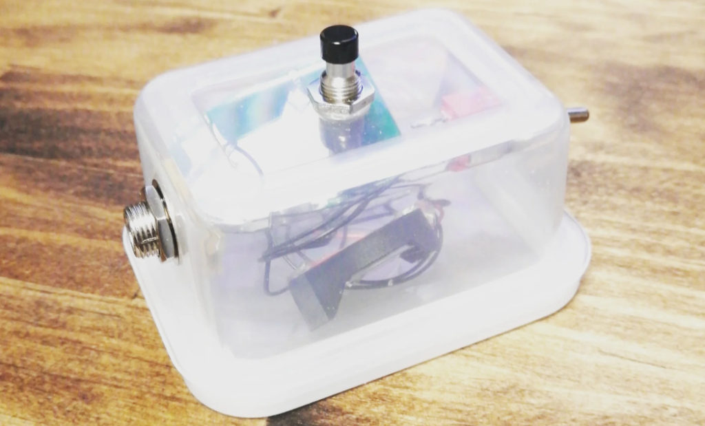
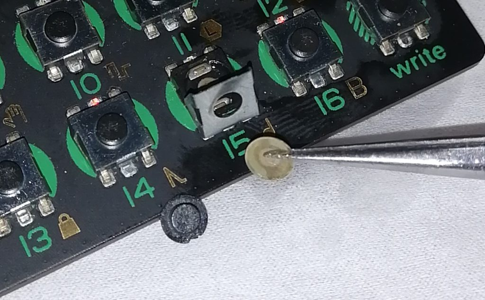

クリスマスを境に、ほんとに無の時間を淡々と過ごしている。昼間はまんじりともせず倦怠感をやり過ごすのに費やし、ささいな身辺の整頓やちょうしのわるい物事の修理などを夜にやる。

[スマホ用のBluetooth遠隔シャッターにフットペダルを接続する](https://imdkm.com/archives/1607)……という改造、かなり急ごしらえだったこともあり断線や破損がありそうで気になっていた。パーツ箱を見たらトグルスイッチ、プッシュスイッチ、フォンジャック、電池ケースがあったので、小さいタッパーをケースがわりに遠隔シャッターをつくりなおした。

もともと親指サイズみたいなシャッターをもっとでっかくしてしまっているわけだが、持ち歩く用じゃなくて家で使う用なので、むしろある程度でかいほうがなくさないし丈夫だし都合が良い。

ケーブル類やACアダプターを整理していたら[Teenage EngineeringのPO-12](https://amzn.to/3qocG69)（アフィリンク注意）が出てきた。ボタンの接触が悪くなってほとんど使い物にならず、放置していたのだった。とりあえず精製水と無水エタノールでじゃばじゃば洗浄し乾燥するも状態はかわらず。奥の手だな、とタクトスイッチを分解して清掃のうえ、KURE 5-56を塗布する。

PO-12のタクトスイッチはプラスチックのベースにツメで金属のカバーがついている。このカバーをかぽっと外すと簡単にスイッチが分解できる。タクトスイッチは（多くのスイッチと同様）ごくシンプルな構造になっていて、ベースに接点があり、そこにレンズのように湾曲した丸い金属板がかぶさって、ボタントップがその上に置かれる。金属板がベースの接点に接触すると通電する仕組みだ。なので、この接点と金属板を洗浄して電気の通りをよくすれば簡単に復活する。

かぽっとカバーを外し、紛失しないように部品をよりわけ、接点と金属板を洗浄。以下リピート。

シンプルな構造とはいえちっさい部品なのでひとつでも欠けると使えなくなってしまう。それなりに慎重に分解していたけれど、金属板を一枚どっかやってしまった。手持ちのほぼジャンクのタクトスイッチを探してきて、かわりの金属板をそこからゲットする。使っていない電子部品がストックしてあると地味にありがたいことが起こる……。

結果として、新品同様とまではいかずとも、打ち込みや演奏にはまあ問題ないくらいに復活した。PO-12、いいですよ。やすいし。シーケンサーもよくできてるし。あくまでドラムマシンなんでメロディとか（よほど工夫しないと）打ち込めないけど。なにより7000円とか8000円で買えるのがいい。



治りました～（指毛が汚いとか言わない）。ちなみにこの動画はPO-12をBEHRINGER UFO-202でスマホにライン入力して撮影しました。
