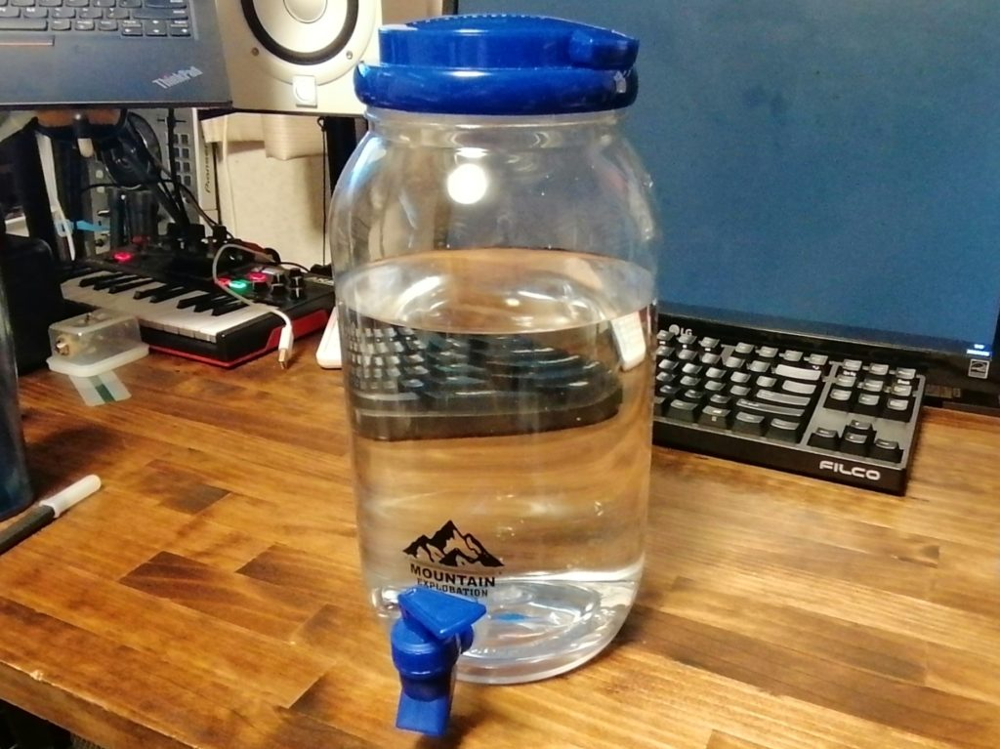

## ダイソーのアウトドア用ウォータージャグ

300円で売ってるやつ。4Lくらい入る。ウォータージャグに水をためておいて、コーヒーとかお茶のみたくなったら電気ケトルに入れてお湯をつくる。これによってQOLがバチ上がりしている。ただ耐久性めっちゃ低そうなのでもうちょっとちゃんとしたやつを買ったほうがいいかもしれない。まあ壊れるまで使いますが……。

<figure>

<figcaption>

mde

</figcaption>

</figure>

こいつです（なんか全体的に汚い）。

## RME Babyface Pro FS

Native Instrumentsの1万円くらいのインターフェースをながらく使っていたのだけれど一念発起して買った。コンパクトながらフラッグシップ級の音質、デスクトップアプリTotalMix経由の柔軟なルーティング、等々、さすがになにも文句ない。ただここ数年の半導体供給の滞りで入手しにくくなっていて、粘っていたらたまたま定価くらいで買えた。よかった……。

## [KURE 5-56 ペンタイプ](https://amzn.to/31uLtGt)（アフィリンク注意）

定番の潤滑剤で接点復活剤としても使えるKURE 5-56がペンになったやつ。細かいところにさくっと塗るのにとても良い。ジッパーとか。調子乗って吹き付け過ぎたりしないし。接点まわりをきちんと整備したい場合はコンタクトスプレーを使ったほうがいいらしい。

## [倒せる冷水筒](https://amzn.to/31ttQGT)（アフィリンク注意）

自分用のルイボスティーや麦茶を量産するにあたって、冷水筒の置き場所の確保はシビアな問題。でっかい冷水筒にがっぽりつくりたくても冷蔵庫に入んなかったら意味ないし。自分だけが使うならまだしも家族がいろいろ使うからややこしい。横に倒してもこぼれない冷水筒を導入することでこれは解決。これはかなりいい。いいぞ。

## にぎにぎぱっちん

近所のゲオの店頭にあったガチャガチャで見つけたフィジェットトイ系のおもちゃ。ぐっと握って吸盤をくっつけて、90度回転させてまた握ると「ぱちん！」と弾ける。これが良い。意外と力いれないといけないけど。



## [経口補水液パウダー](https://amzn.to/3pXtcuC)（アフィリンク注意）

500mlの水に溶かすと経口補水液になる。夏場の熱中症対策やワクチン接種後などいざというときのためにスポドリや経口補水液を備蓄していたのだが、パウダーが一番いいという結論に至った（マジでやばいときは水用意して溶かす余裕もないのだが、ここでウォータージャグが役に立つ）。ちなみに経口補水液ばっか飲んでもしょうがないというかからだにかなり悪いと思うので、普段は麦茶だし、多少気になる体調のときでもスポドリにしている。粉末のスポドリは[このシリーズ](https://amzn.to/3zsOMKE)がよい（アフィリンク注意）。500ml単位でつくれると、適当にそこらで売ってる水筒が大活躍になる。

## ダイソーで売ってるPPバンドのセット

PPバンドってあれです、かたいプラ製の帯で、荷物とかぎゅっとまとめるときに使うやつ。ちょっとした小物をまとめたりするのによいなと思って買ったんだけど、DIY中に接着しているものを固定するのにも都合がよくて、丈夫だから一回使っても何度か使いまわしできる。
