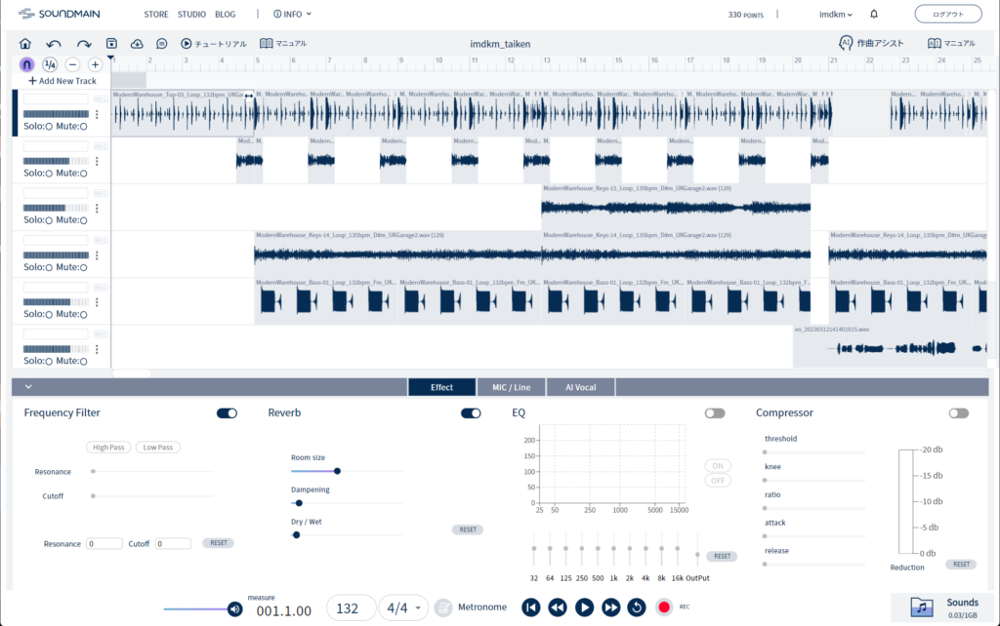
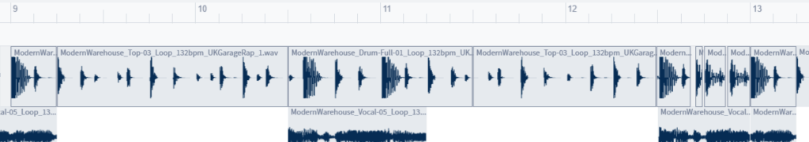
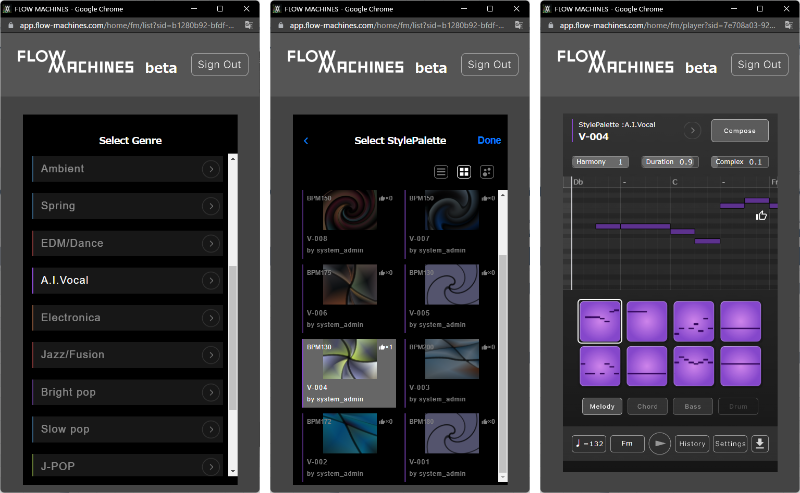
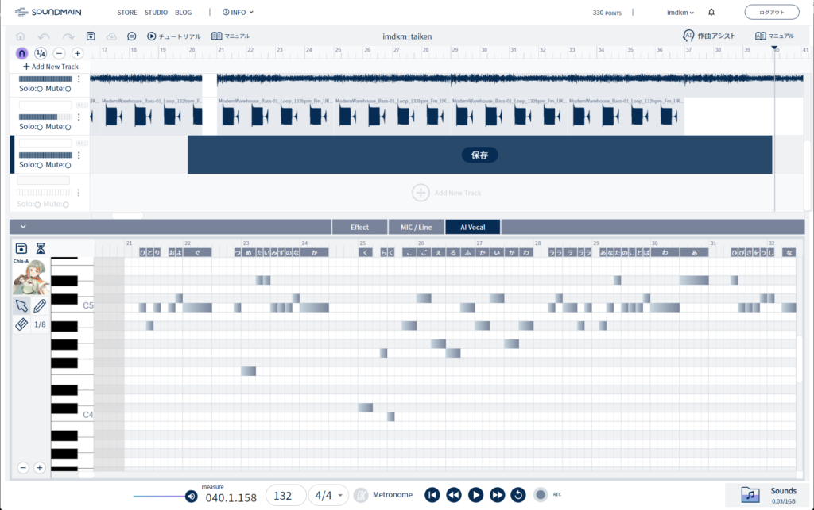
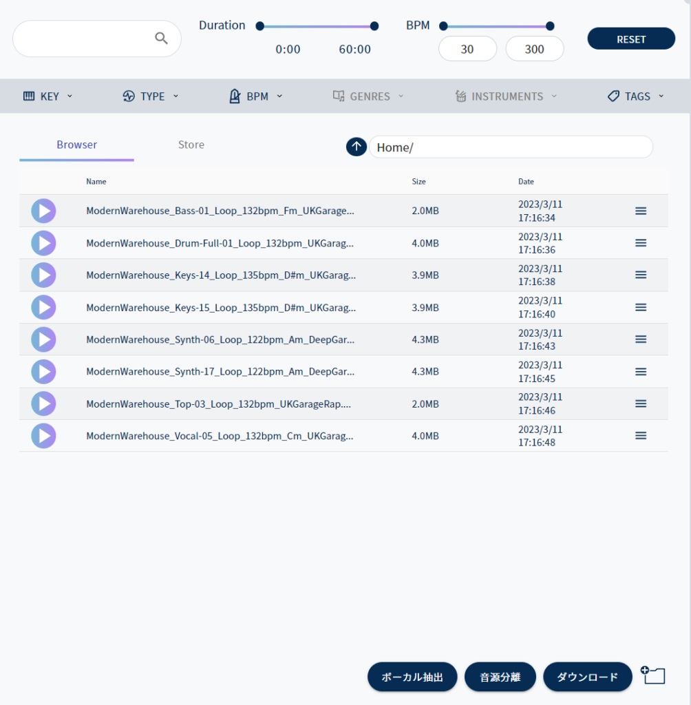

Sony Music EntertainmentはSoundmainという音楽制作にかんする総合プラットフォームを運営しており、楽曲制作に使えるサンプルパックのストアやブラウザ上でつかえるDAW・Soundmain Studio、そして音楽制作を中心にさまざまなトピックについて伝えるメディアSoundmain Blogなどが提供されています。

Soundmain Blogには自分もこれまでインタビュー記事やコラム記事を寄稿してきました。また、自分の関わった記事以外にもかなり尖った企画が載っていたりするので、すでにご覧になったことがある方も多いかもしれません。これまでの記事の例は次の通り↓

[uami インタビュー　iPhone1台で生み出される驚きのサウンド、独自の〈声〉の使い方に迫る – Soundmain](https://blogs.soundmain.net/10306/)

[特集「アンビエント＋ポップの現在」Part1　Akiyoshi Yasudaインタビュー（森山直太朗「素晴らしい世界」編曲ほか） – Soundmain](https://blogs.soundmain.net/13895/)

[Nao’ymtインタビュー　自身を「解放」する、R&Bからアンビエントへの道のりと創作の思考法 – Soundmain](https://blogs.soundmain.net/15088/)

ほかにもいろいろ書いております。

そんなSoundmainが「春の作曲チャレンジキャンペーン」と題して、ブラウザ上で使えるDAWであるSoundmain Studioの無料体験をはじめとしたプログラムを実施しています。有料プランオンリーだった機能が無料のトライアルプランでも試せたり、「Standardプラン」でしか試せなかったAIアシスト機能（音源分離、ボーカル抽出、歌声合成、作曲アシスト）が「Basicプラン」で使えたりします。

[音楽制作プラットフォーム Soundmain | 春の作曲チャレンジキャンペーン実施中！](https://soundmain.net/lp202303/)

今回、「ぜひ使ってみて欲しい」というお誘いをいただいたので、「ベーシックプラン」に加入して1曲つくってみることにしました（というわけでこの記事はSupported By Soundmainです。あしからず）。

そんなこんなでできあがった楽曲がこちらです。まず聴いてみてください。

https://soundcloud.com/ito-ryohei-461911984/nxy49x1uwjy4

Studioの機能から考えて、波形編集を中心にできること……という発想で、ちょっとBurialを意識したダークなフューチャーガラージ風にしてみました（注：Burialは初期に波形編集ソフトでビートメイクしていたことで有名）。歌声は、AIアシスト機能のひとつである歌声合成（AI Vocal）で、Studio内で打ち込んでいます。そして歌メロも、AIアシスト機能のひとつである作曲アシスト（Flow Machines）で生成したメロディを調整してつくりました。もちろんサンプルもすべてSoundmainで販売中のものですから、隅から隅までSoundmain製です。

Soundmain Studioは、主にサンプルファイルのエディットを中心とした機能を提供しているブラウザで動作するDAWです。サンプルの配置、カット＆ペースト、タイムストレッチ、ピッチシフトといった基本的な編集に加え、各トラックごとにレベルの調整や、ハイパス／ローパスフィルター、リヴァーブ、EQ、コンプレッサーといったエフェクトで音色を変えることもできます。

<figure>

<figcaption>

画面の下半分がエフェクト。トラックごとに設定できる。

</figcaption>

</figure>

主な使い方としては、サンプルファイルをローカルからアップロードするか、もしくはStudioのブラウザ上からストアでサンプルを購入し、そのままドラッグ・アンド・ドロップで読み込みます。今回は、メインのビートに使うサンプルをザザザッと（Studio経由ではなく）ストアで購入したあと、ローカルにいったん保存。そこから使えそうなものをアップロード……というかたちにしました。せっかく手に入れたサンプルなので、ふだんづかいのDAWでも使いたいですしね。

具体的な作り方ですが……そこまで凝った編集はしていません。しいていえば、ドラムのループは2種類を組み合わせて、フィルインのかわりに数小節ごとに細かいエディットをしています。サンプルパックに入っているループは、同じパターンのキックドラムあり／キックドラムなし（だいたい後者は「Top」とか言われる。ハイハットなどのパーカッションやスネアだけのループですね）のようなバリエーションが入っています。それをつぎはぎしてキックの数を減らしたり増やしたりしているわけです。

<figure>

<figcaption>

ドラムのトラック。切れ目がわかりやすいよう選択しています。最後のほうが細切れになっているのがわかるでしょうか。

</figcaption>

</figure>

そこに、コード感をつくるパッドとそのバリエーション、ベースライン、そしてアクセントの声ネタを重ねてビートにしました。

続いて、メロディづくり。Sony CSL（ソニーコンピュータサイエンス研究所）によるAI作曲プロジェクト・Flow Machinesをもとに実装された作曲アシスト機能で生成します。Flow Machinesという名前はAI作曲の分野では2010年代後半に話題を呼びましたが（ビートルズ風の楽曲ができた！　なんて話も。昔ブログの記事にしたことがあります→[AIはプリペアド・ピアノの夢を見るか？――人工知能と自動作曲に関する覚書](https://imdkm.com/archives/577) ）、近年は自動作曲からアシストツールという方向性に転換して、実用化が進んでいるようです。

使い方は簡単。ジャンルを選択し、ジャンルごとに用意されているスタイルパレットからイメージに近いスタイルを選択。最後にピアノロールと演奏を実際に聞きながらパラメーターを調節し、素材を生成します。ここではメロディだけ使いましたが、バッキングのコードやベースライン、ドラムのパターンも生成できるようです。MIDIファイルを出力できるので、ここで生成した素材をふだんづかいのDAWに流用することも可能です。

<figure>

<figcaption>

左から、ジャンル選択、スタイルパレット選択、生成画面

</figcaption>

</figure>

直球でR&BとかEDM/Danceといったジャンルを選んでもいいんですが、適度なミスマッチがあったほうが面白そうなので、A.I. Vocal（ジャンル名ということなので、平たく言えばボカロでしょうか）を選択。BPM帯と雰囲気があっているスタイルを選択し、試行錯誤しました。BPMやキーを変更できるのはもちろん、ハーモニーとメロディのマッチ具合、メロの細かさ、複雑さも設定でき、いろんな組み合わせを試すと面白いです。

無限にバリエーションが生成できるというよりは、パレットで選んだスタイルの細かな差分をつくるといった印象で、むやみやたらに生成して博打を打つ感じではありませんでした。きちんと「どんな雰囲気がほしいか」をイメージしながらジャンルやパレットを選ぶのが大事そうです。

生成したメロディを、StudioのAI Vocal機能で打ち込んでいきます。MIDIを読み込みできるとうれしいんですが、歌詞の入力も含めたエディタの使い心地はまずまずで、不満はありません。

<figure>

<figcaption>

AI Vocalの編集画面（下半分）。ノートごとにひらがな一文字をあてはめて歌わせることができる。

</figcaption>

</figure>

入力したメロディと歌詞はそのままプレビューできます。ブラウザ上で動作しているわりには、スムーズに生成＆再生してくれる印象です（もっとも、フレーズが16小節程度と短いこともあるでしょうが）。歌声は、ベタに打ち込んだだけなのにかなり自然です。ブレスも休符に合わせて適度に生成してくれます。発音の細かいニュアンスを詰めるには向きませんが（撥音や拗音、二重母音など）、クセにあわせた歌メロをつくれば気になりませんし、ガイドボーカルやデモには十分すぎるクオリティではないでしょうか。

打ち込んだら、「保存」をクリック（AI Vocalエディタの左上アイコンか、タイムライン上の「保存」ラベル）すると音声にレンダリングされます。一度「うわ、間違って編集中なのにレンダリングしちゃったよ！」と焦ったんですが、レンダーされた波形を右クリックすると再度編集をすることができます。よかった。

せっかくなので、1トラック追加してもうひとつAI Vocalを立ち上げ、末尾のゆったりとした譜割りの部分に一声だけざっくりとハモリを加えて、フィニッシュとしました。

<figure>

<figcaption>

今回使ったサンプルはこんな感じ。UKGarage系のパックからつまみ食い。もっとも、2つくらい使ってないのもあります。

</figcaption>

</figure>

今回はちょうどいいファイルが手元になかったので使えませんでしたが、音源分離やボーカル抽出も含めたAIアシスト機能も使えて、サンプルの購入にも使えるポイントが500ポイント付属（AIアシスト機能の使用にもポイントが必要なので注意）してくるので、ひと月だけでも試しに使ってみると面白いんじゃないでしょうか。500ポイント分サンプルをダウンロードしたら元はとれるでしょう。
