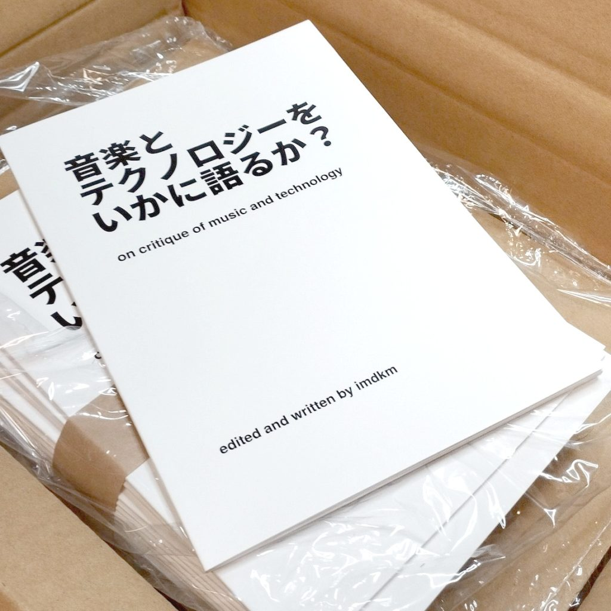
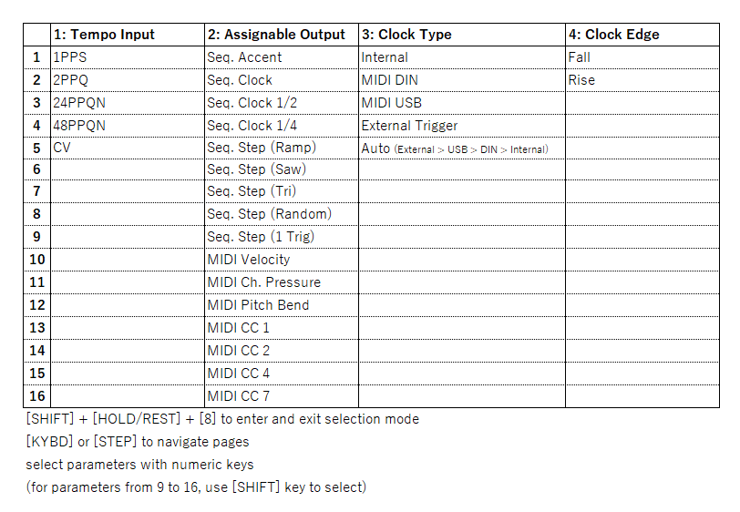
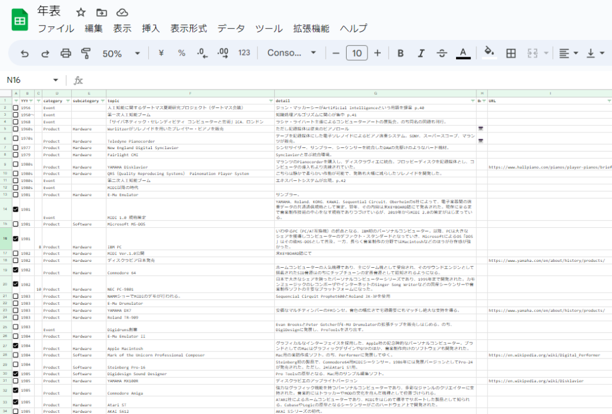

<figure>

<figcaption>

納品された当日のZINE。シンプルなデザイン（といえばきこえはいいが）が光る

</figcaption>

</figure>

### 「音楽とテクノロジーをいかに語るか？」

2022年度、[柳樂光隆さんが講師を務める美学校のライター講座](https://bigakko.jp/course_guide/art_mediation/writer)に参加した。そこでの課題がZINEをつくること、だったので、じゃあ自分が関心のある、しかしなかなか仕事にはなりづらい領域について書いてみようかという気になった。そうしてつくった企画書が、のちに「音楽とテクノロジーをいかに語るか」となる、音楽とテクノロジーにまつわるいろいろを考察するというものだった。

当初はインタビューや寄稿をふくめ、もっと凝った企画をしようかと思っていたのだけれど、二転三転してすべての内容を自分で書き下ろす方向に定めた。といっても、内容が大幅に変わったというよりは、主従関係が変わったというべきか。年表もコンテンツガイドも、最初はおまけ、ページの埋草のつもりだったのだ。年表は最初思っていたよりもずっと分量がふくれあがりそうだったし、コンテンツガイドもなんだかんだで30冊ちかく候補があがって、無理して記事らしい体裁をととのえてこれらを切り捨てるよりも、これらをかたちにするほうが先決だろうと思ったのだ。

### 執筆の方法

コンテンツガイドは基本情報をスプレッドシートにまとめ、そのまま300文字程度のレビューをセルに書き込んで執筆していった。進行の程度が見えやすかったし、のちにブックガイドを3つのテーマにわけて掲載順を決めるときにも行を入れ替えればよかったのでとても便利だった。

<figure>

<figcaption>

コンテンツガイドのスプレッドシート、こんなんでした。

</figcaption>

</figure>

年表も、スプレッドシートに時系列を気にせずひたすら項目を書き連ね、300から400程度のリストを作成。それにフラグを付けて掲載する項目を厳選したうえ、フィルターやピボットテーブルを駆使して年代順にソートし、原稿にしていった。

<figure>

<figcaption>

ごりごり項目を追加して行って、左端のチェックボックスで掲載の可否をつける。

</figcaption>

</figure>

<figure>

<figcaption>

そのあと、ピボットテーブルでソートし確認。項目量の偏りなどを確かめる。あとは頑張って整形する。

</figcaption>

</figure>

つまり、これはほぼGoogle Spreadsheetで書いたZINEみたいなもんである。一本だけ載せた論考はGoogle Documentsで書いたが（そりゃそうだ）。ごりごりに考証することもせず、一方読みやすさに心を砕くこともせず、かなり素で、リラックスして書いた。のでなんか間違ってたらごめんなさい。

スプレッドシートを駆使した執筆にはある程度手応えがあり、その後の仕事でもやったりしている。あれはいいですよ。

論考に掲載した図版は[InkSpace](https://inkscape.org/ja/)で作成し出力したもの。これについては『リズムから考えるJ-POP史』と変わらない。しかし実はZINE制作の最後の最後に気まぐれでつくって入れたので、これもしかして伝わってねぇんじゃね？　という不安もなくはない。まあ文章自体も伝わってんのかというとわかんないしいいんですけど……。

### デザイン

デザインというか誌面も自分でつくった。といっても、Adobe InDesignを購入する余裕もないし、使いこなせる気もしない。多少使ったことのあるLaTeXで組版することに決めた。LuaLaTeX + jlreqで、ちまちま試行錯誤を繰り返しながら表紙もふくめた40ページ。がんばった。

LaTeXの導入などはまあいいドキュメントがネットに転がっているし、いまはTeX Liveのようなすぐれたパッケージもあるのでそこまで難しくはないはず。クラウドで使えるエディタもあるそうなので触ってみたいひとはやってみるといいと思う。たぶん、HTMLのタグ打ちできるなら余裕。自分の場合はVS Codeを主要なエディタとして環境を構築した。ただ、最初にうまく環境構築できるまでに結構ハマってしまった……。こればかりはインターネットの力にたよりきりだった。

[VSCodeでLaTeXを書く最低限（←ここ重要）の環境をとにかく楽に構築したかった｜D学生](https://note.com/d_meaning_flunk/n/nefbc684dc7ff)

なんでもいいからとにかくVS Codeで動いてくれ！　と思ったらこの記事が参考になった。結局これにしたがって全部やりなおした。

ネットだけで使い方を覚えることだってできたとは思うけれど、基本的なところはすぐに見れるリファレンスがあったほうがいいと思って、この分野では定評のある本を手元に置いておいた。とても役に立ちました。

[\[改訂第8版\]LaTeX2ε美文書作成入門](https://amzn.to/3MzQCAn)

LaTeXはInDesignなんかと違ってWYSIWYGではないしいちいちビルドするのめんどくせーとか思っていたけれど、いったんフォーマットができてしまえば仕事は早かった。年表はちょっと工夫が必要だったけれど、これもめちゃむずいというほどでもなく。LaTeXの書き方を覚えるのでいっぱいいっぱいだったこともあり、デザインを凝れなかったのは残念だった。

### 印刷

さて、一番問題というか、懸念があったのが印刷だ。格安の印刷会社はInDesignやMS Wordを前提としていることが多く、LaTeXで組んだPDFをきちんと印刷してもらえるのかがいまいちわからなかった。LaTeXで人文系の文章や小説を組版しているらしい人はけっこういて、PDFをつくるだけなら問題ないのだが、肝心の入稿のノウハウとなると情報が限られる。Twitterで検索しても、「ここの印刷会社でいけました」みたいな報告はごくごくわずか。不安しかない。

もっとも、その点は、限られた情報をとりあえずまとめたうえで、Affinty Publisherのような安価なDTPソフトを使っている人の知見を参考にすることで乗り切った。結論としては、**PDF/X-1aで出力されており**、**トンボが適切に配置されたPDF**を作成したところ、少なくとも自分の場合、プリントパックでデータ確認は通ったし、問題なく印刷されていた。とはいえ、**公式に推奨されているわけではない**ので、あしからず。

[TeXで同人誌を作ってみた。（トンボ） - いものやま。](https://yamaimo.hatenablog.jp/entry/2019/10/01/200000)

トンボの付け方は上の記事を参考に。

### 販売

文学フリマ東京36で頒布しよう、ということは決めていた。出店受付が開始した段階ではまだ完全に完成はしていなかったものの、おそらく出せるだろう（印刷に問題がなければ）という見込みで、いやむしろ締切を設定するつもりで申し込み。同時期に並行してがっつり参加していた「ZINEおかけん」とブースの隣接配置を申請し、当日はそちらの作業も手伝いつつ、こちらの店番も手伝ってもらいつつ……というかたちでやりくりした。

現地に持っていったのは90冊。ちょっと中途半端な数だけれど、これは単に箱に入るだけつめたらそうなったというだけで、特に根拠はない。なんなら、想定していた頒布数は「よくて50冊、おそらく30冊で上々」だった。余ったらどうせ箱に入れ直して送り返せばいいし……と、持ってけるだけ持ってっちゃえと梱包＆発送。

フリーペーパーもあったら立ち止まる人が増えてZINEも読んでくれるかも～と思い急遽論考を書いて前々日に家のレーザープリンタで印刷。80部くらい刷ったのかな。100もいってないはず。ちなみにこれもLaTeXで組んだ。

しかし蓋を開けてみればあれよあれよとZINEは売れていき、結局持っていった90部はすべて完売してしまった。これは結構衝撃だった。

開場から二時間半ほど経った14時半の時点で売り切れ。フリーペーパーはそれよりずっとはやくになくなっていた。ありがたい話だが、こんな地味な内容のZINEがあんなに売れるのは、文フリにはなにかいけない魔法がかかっているんじゃないかとやや戦慄してしまう。

## 通販

東京から自宅に戻ってもろもろ整理がついたタイミングで、BOOTHを使って通販ページをスタートした。すでに素材はあったし、梱包材もある程度揃っていたのでさくっと[商品を公開](https://imdkm.booth.pm/items/4798407)。なんだかあれよあれよという間に売れてしまい、気づけばまる二日で90部売り切れてしまった。クリックポストで淡々と発送作業を行い、無事発送完了（一部、入金待ちあり）。

また、文フリではけてしまったフリーペーパーのPDF版もBOOTHにて無料配布。通販で注文していただいている人には刷ったものを同封していますが……。

ともあれ、これで印刷した冊子はほぼはけた（保存用、あとなにかあったとき用に20部ほど確保してますが）。今後はPDF＋EPUB版をちょっと安めに販売する予定なので、よろしくどうぞ。データ自体はできているので、内容の確認と修正が終わったら販売します。6月はじめになるかと思います。よろしくお願いします。
