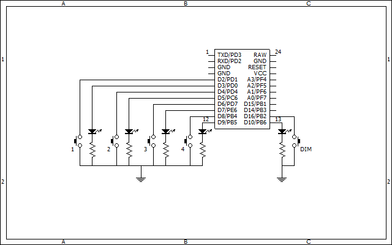
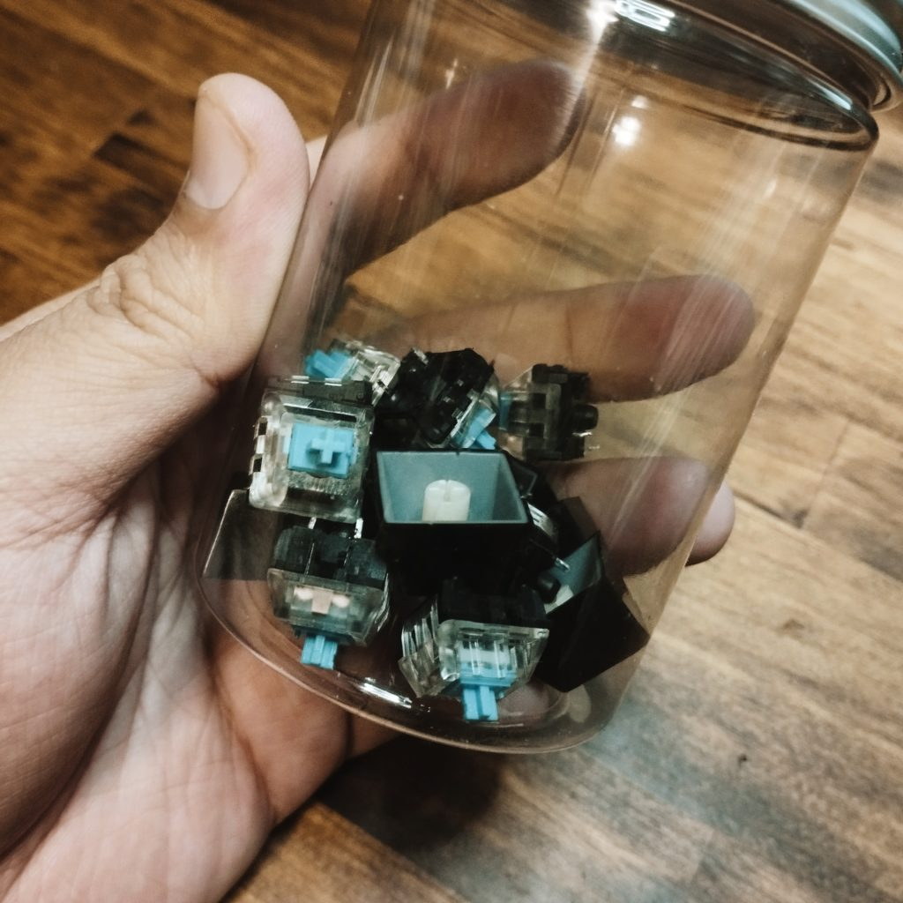

本記事はアフィリエイトリンクを含みます。

ある日、ふと思い立って、MIDIコントローラーをつくることにした。Arduinoでさくっとつくれるようだったので、互換基板をポチっていろいろいじくってみたら、筐体ふくめて2,3日ほどでできてしまった。その記録です。

## 動機：TotalMix FXのスナップショットを手元で切り替えたい

Elgato Stream Deckを買おうかどうかずっと迷っていた。決まっている用途はたったひとつだけ。TotalMix FXのスナップショットを手軽に手元で変更したい。たとえばふだんはもっぱらスピーカーを鳴らしているけれど、ヘッドフォンとマイクを使う「ウェブ会議用のルーティング」が設定してあって、そういうタイミングにはTotalMixを呼び出してスナップショットを変えて……というステップを踏む必要がある。Stream DeckにはTotalMix用の拡張があるので、それを使えばそういう面倒がなくなる。

もちろん、Stream Deckは導入してしまえばいろんなことに使える。自分が思ってもいなかったような便利な使い方もできるだろう。しかし、あまり多機能なものを「なんにでも使えるだろうから」と適当に導入するのは、心情として腑に落ちない。TotalMixはMIDI信号で制御できるため、ちょうどいいMIDIコントローラーがあったらそれを買ってしまってもいいのかも？　と思い始めていた。

とはいえ、必要なのはせいぜい4～8個のボタンである。そんなミニマムなMIDIコンはいまなかなか見当たらない。なら自作してしまったほうが早いのでは？

## Pro Microで手軽にUSB-MIDI機器をつくる

というわけで、Arduino Microの互換製品、Pro Microを購入した。面倒な作業なしでUSBデバイスとして動作させることができ、たとえば自作キーボードのマイコンとして多用されているボードである。今回はAmazon経由で[遊舎工房の青基板2個セット](https://amzn.to/3MuXoIz)を購入（遊舎工房から買ったほうが多分もうちょっと安い）。

入力の数が増えたらまた別のボードなり、あるいはマルチプレクサなりが必要になるだろうけれど、自分の用途ではこれだけで十分。しかも1つあたり1000円ほどだ。

もともとArduinoは触ったことがあったので、導入に特に苦労はなかった。とはいえかなり久しぶりだったから、Lチカから始まり、ボタン入力の処理などを思い出すタイムもあった。ある程度見通しが立ったら、MIDIUSBライブラリを導入して早速プログラムを組む。

参考にしたサイトとしては、

- [Arduino 日本語リファレンス](http://www.musashinodenpa.com/arduino/ref/)

- [MIDIUSB - Arduino Reference](https://www.arduino.cc/reference/en/libraries/midiusb/)

- [『天国、それともラスベガス』のコーディング：PCDJ用MIDIコントローラーをArduinoで自作する（その②・プログラミングと設定編）｜寺本秀雄（spinn / spinnage）](https://note.com/spinnote/n/n122872b2612b)

など。あと途中でめんどくさくなってLEDの挙動とかは[ChatGPTに書いてもらった](https://chat.openai.com/share/68d6cb7a-b73e-45e2-83a5-1d487a731c14)のを参考にした。

また、TotalMix FXのMIDIまわりの仕様については、[【pdf】How to control RME TotalMix with a MIDI controller - natamotta - BOOTH](https://booth.pm/ja/items/3565175) を大いに参考にした。

## お久しブレッドボード

ブレッドボードやジャンパー類を部屋から発掘・整理し、Pro Microにピンをはんだ付けする下準備などを重ねたのち、

> [
> 
> この投稿をInstagramで見る
> 
> ](https://www.instagram.com/p/CzI4hq_SzRP/?utm_source=ig_embed&utm_campaign=loading)
> 
> [imdkm(@imdkm)がシェアした投稿](https://www.instagram.com/p/CzI4hq_SzRP/?utm_source=ig_embed&utm_campaign=loading)

<script async src="//www.instagram.com/embed.js"></script>

ためしに組んでみた図。汚いけどゆるして。ブレッドボードやLED・抵抗・タクトスイッチなどは電子工作に一時期凝ってたのを使っていたので新規購入はなし。組んでいくうちに、DIMスイッチがあったほうがいいなと思ったのでそれも1つ追加した。っていうかこのブレッドボード、右下のところがなんか熱で溶けてんだよな……　使えるからいいけど。

## ソースコードと回路図

最終的に配線をいろいろいじってこんな回路図に。



こんな書き方でいいのか忘れたけど。直接空中配線やろうかと思ったけど、念のため（？）ユニバーサル基板を適当な大きさにカットし利用。GNDは最終的に全部23ピンに落としてます。

ソースコードは以下の通り。多分そんなきれいではないです。TotalMixではF#3～C#4の信号をCh.1で送るとスナップショットの切り替えができ、A6でDimのオンオフを制御可能。

```
/*
imdkm
a midi controll for TotalMix Fx
2023/11/02
*/

#include "MIDIUSB.h"

// スナップショット切り替え部分の入出力関係

const int btn[] = {2, 4, 6, 8};
const int led[] = {3, 5, 7, 9};
const int note[] = {54, 55, 56, 57}; // notes = F#3, G3, G#3, A3
int ledActive = 0;

// DIMの入出力関係

const int btnDim = 16;
const int ledDim = 10;
const int noteDim = 93;
bool isDimOn = false;

void setup() {
  Serial.begin(31250); // MIDIのボーレートを設定

  for (int i = 0; i < 4; i++){ // ピンをボタンとLEDに割当
    pinMode(btn[i], INPUT_PULLUP); // ボタンは内部プルアップ使う
    pinMode(led[i], OUTPUT);
  }
  digitalWrite(led[ledActive], HIGH); // デフォルトのLEDを点灯

  pinMode(btnDim, INPUT_PULLUP);
  pinMode(ledDim, OUTPUT);
}

void loop() {
  for (int i = 0; i < 4; i++){
    if (digitalRead(btn[i]) == LOW) { // タクトスイッチが押された場合
      delay(50); // チャタリング防止

      // MIDIノートの送信
      noteOn(0, note[i], 64);   // Ch.1, note, vel. 64
      MidiUSB.flush();
      delay(50);
      noteOff(0, note[i], 64);  // Ch.1, note, vel. 64
      MidiUSB.flush();
      delay(50);

      // LEDの挙動
      digitalWrite(led[ledActive], LOW);
      ledActive = i;
      digitalWrite(led[i], HIGH); // 新しいLEDを点灯
      while (digitalRead(btn[i]) == LOW) {
        // スイッチが押されたままの場合、待機
      }
    }
  }

  if (digitalRead(btnDim) == LOW) {
    delay(50); // チャタリング防止

    // MIDIノートの送信
    noteOn(0, noteDim, 64);   // Ch.1, note, vel. 64
    MidiUSB.flush();
    delay(50);
    noteOff(0, noteDim, 64);  // Ch.1, note, vel. 64
    MidiUSB.flush();
    delay(50);

    // LEDの制御
    isDimOn = !isDimOn;
    digitalWrite(ledDim, isDimOn ? HIGH : LOW);
    while (digitalRead(btnDim) == LOW) {
      // スイッチが押されたままの場合、待機
    }
  }

}

// 以下、多分なんかMIDIUSBの動作に必要なやつ

void noteOn(byte channel, byte pitch, byte velocity) {
  midiEventPacket_t noteOn = {0x09, 0x90 | channel, pitch, velocity};
  MidiUSB.sendMIDI(noteOn);
}

void noteOff(byte channel, byte pitch, byte velocity) {
  midiEventPacket_t noteOff = {0x08, 0x80 | channel, pitch, velocity};
  MidiUSB.sendMIDI(noteOff);
}

void controlChange(byte channel, byte control, byte value) {
  midiEventPacket_t event = {0x0B, 0xB0 | channel, control, value};
  MidiUSB.sendMIDI(event);
}
```

スイッチ及びLEDには、使わなくなってほっぽっていたメカニカルキーボードからLED付きキースイッチをいくつか拝借した。キーキャップもそのキーボードから流用。



## 筐体をどうするか

キースイッチを使うのはいいけれど、筐体が悩みどころだった。ユニバーサル基板に固定するのも面倒そうだし、わざわざ図面をひいてアクリルカットや3Dプリントを発注するのもだるい。結局、加工が楽でサイズ感も手頃なダイソーの桐材とMDFを使うことに。

- [工作材料（角棒、４５０ｍｍ×５ｍｍ×２４ｍｍ、Ｓー４） | 【公式】DAISO（ダイソー）ネットストア](https://jp.daisonet.com/collections/stationery0253/products/4526324063607)

- [ＭＤＦ（３００ｍｍｘ４００ｍｍｘ２．５ｍｍ、Мー６） | 【公式】DAISO（ダイソー）ネットストア](https://jp.daisonet.com/products/4550480291239?_pos=2&_sid=bcf6e055d&_ss=r)

14mmの隙間をあけて平行に配置した5mm厚・24mm幅の桐材のあいだに、キースイッチをきゅぽっとはめると、キープレートがなくても固定ができる。タイピングをするにはおそらく強度が不安だが、たまに押すスイッチとしての利用なら問題ない程度には丈夫そうだ。同じ桐材でハコをつくり、底面はMDF材をグルーガンで貼り付ける（グルーガンなら分解するときにあまりダメージなくパコッと外せそうなので。ほんとはネジ止めしたかったが材質から考えて無理）。

さくっとつくったわりには必要十分の出来になったので、完成とした。

## 完成

わいの答えはこれや！

> [
> 
> この投稿をInstagramで見る
> 
> ](https://www.instagram.com/p/CzL2VKhyxi2/?utm_source=ig_embed&utm_campaign=loading)
> 
> [imdkm(@imdkm)がシェアした投稿](https://www.instagram.com/p/CzL2VKhyxi2/?utm_source=ig_embed&utm_campaign=loading)

<script async src="//www.instagram.com/embed.js"></script>

実際には傾斜をつけるために桐材を裏に足したりといろいろしているけれど、まあほぼ完成。問題なく動作している。暇なときにキープレートを設計・発注して筐体をバージョンアップしてもいいかもしれない。結局、新しく買ったのはPro Microと筐体用の資材だけなので、総費用は1300円ほどか。満足なり。

## 今後の抱負

Pro Microが1枚余ってるのと、部屋から発掘されたArduino DuemilanoveやMEGA2560もあるので、なんかちょっとしたプロジェクトをやってみたい。しかし必要がないとモチベもうまれないのでなんとも。部屋digの最中に大量のCdSや圧電素子、555/556が出てきたりしていて、これもうまく使うとなんかおもしろいのかな。
