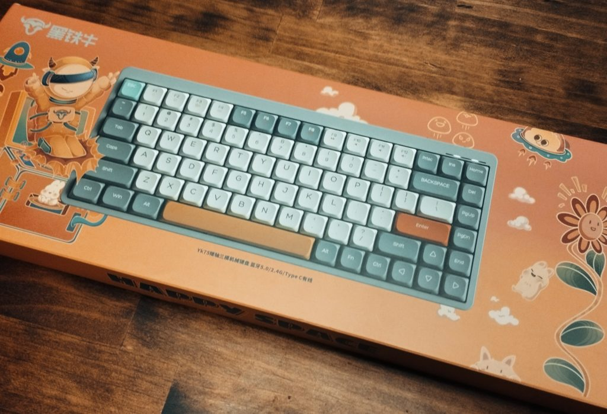
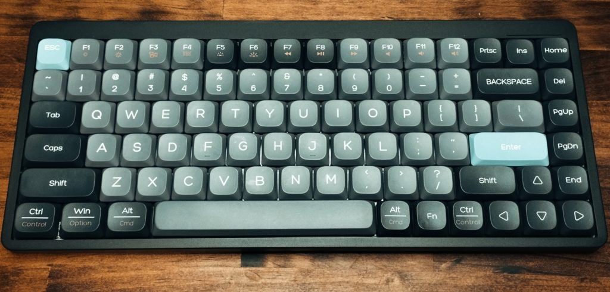
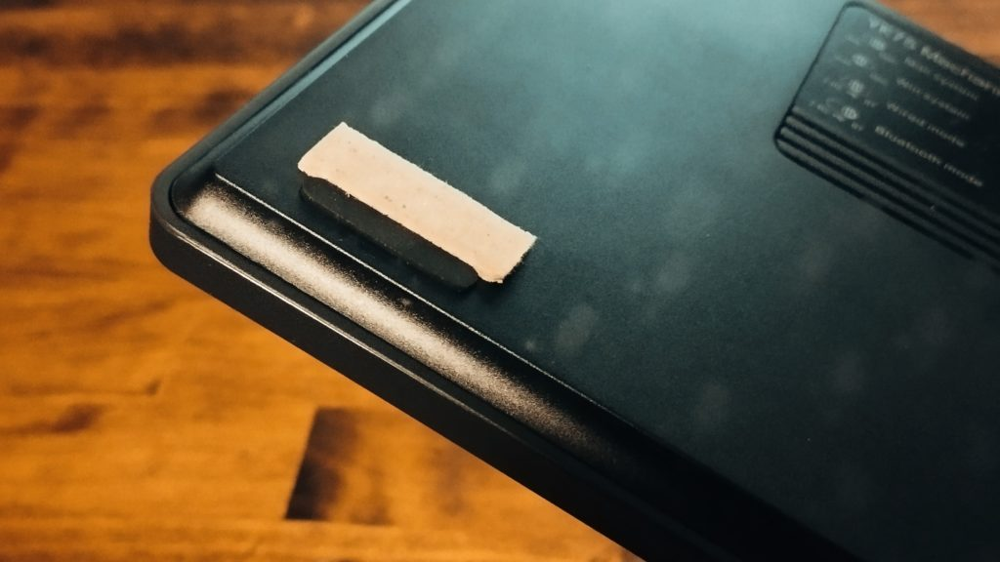

ながらくメインキーボードにFILCOのMajestouch Convertible 2（赤軸、US配列）を愛用していて特に不満もなかったのだが、ある時期からロープロファイルのキーボードがめちゃくちゃ気になるようになっていた。ストロークが短くて軽快そうだし、なによりなんか薄くてかわいい。デザインがっていうかたたずまいが。なので試してみたかったのだけど、KeychronやLOFREEの人気機種は興味本位で手を出すような値段でもなくちょっとためらっていたのだった（といって、HHKBやRealForceといったフラッグシップな機種と比べたら大した値段ではないのだが）。

しかし調べてみると7,000円台のロープロファイルメカニカルがあるじゃないか。人気機種の半値以下。買って合わなくてもサブ機として持っておけばいいか、くらいの妥協はできる範囲。清水の舞台から飛び降りるつもりで注文してみた。

中国からの配送なので納品まで2週間ほど見ていたのだけれど、予想外に早く一週間ほどで到着した。

パッケージはやけにファンシーで、キュートなキャラクターや子供のおえかきみたいなイラストが書いてある。キーボード自体のちょっと子供のおもちゃじみたデザインもあいまって、ほんまに大丈夫なんかという気持ちになってしまう。ぶっきらぼうなダンボールのパッケージを想像してたんだけど。

現物は商品写真で見た通り、特になにも言うことはない。さすがに安物でつくりが悪いのか、少し筐体が歪んでおり、デスクに置くとかたかた不安定に揺れてしまう。打鍵感が命のキーボードでそりゃまずかろう。とはいえ、適当にダンボールを裏にかませてやれば問題なく使えるのでよしとする。

説明書は英語だけれど、たいしたことは書いていないので特に問題なし。YK75 Tri-Mode Mechanical Keyboardというのが商品名らしい。多分これと同じ機種がブランド名だけ変えてAmazonやらアリエクやらでたくさん出回っているのだろう。

PCとの接続については、USB・Bluetooth・専用レシーバーを使った2.4GHzの3つの接続を用いることができ、USB Type-Cで充電可能。Fnキーと1-3までの数字キーの組み合わせでBluetoothのペアリングを行い、つごう3つの接続先とペアリングできる。一般的な無線キーボードの動作だ。バックライトとかもあるけど正直かったるいので全部切ってしまった（Fn+BackspaceでOn/Off）。

肝心の打鍵感だが、ストロークが短く軽快ながら、パンタグラフやメンブレンとは違うメカニカルらしいコシみたいなんが感じられて、これならゆくゆくきちんとした（ノーブランドではない）ロープロファイル機をゲットしても全然ありだなと思う。さすがにここから悪くなることはないだろうし……。

思いの外困惑したのは、一般的なキーボードでタイプするつもりで手を動かすとミスタイプが頻発してしまうことだった。ロープロファイルならではの反応のよさはかえってピーキーだし、キーピッチは変わらなくてもキーの表面積が広くなっていることでキー同士の距離感が大幅に違って感じられる。いまもちょっと困惑しているけれど、これは慣れだろう。もしかしたら赤軸じゃなくてもうちょっと叩きごたえがある青軸にしたほうがよかったのかもしれない。ふつうのメカニカルだと青軸はあまり好みではないのだけれど、ロープロファイルは結構特殊なのだな。

本当はトラックポイントがついたHappy Hacking Keyboard Studioがめちゃくちゃ気になってて、いっぺんレンタルでもしてみようかと思っていたのだけれど、しばらくその必要はないな。悪くない買い物であった（耐久性がなくてあとで泣くかもしれない。それはそれでまた一興……）。
