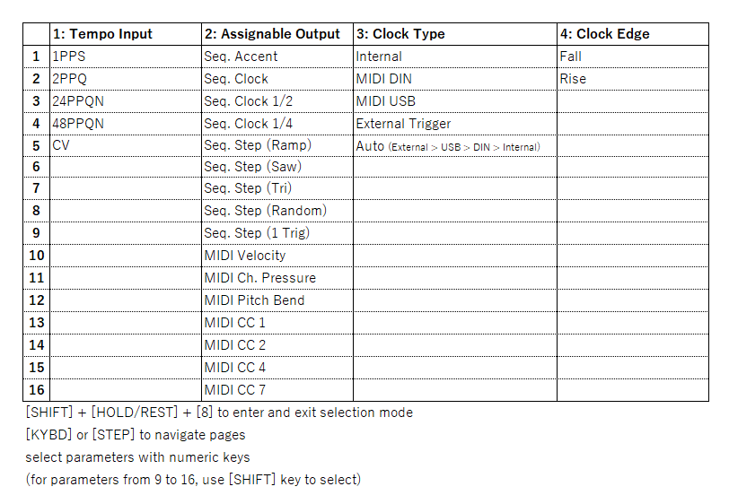



最近BehringerのCRAVEというシンセでよく遊んでいるので覚書。

Behringerのセミモジュラーシンセ・CRAVEは、オフィシャルには明言されていないがMoog Mother-32のクローン機であり、パッチポイントも操作もほとんどMother-32そのままだ。Mother-32が定価12万円ほど（[アウトレット品が半値で出回っていたりもするが](https://amzn.to/3SFGPxw)）であるのに対して、CRAVEは3万円強。っていうか知らずに買ってうきうきで使い方調べてたら「Mother-32のクローンなので～」って言われておまえ、おまえBehringer！　と思ったよ。

## ユーザーマニュアルの問題

このCRAVE、ユーザーマニュアルが非常に不親切だ。そももそもクイックスタートガイドしかないし、そのクイックスタートガイドも日本語訳が途中まで。シーケンサーの使い方と細かい設定方法は英語のままだ。英語のままってだけならまだしも、設定方法は日本で同梱ないしPDFで配布されているクイックスタートガイドについては実際の仕様と食い違っている。なので、きちんと使おうと思えば元のクイックスタートガイドを参照せざるをえない。

元のクイックスタートガイドは[Behringerのサイト](https://www.behringer.com/downloads.html)からダウンロード可能であるほか、有志が必要なところだけ（元が他言語版なのでページ数がかさむのだ）[抜粋してシェア](https://modwiggler.com/forum/viewtopic.php?t=264970)している。

また、シーケンサーの操作方法については日本語で解説しているブログや動画もある。



[Behringer Crave シーケンサーの操作方法まとめ | A Smooth Architect](https://www.asmootharchitect.com/posts/38190170/)

他方、細かい設定（ASSIGNから出力する信号の設定や、内部クロックの動作など）については日本語でまとめているところが見当たらなかったのでまとめておく。

## 「パラメーター・セレクション」で細かい設定をする

アサイナブル・アウトプット（ASSIGNから出力する信号）の設定や、内部・外部クロックの設定、クロックのエッジ検出の設定、テンポのコントロールなどは「パラメーター・セレクション」で変更できる。

以下、CRAVEのクイックスタートガイド（英語版）と[Moog Mother-32の日本語マニュアル](https://www.korg-kid.com/moog/product-details/mother-32/)の記述を参考に操作方法を備忘録的にまとめておく。ただし、Behringerが提供しているSYNTHTRIBEというアプリを使ってUSB接続経由で設定するほうがわかりやすいだろう。PCとつなぐのめんどくさい、本体で済ませられるならそっちのがいい、という場合はこちらで。

```
1. [SHIFT] + [HOLD/REST] + [8] を同時押しして設定モードに入る
   （ロケーションLEDの1が黄色に点灯）

2. [KYBD] or [STEP] キーでページ選択（ロケーションLEDの対応する箇所が黄色に点灯）
   ページ内で数字キーを押してパラメーターを選択
   [1]-[8] キーまでは表示の通り。 [SHIFT] キーを同時に押すことで [9]-[16] を選択可能
   設定したパラメーターはロケーションLED上で緑色に点灯

3. [SHIFT] + [HOLD/REST] + [8] を同時押しして設定モードから出る

	ページ1： [TEMPO] インプット
		1. 1PPS
		2. 2PPQ
		3. 24PPQN
		4. 48PPQN
		5. CV
		シンクしたい機材にあわせて選ぶ（e.g. volcaなら2ppq）

	ページ2：アサイナブル・アウトプット
		1. シーケンサー アクセント
		2. シーケンサー クロック
		3. シーケンサー クロック（1/2）
		4. シーケンサー クロック（1/4）
		5. シーケンサー ステップ（ランプ）
			ステップ1から徐々に電圧が上がるランプ波を出力
		6. シーケンサー ステップ（ソー）
			ステップ1から徐々に電圧が下がるノコギリ波を出力
		7. シーケンサー ステップ（トライアングル）
			ステップ間で電圧が徐々に上下する三角波を出力
		8. シーケンサー ステップ（ランダム）
			ステップ間でランダムなCVを出力
		9. シーケンサー ステップ（1トリガー）
			ステップ1の演奏時にトリガーを出力
		10. MIDIべロシティ
			受信したMIDIベロシティの値をCVで出力
		11. MIDIチャンネル・プレッシャー
			アフタータッチの値をCVで出力
		12. MIDIピッチ・ベンド
			ピッチ・ベンドの値をCVで出力
		13. MIDI CC 1
		14. MIDI CC 2
		15. MIDI CC 4
		16. MIDI CC 7
			受信したCCの値をCVで出力

	ページ3：クロック・タイプ
		1. INTERNAL（内部クロック）
		2. MIDI DIN
		3. MIDI USB
		4. EXTERNAL TRIGGER（外部トリガー）
		5. AUTO
			外部トリガー＞MIDI USB＞MIDI DIN＞内部クロック
			以上の優先順位で自動的にクロックが選ばれる

	ページ4：クロック・エッジ
		1. フォール（降下時）
		2. ライズ（上昇時）
			パルスの上昇と加工どっちを読むか
```

クロック・タイプを外部トリガーにして、\[LFO SQU\]から\[TEMPO\]にパッチングすると、LFOがトリガーになってシーケンスがひとつずつ進む、みたいなことができる。

<figure>



<figcaption>

LFOのレートをランダムにすればこういう感じでシーケンスを不規則に進めることができる。

</figcaption>


</figure>

本当は\[TEMPO\]をCVでコントロールしたいんだけどなんかうまくいかない。できたらまた書きます。

チートシートも以下に。


