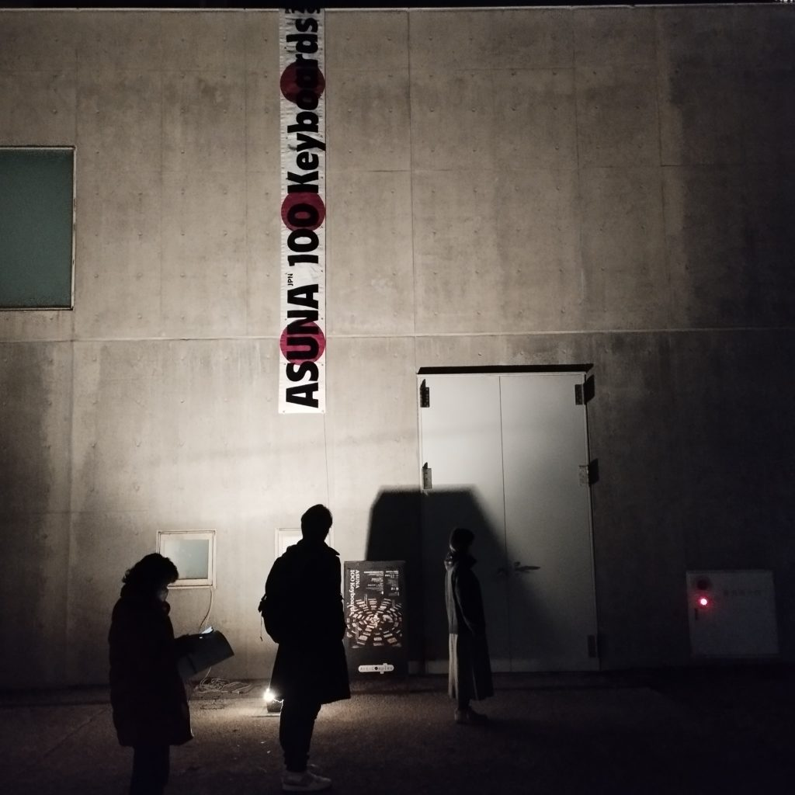
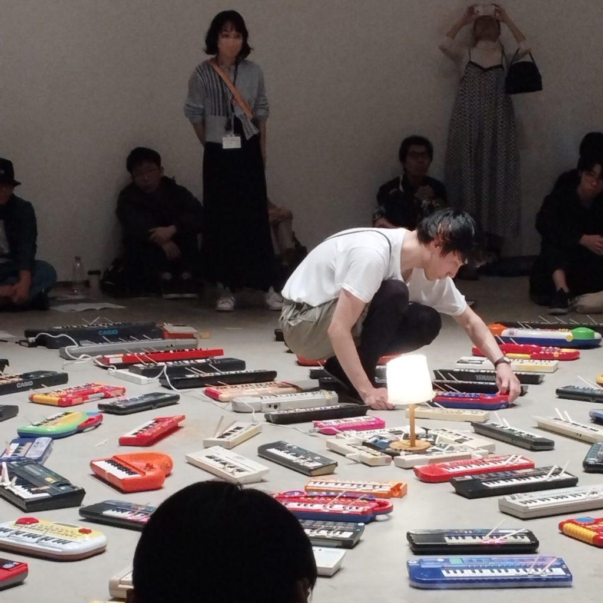

[2023年12月8日・9日にかけて行われた、サウンドアーティストASUNAのパフォーマンス《100 Keyboards》](https://www.kanazawa21.jp/data_list.php?g=25&d=2065)を見てきた。衝動的に2日ぶんのチケットを取ってしまって、「全通じゃん」と思ったが、じっさい2日間見ることができて大変良かった。良いパフォーマンスだった。

かんたんにパフォーマンスの概要を記すと、おもちゃの電子キーボードを100台以上放射状にならべ、アイスの棒でキーを固定してドローンを鳴らしていく。すると、たとえ同じピッチのキーを鳴らしっぱなしにしていても、キーボードの個体差や電池消費に伴う電圧降下、また空間内の反響などさまざまな要因によって、響きには音波の干渉によるうねるような「モワレ」が生じる。低い音域でのうねりと、より高い音域でのうねりが組み合わさって、ときにそれらのうねりがリズムに聴こえたり、シンプルなメロディに聴こえたりもする。

以上のように、《100 Keyboards》というタイトルやそこで示されているコンセプト、またどのような現象が起こるかは非常に明快で、ある意味ではコンセプチュアルでプロセス的な作品に思える。つまり、実現されるべきコンセプトがあり、それを忠実に遂行することによって、なんらかの現象が生起するプロセスを提示し、見守る、というような。[1](#fe470b6b-e917-4b4d-804a-966162f7a192)

しかし実際に見た《100 Keyboards》はもっとはっきりと「演奏」であり、ポストパフォーマンストークで畠中実さんがちらっと言っていたように、「世話をする」ような介入が細やかに行われていた。鳴らされるキーボードが徐々に増えてクレッシェンドし、おもちゃのキーボードから鳴っているとは思えないくらいの大音量に会場が包まれて、徐々に音が減らされて、静寂に戻る。90分ほどのパフォーマンスだが、思ったよりもあっという間に終わる。

パフォーマンス中は会場内を歩き回れたので、キーボードをじろじろ眺めながら耳を傾けてうろついていたのだが、コンクリートの床に汗が滴っているのが見えた。観客のものではない。寒さがすこし和らいだタイミングだったとはいえ、12月上旬の金沢、しかも会場の空調は切ってある。演奏者のめちゃくちゃな重労働がうかがえる。地べたに置いたキーボードを少しずつ鳴らし、音を決め、ピッチを決め、ときにはそれもいったんやめて鳴らすべき次のキーボードを探し……　と間断なく動き回る。

《100 Keyboards》をうまく鳴らすには、そのための経験と耳が必要になる。また、キーボードの個体差が大きいので、ひとつひとつの扱いを心得ていなければいけない。どう操作したらどの音が出るか、みたいなすごく具体的なレベルで。すぐに減衰してしまうピアノの音じゃこれできないものね。音響的なおもしろさ・豊かさも含めて、「コンセプトにのっとれば誰でも実現可能」という種類の作品とは性質の違うユニークなパフォーマンスだった。そしてそれは、キーボードひとつひとつが持つ来歴（そもそも中古品だからそのブツには固有の来歴があるし、人から譲り受けたものもたくさんあるという）と向き合う行為としても見、読むことができるだろう。

開演前に会場で誰かがリゲティ・ジェルジュの《ポエム・サンフォニック（100台のメトロノームのための）》（1962年）の話をしているのを小耳に挟んだのだけれど、あれはまさしくコンセプチュアルでプロセス的な作品だ。



一度100台のメトロノームをセッティングしたら、あとは各々のメトロノームが動きを止めるまでその現象を見守るしかすることはない。あるいはスティーヴ・ライヒの《振り子の音楽》（1968年）も同様に、スピーカーを仰向けにおいて、そこにつながったマイクを上から垂らし、振り子のように揺らすことで断続的なハウリングを起こして、しまいには（振動が止まることで）ハウリングの持続音に結末する。



見る前はどっちかというとそういう感じのイメージだったのだが、いい意味で裏切られた。

と同時に、その面白さはわかったうえで、「このパフォーマンスを誰かに委任することはできるのだろうか？」という問いも浮かび上がる。実際二日目のトークに登壇した佐々木敦さんがそんな提案をしていたけれど、「誰でも実践できそうなキャッチーさ」と「実際にパフォーマンスで感じられる面白さ」とのあいだをどう捉えるか？　というのは実はこの作品を考えるときに大事なところのように思う。スコアにしたらしたで、まったく違うリアリゼーションが起こってきてそれも楽しい。インスタレーションにすれば観客の鑑賞の仕方も干渉の度合いも大きく変わる。けれどもASUNAさんのやる《100 Keyboards》の持っている面白さにまずはフォーカスするのがよさそうだ。
