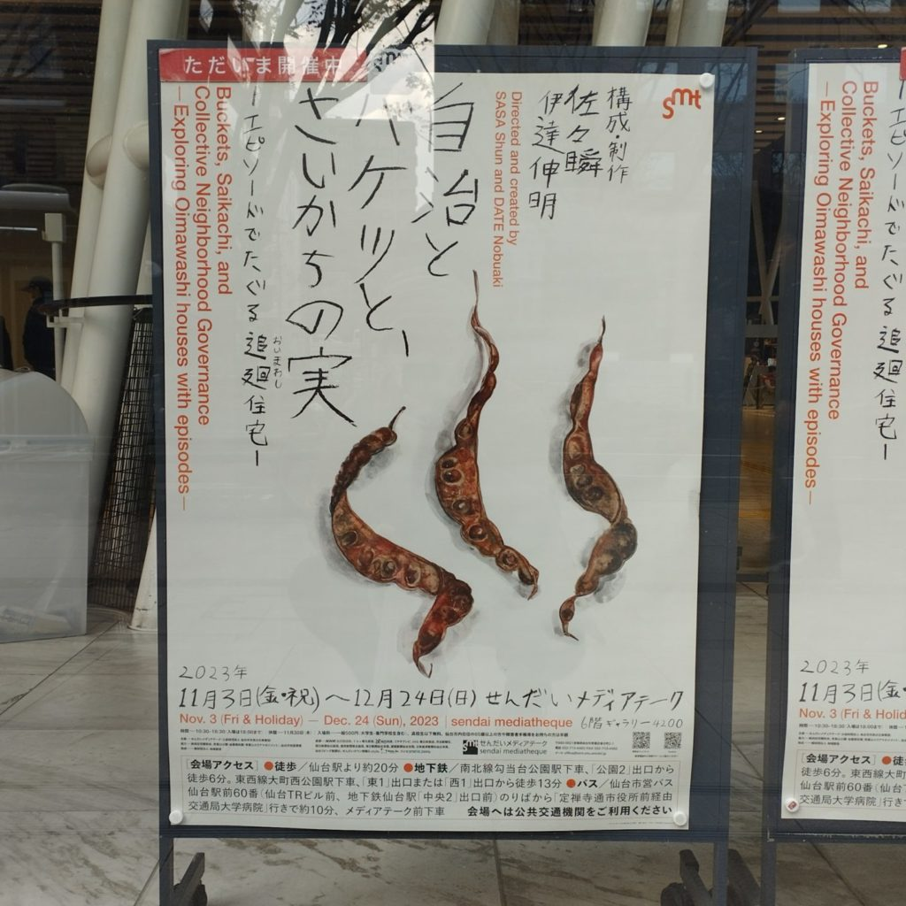
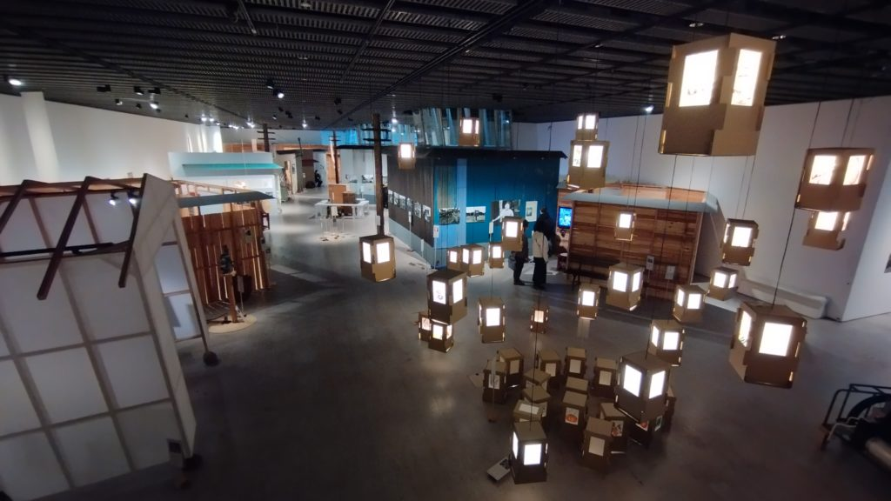

仙台経由で金沢に行ったので、帰りがけにせんだいメディアテークに寄った。そこでたまたまやっていた「[自治とバケツと、さいかちの実－エピソードでたぐる追廻住宅－](https://www.smt.jp/projects/oimawashi/)」（11月3日（金・祝）～12月24日（日）まで）を見たのだが、思いの外よかった。

戦後に「応急簡易住宅」として住宅が建てられ、戦災にあったひとや海外からの引揚げ者が暮らした、仙台市の追廻住宅。しかし暮らしが成立するとまもなく市の緑地計画の対象となり、立ち退きを迫られ……と国や行政に翻弄されながら団結して営んできた暮らしの記録と記憶を展覧会に構成したもの。アーティストの佐々瞬と伊達伸明が構成・制作を担当している。

追廻の前史や住民たちが編んだ追廻40年史を年表や歴史資料を使って淡々と提示するイントロダクションを抜けると、追廻の歴史と暮らしを再構築したインスタレーションが展開される。公式に書き残される記録からはこぼれ落ちるディテイルを、会場内に散りばめた断片的なエピソードを通じて示すのも良いし、そこにあんまり公に残らなさそうな陰影が落とし込まれてるのも良かったと思う。

2023年現在、追廻住宅があったところは青葉山公園になっている。戦後にふっと誕生し、終戦から70年を経てなくなってしまったコミュニティのことを思うと少しビターな気持ちになる。仙台市民ではないから追廻のことはまったく知らなかったけれど、訪れていたお客さんのなかには、なにか懐かしがっているらしい人もいたので、仙台の人にはまたちがった見え方がしたのかもしれない。

言ってしまえば、日本ではいわゆる「地域アート」にしばしばみられる、地域のリサーチをベースとしたインスタレーションと言ってしまえるのかもだけれど、それが追廻住宅というコミュニティの歴史を再構築して残す試みと、うまくマッチしていた。コンテンポラリーアートの文脈から外れて、地方都市の文化複合施設であるせんだいメディアテークのミッションとちゃんとシナジーを起こしてるというか。

せんだいメディアテークは特に東日本大震災以後こうした記憶の問題に対して継続的にアプローチしていて、震災をアーカイヴする「[3がつ11にちをわすれないためにセンター](https://recorder311.smt.jp/)」だったり、開館20周年展「ナラティブの修復　せんだいメディアテーク開館20周年展」もそうした問題意識をもった企画だった（ざんねんながら見に行けなかったんだけど……）。特に、今回展示を構成した佐々と伊達は「ナラティブの修復」の出展作家でもある。

[10のナラティブ。「ナラティブの修復」展に寄せて｜美術手帖](https://bijutsutecho.com/magazine/insight/25335)

当然、これを「アート」の土俵で語ろうとすればさまざまな批評が可能ではあるのだろうけれど、しかしこれを「アート」として語ることで見過ごされるものも多そうな気はする。さまざまなメディウムを複合的に空間内に構成し、ナラティヴを喚起するというインスタレーションの手法は、それ自体批判的な検討も行われて久しいが、一方で、そこでつちかわれてきたノウハウじたいはまだ使いようがいくらでもある。というようなことを思ったりした。ある意味「山形ビエンナーレ」もそういう志向があったか。良いか悪いかはぱっとわからないが、自分は好ましいと思う。
