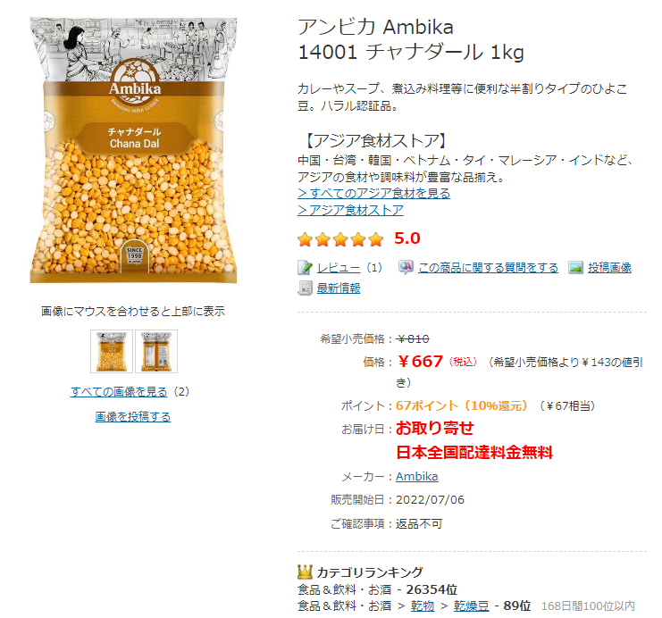
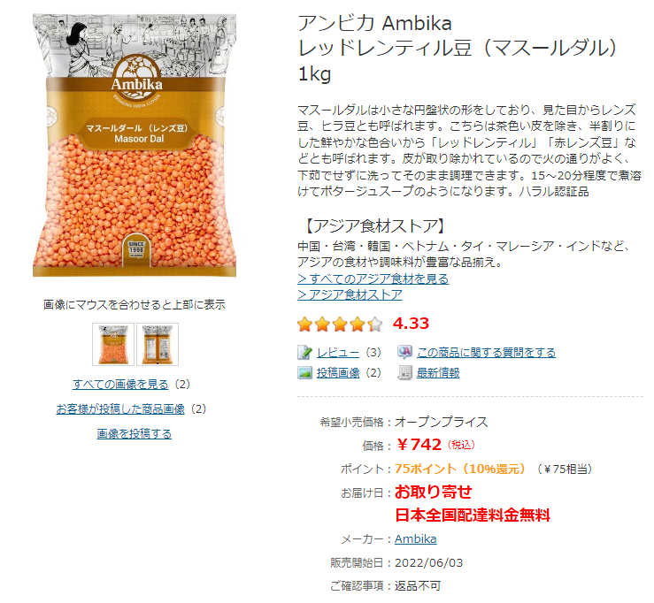
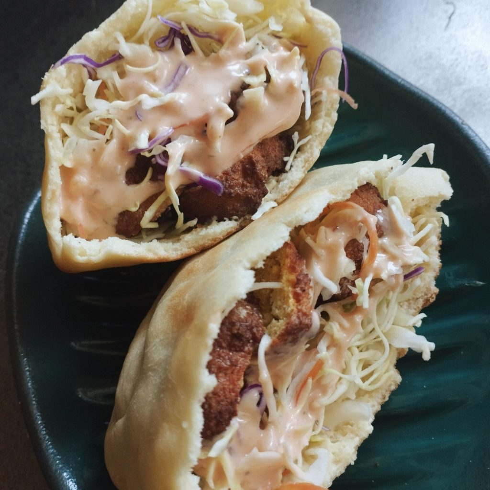
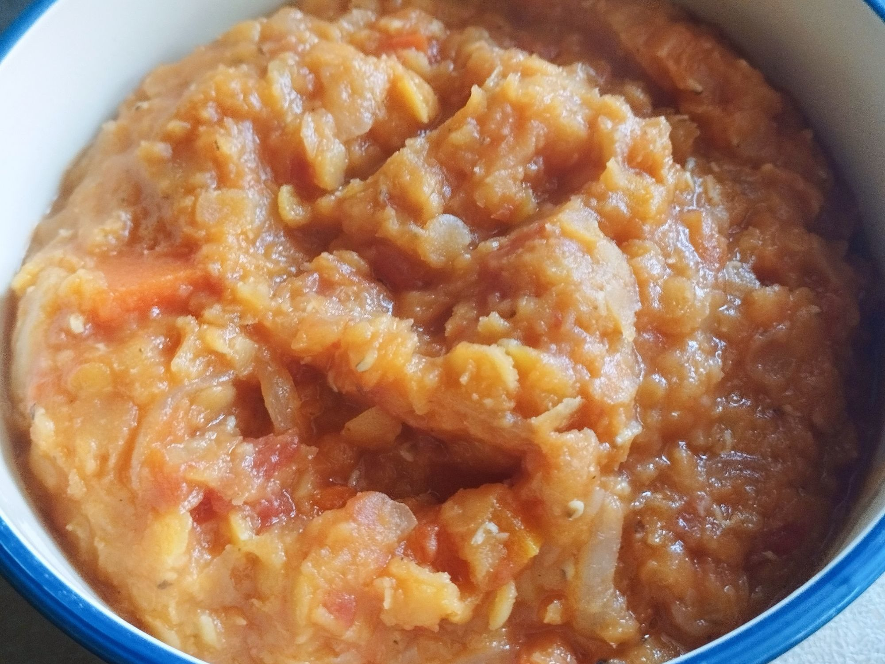

なんか知らんがヨドバシで豆が安い。

[ヨドバシ.com - アンビカ Ambika 14001 チャナダール 1kg 通販【全品無料配達】](https://www.yodobashi.com/product/100000001007196721/)

[ヨドバシ.com - アンビカ Ambika レッドレンティル豆（マスールダル） 1kg 通販【全品無料配達】](https://www.yodobashi.com/product/100000001007137398/)

その他にもこれでもかという品揃えでめちゃくちゃ豆があり、安い。いま見たら「お取り寄せ」になってたけど。種類によってはまだ在庫ある。自分は発見次第即注文し、翌日には届いた。

赤レンズ豆はトマトスープにして、ひよこ豆はファラフェルにして食べている。

スープは適当に野菜を放り込んで煮込んでいるだけだが、ファラフェルはいくつかネットで見れるレシピ（[これ](https://www.on-the-slope.com/articles/recipe_all/recipe/articles-268259/)とか[これ](https://www.kurashiru.com/recipe_cards/cb3aaeae-40e7-48ee-83c0-212737fc2d44)とか）を参考にして、ノンフライヤーで加熱している。最初につくったときは食べれなくはないがぱっさぱさで仕方なかったが、きちんと浸水してあまり細かくペーストにしすぎないように気をつけて、つくるごとにおいしくなっている……気がする。

ホブズ（ピタ）も自分で焼いて、カット野菜なんかをあわせてサンドイッチにすると、安い割にちょっとしたものを食べた気分になって、良い。

2024年は「豆」と「酸味」が来ます。これは予言です。
