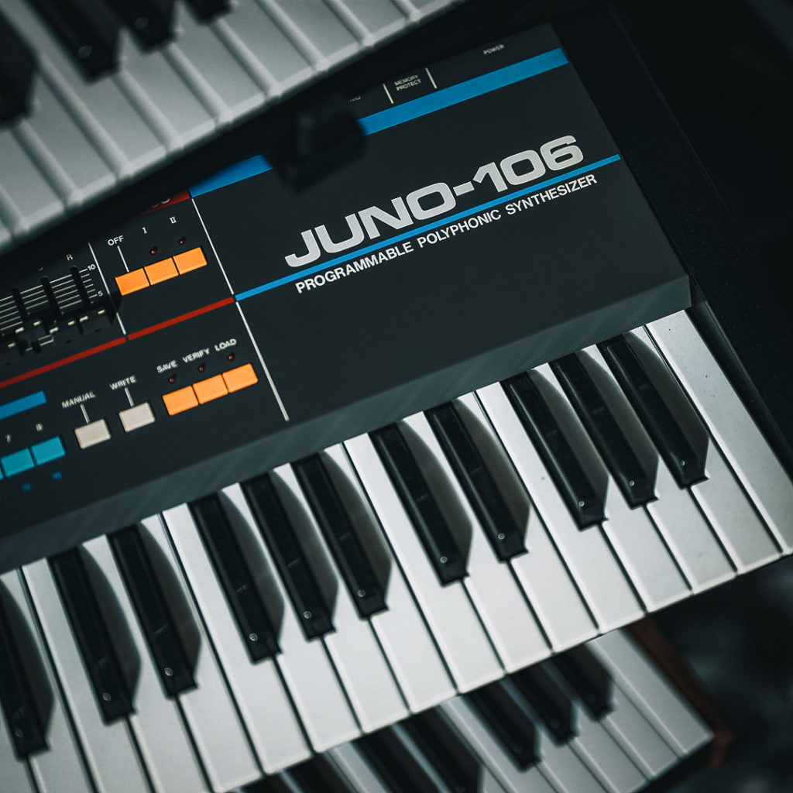
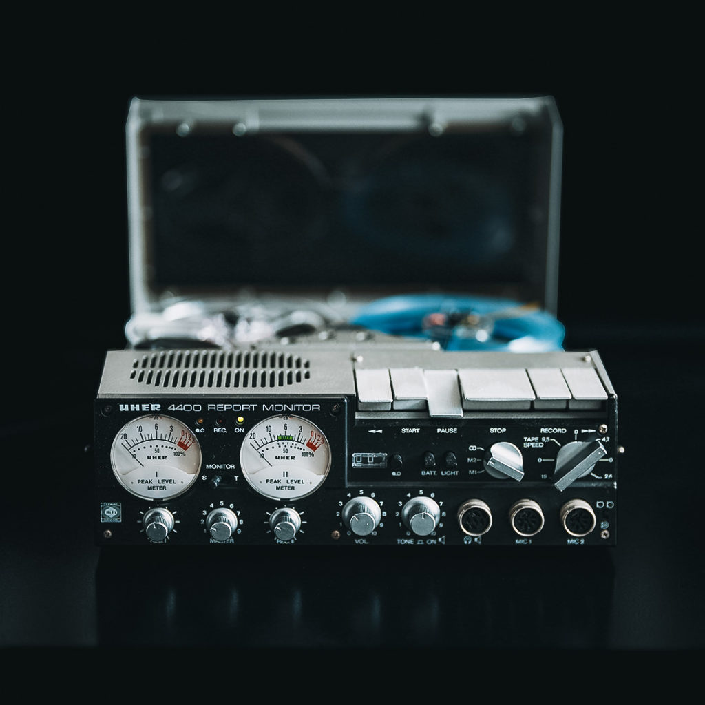

安室奈美恵や三浦大知のプロデュースワークでも数多くの人気曲を生み出し、自らヴォーカルをとるソロアーティストとしても知られるNao’ymt。そんな彼はここ数年、2014年リリースのソロ作『矢的直明2014』収録曲をリメイクする「Reinterpretation」シリーズや、ヴォーカリストとのコラボレーションを始めとして、旺盛にソロ活動を展開してきた。

Nao’ymtのサウンドを特徴づけるのは、ダンスミュージックの高揚感や、ヴォーカルミュージックとしてのR&Bのスウィートさを芯に持ちながら、さまざまな質感を湛えたシンセやポスト・クラシカル的な音使いでアンビエントに接近する折衷性だ。プロデュースワークでももちろんその片鱗を感じることができるが、もっともそのユニークさが直にあらわれているのは、やはりソロだろう。今回のインタビューでは、具体的な制作プロセスから音楽的な影響源、そして名作・三浦大知『球体』への思いまでを伺うことができた。ストイックさと音楽への愛が同居したような語り口のニュアンスが、テキストでは抜け落ちてしまうのが残念だが、少しでもそれを感じてもらえればと思う。

<figure>



<figcaption>

Nao’ymt「月暈」（2020）

</figcaption>

</figure>

## 「感謝の気持ち」としてのReinterpretationシリーズ

**2020年、新型コロナ禍が始まって、音楽業界にも様々な変化があったタイミングで、ソロでのリリースが活発になりましたね。『矢的直明2014』（以下『2014』）の収録曲をリメイクする「Reinterpretation」シリーズを始めとして、このタイミングでソロ活動に力を入れるようになったのはなぜでしょう。**

前々から、『2014』や三浦大知くんとの『球体』で追求した「アンビエント＋ダンスミュージック」を自分のソロでもう一度やってみようかなと思っていました。自分の中で大事にしている音楽性がずっと続いていることを伝えたかったんです。そこに奇しくも新型コロナ禍が起こって、自分の制作に集中する時間が確保できたことはきっかけのひとつでした。『2014』を買って聴いてくれた方への感謝の気持ちも大きいです。聴いてくださった方には、元を知っているからこその楽しみ方をしてもらいたいなと。

初めはもっと気軽に、ちょっと手を加えて歌い直すくらいのつもりだったんですが、元のプロジェクトファイルを自分で見てもわからないことが多くて。それに、自分のプロジェクトではプラグインをあまり使わず、実機のシンセサイザーを弾いていることが多いので、まったく同じ音は2度と出ない。がらっと作り変えようとも思ったんですが、連続性の部分がわかりづらくなってしまうので、元の楽曲に合わせて、改めて音を作っていきました。

<figure>

<iframe src="https://open.spotify.com/embed/album/5j5PLCQe8dlAjkkykpQ2Cs" width="300" height="380" frameborder="0" allowtransparency="true" allow="encrypted-media"></iframe>

<figcaption>

Nao’ymt『矢的直明2014』（2014）

</figcaption>

</figure>

<figure>



<figcaption>

Nao’ymt「Sunrise (Reinterpreted)」（2021）

</figcaption>

</figure>

**「Reinterpretation」のヴォーカルはどれも再録ですよね。原曲と比べると、メインのボーカルラインに加えて新しくハモりが加わっていたりします。**

『2014』は普通の部屋でヴォーカルを録っていたので、反響の面でもあまり声を出せなくて。「Reinterpretation」では半分くらいスタジオを借りて録音したので、より歌にスポットを当てることができました。簡単なものとか、大きい声を出さなくていいものは、家で録ったりもしました。

## ソロワークならではの実験が作りだす理想のサウンド

**具体的に楽曲についてもお聞きしたいと思います。個人的に気に入っている曲のひとつが、「Irreplaceable (reinterpreted)」です。元曲も好きだったんですが、特に空間の作り方がすごく鮮やかになったように感じました。**

<figure>



<figcaption>

Nao’ymt「Irreplaceable (reinterpreted)」（2020）

</figcaption>

</figure>

いつも曲を作るときにはまず映像が見えるんです。「Irreplaceable」のときは、車で走っているときに目黒通りで古くて小さな教会を見つけたんです。そのとき、教会の中に人が座っていて、膝の上にかけたブランケットの上に葉っぱが一枚落ちてくる……そういう絵がパッと浮かんで。その時にこの曲が浮かんだんです。異世界感のある、ノスタルジアの感じられる曲。それを再現するために、基本的に素材はテープに1回録って、そのテープに録った音をまた戻して使っています。Sequential Prophet 12やRoland JUNO-106の音をテープに録って、それを戻す、っていう。昔eBayで買った、Uherという古いオープンリールのテープレコーダーを使いました。

**そういったガジェットは普段からよく探していらっしゃるんですか。**

はい。でも、7割失敗しますね（笑）。でも3割は当たりというか。ほんとに1曲の中のワンフレーズだけかもしれないですけど、「これがあったからこの音が作れた」という喜びがあるんです。仕事のときは修正がなるべくしやすいように配慮するんですが、自分のときは、そういう好き勝手な実験ができる楽しさがありますね。

**ハードウェア以外にも、プラグインで重用しているものはありますか。**

U-heのシンセがすごい好きで、ZebraやReproをよく使っています。特にZebraはパッドがすごくいい。有名なシンセですが、Spectrasonics Omnisphereもよく使います。ミックスで絶対使うのはFabFilterのProQシリーズとWavesのRenaissance Compressor。Wavesのプラグインは、老舗の安定感があるのでなんだかんだでよく使います。また、アンビエント曲では、AudioThingのWiresやWavesfactoryのCassetteなどを味付けで使用することもあります。DAWはAbleton Liveをメインで使っていて、歌とミックスはAvid Pro Toolsで行っています。

**ご自身でミックスも手掛けられていますが、自分でやることにやはりこだわりがあるのでしょうか。**

あんまりないですね。頼みたいんですけど、それはそれで大変なので。ちょっと特殊な音の使い方だったりすると、「どう説明すればいいんだろう」みたいな……。だったら、自分でやった方が力作になるかなと思って、日々すごく頑張って勉強してます。正直、作るのはすごく好きですけど、ミックスはそうでもないんです。作るのとは頭の使う場所が違うんですよね。

## 固定観念に囚われず、自分の表現を「解放」する

**「Reinterpretation」以外の楽曲についても伺えれば。個人的に、2020年のシングル「落葉」がとても好きな一曲です。ビートレスで、パッドとピアノが中心になった前半に、提供楽曲ではあまり聞かれないNao’ymtさんの作家性を強く感じます。**

<figure>



<figcaption>

Nao’ymt「落葉」（2020）

</figcaption>

</figure>

実は、この曲が一番最初に思い浮かんだときは、アカペラだったんです。だから、全部アカペラで行きたいなと思っていたんですけど……。

ソロ活動でいま目指しているのが「解放」で。やっぱり仕事で音楽を作っている影響で、自分の気持ちを解放するのが難しくなっちゃう。「キャッチーにしなきゃ」「もっと分かりやすくしなきゃ」みたいな意識が働いちゃうんですよ。例えば、自分は着物がすごく好きなんですね。でも、着物を着て、今から渋谷行ってくださいって言われたら、ちょっと恥ずかしい。曲作りでも同じようなことがあって、「アカペラはちょっと……」みたいに思っちゃう。だからパッドを入れちゃったんですけど。

**かなり「Nao’ymtらしさ」が出ていると思っていたので、まだ突き詰めたい部分があるんだと聞いてちょっと驚きました。**

そういう、攻めたいのに攻めきれない自分の不甲斐なさは常にあります。今のうちに言っておきますけど、もっと行けるんで！（笑） この先、もっと解放していくので。

**後半でゴリッとしたビートが入ってきますが、こういった展開のひねりは作っているうちに湧いてくるんでしょうか。**

もう、展開まで最初のインスピレーションでできています。あとはそれに耳を傾けて、手繰り寄せて、音にしていく。大体80パーセントは見えてますね。残り20パーセントは、作りながらもっといいのが出てきちゃうことがある。自分の曲で展開が飛んだりするのは、まさに映像から来ているのが理由なんです。映像が変わったら、かかっている音楽も変わるという感じ。音楽はループが前提で、1番・サビ・2番・サビ・大サビ、みたいになっているものですけど、映像は起承転結で進んでいきますよね。作り方が映像寄りなんです。いまは、「サビを一曲のなかで繰り返す必要があるんだろうか？」と思い始めています。

**この曲のように、リズムを強調するよりはパッドの音色などを聴かせるようなアンビエント的なサウンドについて、インスピレーションになっているミュージシャンの方はいらっしゃいますか。**

いろんな方から受けた影響の上に自分の音楽があるのは確かですけど、例えば「この曲はここからの影響」っていうのはあんまりないんです。今まで培ってきたものがじわじわ出てきて、自分の音楽と触れ合っている。ただ、Sigur RósとかBjörkが大好きで、アンビエント系の曲にはその影響が表れているかもしれないです。他にも、同じアイスランドのJóhann Jóhannssonとか。どんな影響を受けているか、あまり深く分析したことはないんですけど。

<figure>



<figcaption>

Jóhann Jóhannssonのアルバム『Orphée』より「Flight From The City」（2016）

</figcaption>

</figure>

**Nao’ymtさんといえばもちろんR&Bが大きな影響源にありますが、それ以外からの影響も大きそうだなと思います。**

初めはUSのポップスから始まって、ロックを経て、R&Bを聴きだして……。作っていたのがR&Bだったこともあって、ほぼR&Bだけを聴いている時期が一番長かったですね。それが、自分の感じている気持ちをR&Bじゃ表せないと感じ始めて、色んな音楽をもっと深く聞くようになりました。そこでSigur RósやJóhann Jóhannssonにビビッときて、自分の中で融合させ始めたんです。

## プロデューサーの視点から振り返る、安室奈美恵と三浦大知

**ご自身も素晴らしいヴォーカリストですが、自分でヴォーカルをとれるということが、制作の上で強みになっていると感じることはありますか？**

ありますね。提供する曲でも、仮歌を結構きっちり、このまま完成してもいいくらいまで作るんです。「聴いた通りに歌ってください」と言えば、いちいち言葉で説明する必要がない。それがすごく助かります。たとえば、自分の歌詞は韻をすごく大事にしているので、あえて言葉を変なところで切ったりするんです。普通に歌っても成立してしまうのだけれど、仮歌を聴いてもらえば、そこが切れてる、ブレスしてる、というのをわかってもらえる。自分みたいに作って歌っている人が提供する時は、多分皆さんそうだと思います。結局、自分で「こういう曲にしたい」と思って作って歌っているわけなので、仮歌と最終的な歌が全然違うってパターンはあまりないと思います。

**とはいえ、実際に歌入れしてもらったときのマジックもありますよね。**

素晴らしいシンガーの皆さんとお仕事しているので、いつもマジックです。特にその人の声が初めて乗った瞬間、一声目で「うわっ」てなったのは安室奈美恵さんでしたね。同じ言葉で同じメロディーなのに、伝わるメッセージの質が違う。

他にも、R&B的な観点で言うと、リフズ・アンド・ランズ（いわゆるフェイク）という、あえて崩す歌い方がすごいのは、やっぱり三浦大知くん。仮歌でもフェイクの部分は全部崩して歌って、ガイドを作ってあるんです。大知くんはそれを聞いた上で、最終的には結構変えてくる。大知くんならではのフレーズになるんですよ。R&Bのシンガーって、その人のフレーズがあるものなんです。タンクだったらタンクの、マライア・キャリーだったらマライア・キャリーのフレーズ、みたいに。それを持っているというのは、R&B好きとしてはすごく嬉しいんですね。

<figure>

\

<figcaption>

三浦大知「Backwards」（2018）。Nao’ymtが作詞・作曲・プロデュースを手がけた。

</figcaption>

</figure>

**ちょうど三浦さんの名前も出たので、三浦さんとお二人で制作した『球体』についても伺いたいと思います。Nao’ymtさんも自ら代表作として挙げられている作品で、個人的にも大好きな作品です。2018年夏のリリースから4年ほど経った今から振り返って、改めて『球体』にどんな思い入れがありますか。**

<figure>

<iframe src="https://open.spotify.com/embed/album/0sG5eHkkoCNcpqH4gyneBX" width="300" height="380" frameborder="0" allowtransparency="true" allow="encrypted-media"></iframe>

<figcaption>

三浦大知『球体』（2018）。全曲Nao’ymtがプロデュースを手がけた「コンセプチュアルプロジェクト・アルバム」

</figcaption>

</figure>

3年以上かけてひとつの作品に向き合うことができたのが一番大きいです。しかも、それがすごく楽しい時間で。PCMレコーダーを持っていろんなところに旅したり、海に行ったり山に登ったりして、いろんな音を集めて、それを元に曲を作って。自分の中では、売れる・売れない、評価される・されないとかいう次元じゃなくて、世に残せたということ自体に意味がある作品です。

もう毎日楽しかったですよ。何をやっていても楽しかった（笑）。晩ごはんを食べていても、「あの主人公はあの後どこ行くかな」とか、「あのシーンでどうやってなんて言うかな」とか、もうそんなことばかりずっと考えてました。『球体』で描かれるストーリーの中に鉄橋が出てくるんですけど、自分の理想に近い鉄橋がどこかにあるんじゃないかと実際に探しに行ったり。わざわざ新幹線に乗って、ぴったりの鉄橋を見つけたら、その下に行ってレコーダーを回して、電車ががたんがたんと通りかかる音を録音して。「おかえり」という曲には、そうやって3年間かけて録った音がSEとしてたくさん入っているんです。春の音、夏の音、秋の音、冬の音を集大成としてあそこに込めていて。そんな作品、なかなか作れない。

<figure>



<figcaption>

ヴォーカル×ダンスパフォーマンスの可能性を追求することが念頭に置かれた『球体』。アルバムの発売に先立ち「”完全独演”公演『球体』」が全国7都市で開催された

</figcaption>

</figure>

しかも、それを稀代のエンターテイナーである三浦大知くんがこれ以上ない形で表現してくれた。独演のステージを観たときに、すごく腑に落ちたんです。音楽が好きで、3歳からピアノを始めて、いろいろな経験を経て、ここにたどり着いた。ひとつの着地点みたいなものを感じましたね。

実は、制作しているとき、「この作品は人々に受け入れてもらえるだろうか」と大知くんにぼやいたことがあって。大知くんは「それは自分がエンターテインメントにします」って言ったんですよ。「エンターテインメントにできるんで、大丈夫です」って。めっちゃかっこいい！　と思って（笑）。深夜のコンビニでの話です。それで自信を持って、弱気にならずに行けたんです。

## 「名刺」がわりのソロで未来を作る

**現在、シングルをハイペースでリリースされていますが、また『2014』や『球体』のように、アルバムを制作する予定はありますか？**

そこはいますごく悩んでいますね。まとめたいんですけど、繋がりがない曲を集めたアルバムになっちゃうのは嫌なんです。今の時代だからこそ、アルバムとしての意味が大事だなと思っていて。もし、アルバムを出すとしても、今までのリリースとは切り離したものになるかもしれません。

**リスナーとしては、「次にアルバムが出るとしたらどうなるんだろう」と期待してしまいます。Nao’ymtさんご自身としては、そうしたアルバムに対するプレッシャーはありますか。**

あまりありません。ソロだから、成功しようが失敗しようが自分の他に誰も傷つかない。そこは楽ですよね。 むしろ、どなたかに提供した作品となると、責任があるなとは思います。

**2022年現在、作家的に楽曲を提供する仕事と、ソロとしてのリリースの両輪で活動されていますよね。意識的にそのバランスをとることはしますか？**

いや、それはもう全然。単に、音楽作るのがほんとに大好きなんで、常に作っていたいんですよ。仕事が来たらそのために作るし、仕事がなかったら自分のために作るしっていうだけです。

今は、ソロ活動がいわば名刺みたいな感じなんです。「こういう感じの曲いいじゃん」って思ってもらって、そういう仕事が来たらいいなと。仕事だから、ソロだから、っていう風にはあんまり考えないようにしてます。最終的には、仕事もソロもひとつになったらいいなと思っています。

取材・文：imdkm

### Nao’ymt　プロフィール

東京都千代田区出身。独自の世界観で全てを包括する音楽家。  
1998年にR&Bコーラスグループ“JINE”を結成。2004年よりプロデュース業を本格的に始め、三浦大知、安室奈美恵、lecca、AI、他、数多くのアーティストに作品を提供している。  
特に三浦大知の多くの楽曲を担当。中でも、2018年7月リリースのアルバム『球体』は、アルバムコンセプト含め全16曲の作詞作曲・プロデュースをした出色の出来である。  
また、安室奈美恵に関しては、ヒットシングル「Baby Don’t Cry」「Get Myself Back」など、これまで28曲を担当。小室哲哉以降もっとも多くの曲をプロデュースしている。

[https://naoymt.com](https://naoymt.com/)  
[https://www.instagram.com/naoymt/](https://www.instagram.com/naoymt/)

#### ニューリリース「Japanese Summer Lost」

> 遠い昔、日本の夏、人々はどのような風景を見ていたのでしょうか。  
> そんなことを思いながら作りました。（ご本人のTwitterより）

各種プラットフォームでの配信はこちら：  
[https://orcd.co/japanesesummerlost](https://orcd.co/japanesesummerlost)
