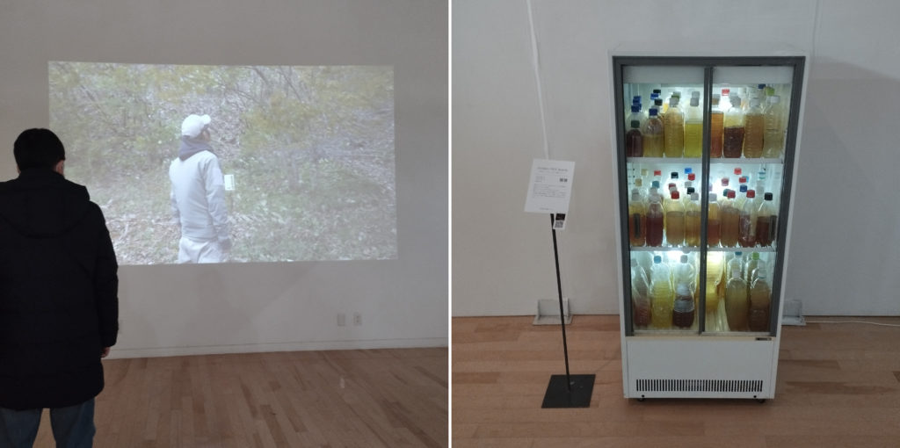
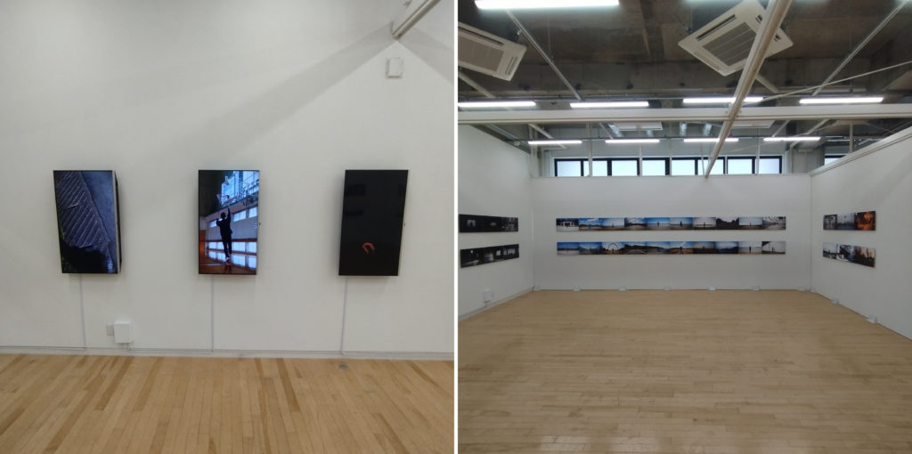
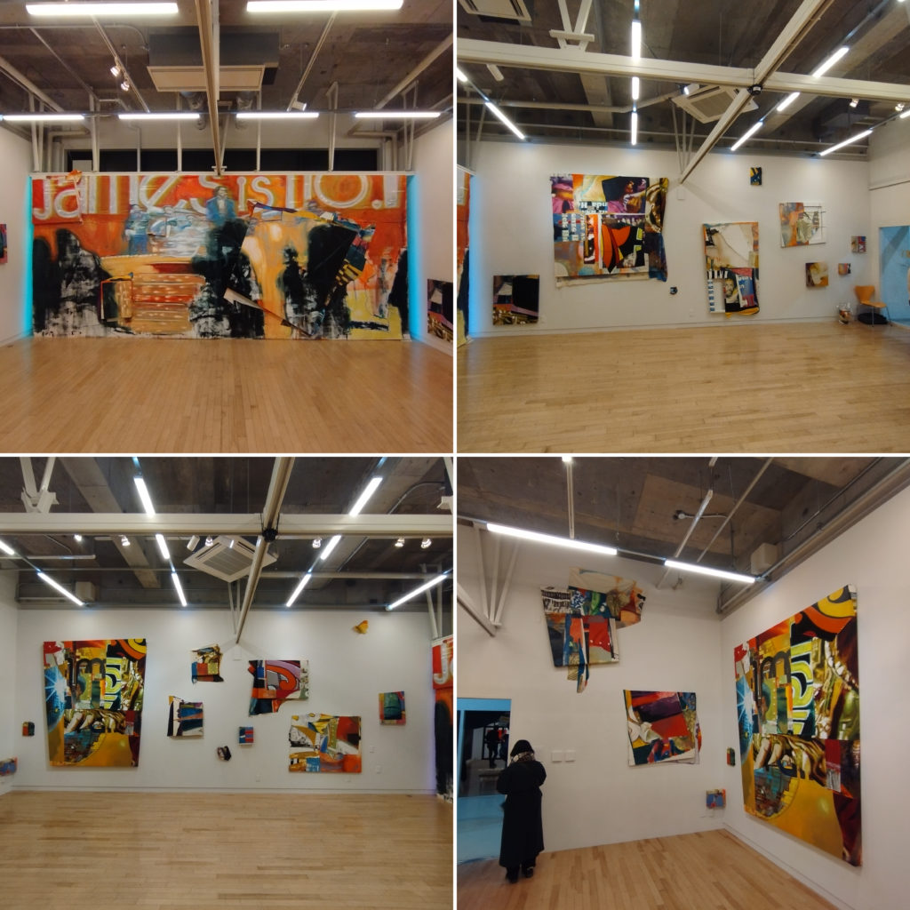
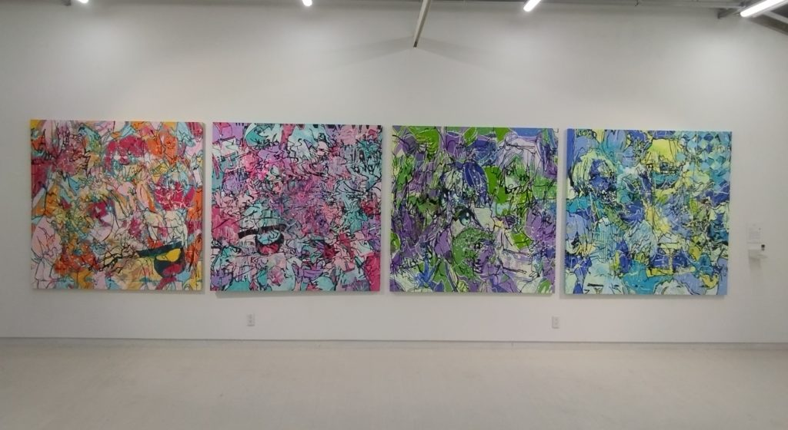

## 2月3日

THE IDOLM@STER CINDERELLA GIRLS UNIT LIVE TOUR ConnecTrip! 山形公演（やまぎん県民ホール）を見た。デレマスのライブは昔ライブビューイングで見たきりで、現地参加ははじめて。近くの駐車場に乗り付けてやまぎんホールに向かうと、アイドルのハッピ着てタオル持ったおたくが広場に押し寄せていて迫力があった。おれはグッズ関係なにひとつ持ってなくて、逆にちょっと恥ずかしかった。気合の入ったおたくにたいする引け目、ありますよね。

開演前BGMには、山形出身アイドル辻野あかりのソロ曲が流れて会場ぶち上がり。いい曲だね。



うちはりんご農家でもあるので山形りんごがフィーチャーされるのはうれしいが、山形といったらむしろさくらんぼやラ・フランスではないかという思いもなくはない。

3階席最後列という席ガチャハズレな感じの場所だったけど、そもそもホールがそんなに広くないのでぜんぜん気にならなかった（オペラグラスはやっぱり欲しかったが……）。というかこんな場所でデレマスのライブ見れるのやべ～って感じで、なんとも贅沢な時間であった。80分とか90分だったかな。タイトだけど濃密なセットリスト。

まあいろいろ楽しかったのだが（MCとか）なによりイノタク曲を存分に楽しめたのがよかった。かねてから生涯ベスト、世界で一番いい曲と公言してきた「クレイジークレイジー」を生で聴けたし、「Radio Happy」も見れたし、「Hotel Moonside」も見れた。思い残すこと、なし。生で動くあやっぺを見れたのもよかった。



ただ、やっぱりペンライトを振って盛り上がるというのがなかなかよくわからない。後半になってようやく掴んできたけれど。あと4つ打ちで手拍子起こるのはいいけどみんな走りすぎてて「ちゃんと音を聞いて！」と思った。でも手拍子って意外とむずかしいよね。おれも上手にできる気がしない。

## 2月4日

山形駅西口のレコ屋RAF-RECに食品まつりさんとTaigen Kawabeさんが来るというので見に行った。食品さんの『Yasuragi Land』には日本盤ライナーを書いていて、インタビューもリモートでしていたのだが、対面ははじめて。『Yasuragi Land』にも参加していたTaigenさんとあわせて、きちんと挨拶できてよかった。食品さんはラップトップとSP-404 Mk2とRoland E-4でパーカッシヴだけどビートレスなトラックとヴォーカルというか声のパフォーマンスを組み合わせたライヴで凄まじかった。なんかもう、「熱唱」というかんじで。SP-404に仕込んであるネタはゲーム機のサウンドロゴばかりでそれもとんでもなかった。Taigenさんのパフォーマンスはラップトップからトラックを流し、足元のエフェクターを操りつつヴォーカルを披露するスタイル。セットアップはめちゃくちゃミニマルなのにオーラとパフォーマンスでスペクタクルにしててすごかった。そのままフリーなセッションに突入して謎の狂騒を経て幕を閉じた……。

## 2月7日

東北芸術工科大学の卒展がはじまったので見に行った。印象に残った人をいくつか。

美術科洋画コースの木村晃子さん（[note](https://note.com/akiko_kimura732/)）、道端に投棄されるし尿入りのペットボトルを題材にしたモキュメンタリーとインスタレーション（《Golden PET Bottle》）、露悪といえば露悪なんだけどアウトプットがスマートで、でも適度に俗っぽい（モキュメンタリーというアプローチ自体が持つ俗っぽさ）。ただテレビとかYouTubeみたいなメディア／プラットフォームではキャッチしきれなさそうなつかみどころのなさもある。

大学院複合芸術研究領域の横田勇吾さん（[ポートフォリオサイト](https://yugoyokota.myportfolio.com/)）、たしか学部の卒制で作品を見ていて印象に残っていたのだが、そのときよりもテーマが地に足ついていたと思う（うろ覚えだけれど）。ストリートダンスの経験に基づきつつ、ダンスの身体性に加えて、身体の外部（空間、時間、リズム）とどう関わっていくかを突き詰めた結果、ある種のコンテンポラリーダンスみたいな問題意識（日常の動作とその身体性、サイトスペシフィシティ）とパフォーマンスになっているのが面白かった。ストリートからのコンセプチュアリズムってめちゃかっこよくないすか。

大学院芸術文化専攻絵画領域の小林由さん（[Instagram](https://www.instagram.com/kobayashi_yuip/)）。この人もストリートダンス経験をもとに制作しているのだそうだけれどがっつりペインティング。ダンスの経験はモチーフのレベルでも明確だけれど、方法のレベルにも入り込んでいる。描いた絵を裁断してミシンで再構築して、フレームに不定形なままはりつける。コラージュ的な造形もヒップホップっぽいけど、このフレームからはみ出したりフレーム自体がいびつだったりするところも、あの種の音楽が持つ歪みや断絶（トリシャ・ローズ的な）の具現化っぽくて面白い。帰ってから、小林さんも卒展で見てたのに気づいた。でも卒展のときよりも方法面でも造形でもキャッチーで強いと思う（モチーフの選択が若干ベタすぎる気もしないでもないけど好みの問題ではある）。

美術科洋画コースの塩原唯菜さん（[ポートフォリオサイト](https://nunuunu0131.wixsite.com/31shiobara)）。描いているモチーフ自体はキャラクターっぽいというかイラスト的なアプローチなんだけど、線に物質性をもたせる方向で構成された画面がすごくよくて、正方形のフォーマットもばちっとハマっている。素朴にもっといっぱい見たい。

ここ数年で見たなかでも面白かったような気がする。コロナ禍で制限が厳しかった時期に制作・発表せざるをえなかった頃を越えて、学生生活がはじまる頃にコロナ禍が本格化して、その環境を前提に制作するようになったからだろうか……とか思った。

ちなみに芸工大ついて車停めてひといき着いてたら目の前を卒展見学にきていたとおぼしき学部生時代の恩師が通りがかり、「えっマジで？」と思いつつ急いで車を降りて勇気を振り絞り声をかけたところ、結構ちゃんと覚えられていた。14,5年ぶりなんじゃないかな。
