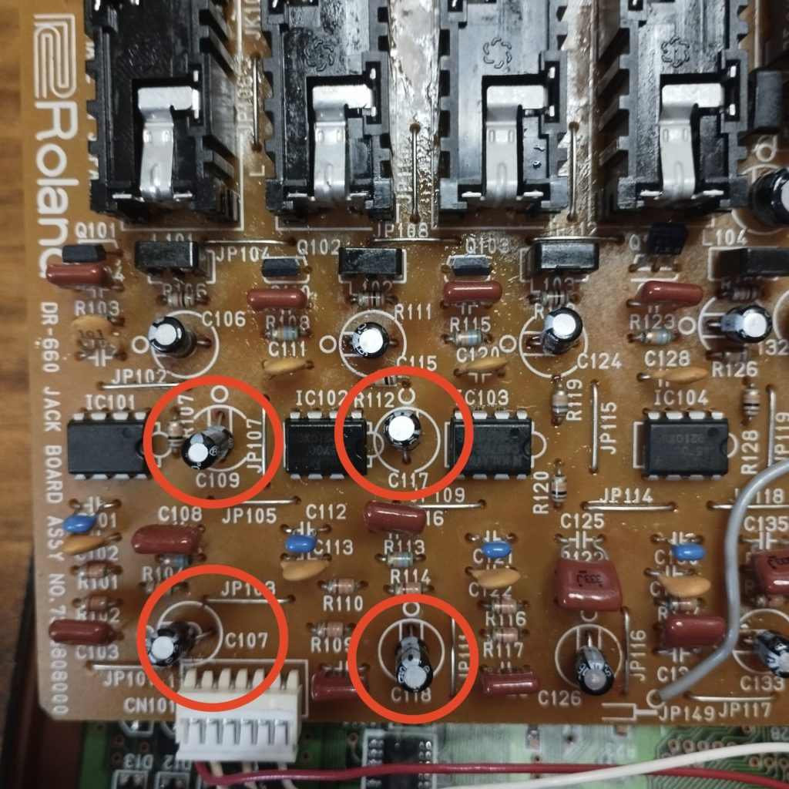

アボかどさんに、メンフィスラップで使われていたギアを紹介する記事を教えてもらった。

[How Memphis Rap Was Produced In The 90s (A Detailed Guide) – Loaded Samples](https://www.loadedsamples.com/blogs/blog/90s-memphis-production)

そこでBOSSのチープなドラムマシン、DR-660が紹介されていた。

> The importance of the DR-660 in Memphis Rap cannot be understated. Without this machine there would be no "Phonk" genre. The style of using pitched 808 cowbells was a direct result of unique design limitations on this budget rhythm machine. Original TR-808 machines did not enable you sequence 808 cowbells or kicks at various pitches in a drum pattern, this functionality was exclusive to the DR series drum machines. It's hard to imagine that Memphis Rap would sound the way it did without the use of the DR-660.

Phonkのあのカウベルがうまれたのはこのドラムマシンのおかげだ、と。



なるほど……

調べると、[Legoweltがこのドラムマシンを激推ししていたり](https://web.archive.org/web/20141201055447/https://awolfe.home.xs4all.nl/studio660.htm)、[Squarepusherの初期機材として名高かったり](https://www.snrec.jp/entry/feature/2009/10/131)（まあ単に手に入るくらい安いドラムマシンだったという話なのだが）、チープな割にエピソードに事欠かない名機らしい。

そこでメルカリでDR-660を購入したのだが、明記されていた液晶の不具合に加えて、メインアウトからの音量が著しく低い。スピーカーがわりのミニギターアンプにつないでも、最大音量にしてやっと音が聞こえてくる程度。メンテナンス用のサウンドチェックモードを試してみたところ、4つあるアウト（L／R／インディビジュアルアウト1／同2）の打ち、インディビジュアルアウト1をのぞく3つがほぼだめになっている。

ちなみに、サウンドチェックモードに入るための手順は以下（サービスマニュアルより）

```
［SONG］ボタンと数字ボタン［7］を同時に推しながら電源を入れる。LCDディスプレイにROMのバージョンと日付が表示される。

対応する数字キーを押すと、各チェックモードに入れる。詳細は省くが、音声出力のチェックは［7］。

パッド番号1～4を押すと、それぞれL／R／インディビジュアルアウト1／インディビジュアルアウト2から異なるタムの音が出力される。

パッド番号13～15を押すと、それぞれL7／センター／R7のパンニングで正弦波が出力される。
```

ブロックダイアグラムや回路図とあわせて基盤を眺めてみて、こうした症状が出そうな部分といったら、シールドを差すジャック、ボリュームノブ、オペアンプ、コンデンサ、あとはどこかのハンダ割れくらいなものだ。抵抗がどうにかなるとか思えないし。

テスターでジャックが劣化していないかチェックしてみたものの、すべてのジャックが問題なし。ボリュームノブも、ボリュームが効かないインディビジュアルアウト2も同じ症状が出ている時点で考えづらい。ハンダ割れも目視できる範囲には存在しないし、念の為はんだが関係ありそうな部分にはんだをもり直したのだが、改善せず。オペアンプか？？？　と、正常に動作しているインディビジュアルアウト1のオペアンプをLに移植してみたところ、症状は全く変わらず。つまりオペアンプも原因ではない。

じゃあ、もうコンデンサか……？　と、回路図で見る限り音量に影響を与えてそうな部分のコンデンサを取り外し、たまたま手持ちにあった同じ数値のコンデンサに置き換えてみた。



このあたりですね。オペアンプの1段目を挟んでる多分フィルター回路のコンデンサ。10μF／16Vでした。4つも交換しなくてもよかったけど、C109を交換したついでにC107も交換したらなんか音がよりでかくなった気がした（気のせいかもしれない）。なのでC117とC118も交換。

理屈はわかんないけど、これで無事にデカい音が出せるように……！　それでうれしくなった様子がこれだ。

https://youtube.com/shorts/C5qEiRWdRL8?si=XbWctt1a6WaJqz0Q

めでたしめでたし。
