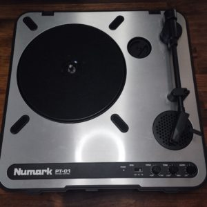
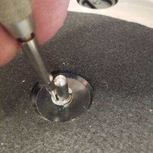
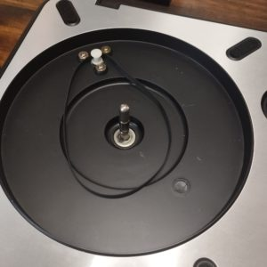
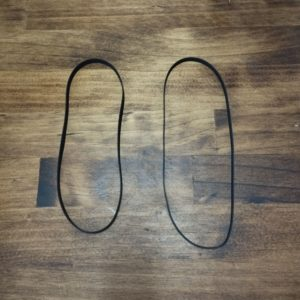

この記事はAmazonアフィリエイトリンクを含みます。

レコード再生環境がしばらくなかったので、以前使っていてお気に入りだったNumark PT01を1,2年前に購入しなおした。そこまで使用頻度も高くなく適当にほっておいたのだが、MPC500を購入したのを期にいろいろサンプリングして遊んでみることに。

[Numark スクラッチ・ターンテーブル スピーカー内蔵 乾電池対応 PT01 Scratch](https://amzn.to/3xJJtJX)

（買ったのは中古の初代PT01ですが、数年前から同じモデルがアップグレードされてポータブルスクラッチ向けの機種になっていますね）

しかし、再生時の回転ムラがひどく、ピッチがうねうね動いてしまう。どうしたものかと思ったら、仕様さえ合えば市販のベルトに交換してしまえばいいらしい。

[ion iPT01試聴記 (studio.jpn.org)](https://studio.jpn.org/pages/ion.html)

調べていると、上記のWebページに、PT01と事実上同じモデルでは、全長30cm（半分で15cm）のベルトであれば大丈夫だったという記述があった。[Amazonで汎用のターンテーブル用ベルトを購入](https://amzn.to/4aPfKhL)し、換装してみた。

ターンテーブルのプラッターを留めている金具をマイナスドライバで外す。

ベルト発見。

だるだるやないか。そりゃ駄目になるわ。

交換はすこしコツがいるのだが、なんかもう、気合でやりましょう。YouTubeみるとPT01 Scratchについては賢いやり方があるようだけれど、PT01でもできるかは謎（カスタムプラッターじゃないとできなさそう）。
