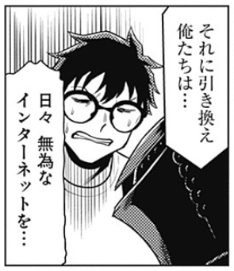

<figure>



<figcaption>

ほぼ実話モノマネ『秋葉原で見た嘘みたいなオタク』

</figcaption>

</figure>

芸人森本サイダーのモノマネシリーズ。何度も見てる。こんな友達がほしい。最後の一言が信じられないくらい良い。

<figure>



<figcaption>

鳥取の前衛芸術家集団スペース・プラン（1968-1977）

</figcaption>

</figure>

日本の戦後前衛のイメージをちょっと変えるような、鳥取の芸術家集団の活動をまとめた動画（スペース・プランについてはこの動画の企画者である筒井宏樹がモノグラフを著している）。

<figure>



<figcaption>

高速で「よ」を連呼する2人ですが本質はそこではありません。(オードリーさん、ぜひ会ってほしい人がいるんです。)

</figcaption>

</figure>

インターネットじゃないじゃん。でもYouTubeだからあり。オドぜひ版「夜明けのすべて」かもしれない。全然違うかもしれない。

<figure>



<figcaption>

Nelly - Hot in herre (QY70 cover, piano tutorial)

</figcaption>

</figure>

NellyのHot in herreをYAMAHAの名機QY70でカバー。脱力系のイラストがかわいい。でも多分音声が逆相かなにかになってる。

<figure>



<figcaption>

アメリカ、日食狂想曲！

</figcaption>

</figure>

Saku Yanagawaが最近始めたYouTube動画シリーズ、いい温度感で見てしまう（町山智浩がラジオでやるアメリカ事情紹介みたいなのを思い出したり）。

[Columns ♯5：いまブルース・スプリングスティーンを聴く | ele-king](https://www.ele-king.net/columns/011127/)

ele-kingで最近野田努さんが書いてるコラムの連載、どれも良い。「[Columns ♯3：ピッチフォーク買収騒ぎについて | ele-king](https://www.ele-king.net/columns/010766/)」も良かった。

> [@jinsei\_chan2](https://www.tiktok.com/@jinsei_chan2?refer=embed "@jinsei_chan2") 焼き芋を買い置きするシチュエーションないしね [#自炊](https://www.tiktok.com/tag/%E8%87%AA%E7%82%8A?refer=embed "自炊") [♬ オリジナル楽曲 - jinsei\_chan2](https://www.tiktok.com/music/オリジナル楽曲-jinseichan2-7357643046379014929?refer=embed "♬ オリジナル楽曲  - jinsei_chan2")

身体に悪そうなものばっかりつくって食ってるTikToker。動画の雰囲気はしゅっとしてるしだいたいうまそうだけどジャンルはバシャウマと同じだと思う。

<figure>



<figcaption>

バシャウマ自炊日記総集編⑪

</figcaption>

</figure>

みんなだいすきバシャウマグルメ。

[八戸市美術館の館銘板　「美」の字のみ館長手製の発泡スチロール製に - 八戸経済新聞](https://hachinohe.keizai.biz/headline/2148/)

美を失う美術館。寓話かなんかか。雪解けが美をもたらしてくれるという期待。偶然の詩情（アクシデンタルポエジー）じゃん。

https://twitter.com/IGLOOGHOST/status/1781729543491060138

幼い頃から消費文化に浸りきった自分の美意識に葛藤しつつ、そうしたキッチュを拒絶するのでもなく、キッチュとアイロニカルに戯れる（キャンプ的な？）のでもなく、キッチュのなかにもホンモノは宿るのではないか、キッチュを換骨奪胎することでキッチュに抗う興味深いものがつくれるのでないか……という可能性を信じようとするIglooghost。いい文章だけど読みづらい（OCRにかけて読んだ）。
